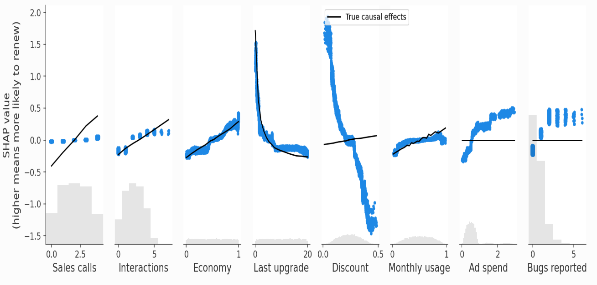

# Causal inference

## What is causal inference?

'Causal inference is the examination of causal associations to estimate the **causal effect of an exposure on an outcome**.'[[Lederer et al. 2018]](https://doi.org/10.1513/AnnalsATS.201808-564PS) 

'Assume we look at the effect of a target variable (something that could be manipulated = predictor) on another variable (the outcome = response) in the presence of other (non-target) variables. The goal of a causal analysis is is to control for these other variables, in such a way that we obtain the **same effect size** for the target variable that we would if the target predictor was manipulated in a **controlled intervention** (= experiment).'[[source]](https://theoreticalecology.wordpress.com/2019/04/14/mediators-confounders-colliders-a-crash-course-in-causal-inference/)

Causal models can be represented visually using causal diagrams.

### Counterfactuals

When we're talking about one thing causing another, this is based in counterfactuals. **Counterfactuals** (or equivalent concepts) are needed to define causal effects. Knowing the counterfactual outcomes can be referred to as knowing the outcomes under treatment and under no treatment. For example, I know ingesting the poison killed John, because if John hadn't ingested the poison, I know he would have lived.

Causal inference for an individual (generating individual causal effects) is general impossible in health and social sciences (as you can't go back in time and not give them the outcome) - instead, causal inference focusses on average causal effect when comparing groups of individuals.

### Causal inference v.s. prediction

Clinical studies are often classified as having either a:
* **Descriptive aim**
* **Etiological aim** - to uncover causal effects
* **Predictive aim** - to forecast an outcome with the best accuracy[[Ramspek et al. 2021]](https://link.springer.com/article/10.1007/s10654-021-00794-w)

What is the difference between etiological and predictive research?
* **Different methods**
* In predictive research, doesn't matter whether predictors are causal or not - just focussed on best prediction, and finding associations (i.e. relationships aren't directional)
* In etiological research, we want an unbiased estimate of the effect of X and Y, and it is important that relationships are directional, as these directions are required to support interventional reasoning[[source]](https://stats.stackexchange.com/questions/56909/what-is-the-relation-between-causal-inference-and-prediction)

The findings of etiological and predictive research can often get **conflated** when reported and interpreted - a review of observational studies found that 26% (46 / 180) observational cohort studies conflated between etiology and prediction.
* In causal studies, this was mainly due to selection of covariates based on their ability to predict **without taking causal structure into account**
* In prediction studies, this was mainly due to **causal interpretation** of covariates included in a prediction model.

In the case of **counterfactual prediction modelling** (which answers ‘what if’ questions on prognosis related to interventions) **prediction and etiology intentionally collide**.[[Ramspek et al. 2021]](https://link.springer.com/article/10.1007/s10654-021-00794-w)

### Explainability v.s. causality

'Explainability may be a ‘weaker’ model property than causality. Explaining the role of input variables in changing the output of a black box neither assures a correct interpretation of the input–output mechanism nor unveils the cause–effect relationships. For instance, in a deep learning system that predicts the risk of heart attack, a subsequent analysis could be able to explain that the input variables ‘race’ and ‘blood pressure’ affect the risk, but could not say if these findings are causal, since they may be biased by stratification or unmeasured confounders, or mediated by other factors in the causal pathway.'[[Prosperi et al. 2020]](https://doi.org/10.1038/s42256-020-0197-y)

'SHAP makes transparent the correlations picked up by predictive ML models. But making correlations transparent does not make them causal! All predictive models implicitly assume that everyone will keep behaving the same way in the future, and therefore correlation patterns will stay constant. To understand what happens if someone starts behaving differently, we need to build causal models, which requires making assumptions and using the tools of causal analysis.'[[source]](https://shap.readthedocs.io/en/latest/example_notebooks/overviews/Be%20careful%20when%20interpreting%20predictive%20models%20in%20search%20of%20causal%20insights.html)

#### How do you know if you want prediction + explainability, or causal inference?

Example: Built an XGBoost model predicting whether customers will renew their subscription, and use SHAP values to help learn the basis of those predictions. We use these SHAP values to look at how changing the value of a feature impacts the models predictions, and notice a surpising finding: **Users who report more bugs are more likely to renew**. Is this a problem? It depends on your goal.

If our goal is to **predict customer retention to estimate future revenue** then this relationship is helpful for prediction, and it doesn't matter about the direction, as long as our predictions are good.

However, if our goal is to **inform actions to help retain customers** then relationship between features and their counterfactural scenarios are important, and we want to understand whether manipulating X will change Y. Hence, we are concerned about the causal relationship between X and Y. Hence, its helpful to draw a causal diagram. We can notice:
* Some features are influenced by unmeasured confounding - e.g. users who report more bugs are people who use the product more so encounter more bugs, but need the product more so are more likely to report.
* Because we can’t directly measure product need, the correlation we end up capturing in predictive models between bugs reported and renewal combines a small negative direct effect of bugs faced and a large positive confounding effect from product need.

````{mermaid}
  flowchart LR;

    ca("Sales call"):::white;
    need("<b>Unmeasured</b><br>Product need"):::white;
    int("Interactions"):::white;
    month("Monthly usage"):::white;
    ad("Ad spend"):::white;
    last("Last upgrade"):::white;
    dis("Discount"):::white;
    face("<b>Unmeasured</b><br>Bugs faced"):::white;
    report("Bugs reported"):::white;
    
    ec("Economy"):::white;
    ren("Did renew"):::important;

    ca --> need;
    ca --> ren;
    ca --> int; int --> ren;

    need --> report;
    need --> month;
    need --> dis; dis --> ren;
    need --> ren;

    month --> ad;
    month --> face; face --> report; face --> ren;
    month --> ren;
  
    last --> ad;
    last --> ren;
  
    ec --> ren;

    classDef white fill:#FFFFFF, stroke:#FFFFFF
    classDef black fill:#FFFFFF, stroke:#000000
    classDef important fill:#DDF2D1, stroke: #FFFFFF;
````


As this example is from a simulation study where know true causal effects, we can plot the SHAP values from the prediction models v.s. the known true causal effects.



We can also add clustering to see the redundancy structure of the data as a dendrogram - 'when features merge together at the bottom (left) of the dendrogram it means that that the information those features contain about the outcome (renewal) is very redundant and the model could have used either feature. When features merge together at the top (right) of the dendrogram it means the information they contain about the outcome is independent from each other.'


**When can predictive models answer causal questions?** When the feature is independent of (a) other features in the model, and (b) unobserved confounders. Hence, it is not subject to bias from either unmeasured confounders or feature redundancy. Example: Economy
* Independent from other features in dendogram (no observed confounding)
* No unobserved confounding in causal digram

**When can they not be used? (1) When you have observed confounding.** Example: Ad Spend (no direct causal effect on retention, but correlated with Last upgrade and Monthly usage which do drive retention). 'Our predictive model identifies Ad Spend as the one of the best single predictors of retention because it captures so many of the true causal drivers through correlations. XGBoost imposes regularization, which is a fancy way of saying that it tries to choose the simplest possible model that still predicts well. If it could predict equally well using one feature rather than three, it will tend to do that to avoid overfitting.'

However, there are methods to deal with observed confounding, such as double/debiased machine learning model. This involves:
1. Train model to predict feature (Ad spend) using set of confounders (features not caused by Ad spend)
2. Train model to predict outcome (Did Renew) using that set of confounders
3. Train model to predict residual variation of outcome (the variation left after subtracting our prediction) using the residual variation of the causal feature of interest

'The intuition is that if Ad Spend causes renewal, then the part of Ad Spend that can’t be predicted by other confounding features should be correlated with the part of renewal that can’t be predicted by other confounding features.' There are packages like econML's LinearDML for this.

**When can they not be used? (2) When you have non-confounding redundancy.** 'This occurs when the feature we want causal effects for causally drives, or is driven by, another feature included in the model, but that other feature is not a confounder of our feature of interest.'

Example: Sales Calls directly impact retention, but also have an indirect effect on retention through Interactions. We can see this in the SHAP scatter plots above, which show how XGBoost underestimates the true causal effect of Sales Calls because most of that effect got put onto the Interactions feature.

'Non-confounding redundancy can be fixed in principle by removing the redundant variables from the model (see below). For example, if we removed Interactions from the model then we will capture the full effect of making a sales call on renewal probability. This removal is also important for double ML, since double ML will fail to capture indirect causal effects if you control for downstream features caused by the feature of interest. In this case double ML will only measure the “direct” effect that does not pass through the other feature. Double ML is however robust to controlling for upstream non-confounding redundancy (where the redundant feature causes the feature of interest), though this will reduce your statistical power to detect true effects. Unfortunately, we often don’t know the true causal graph so it can be hard to know when another feature is redundant with our feature of interest because of observed confounding vs. non-confounding redundancy. If it is because of confounding then we should control for that feature using a method like double ML, whereas if it is a downstream consequence then we should drop the feature from our model if we want full causal effects rather than only direct effects. Controlling for a feature we shouldn’t tends to hide or split up causal effects, while failing to control for a feature we should have controlled for tends to infer causal effects that do not exist. This generally makes controlling for a feature the safer option when you are uncertain.'

**When can they not be used? (3) When you have unobserved confounding.** 'The Discount and Bugs Reported features both suffer from unobserved confounding because not all important variables (e.g., Product Need and Bugs Faced) are measured in the data. Even though both features are relatively independent of all the other features in the model, there are important drivers that are unmeasured. In this case, both predictive models and causal models that require confounders to be observed, like double ML, will fail. This is why double ML estimates a large negative causal effect for the Discount feature even when controlling for all other observed features'

'Specialized causal tools based on the principals of instrumental variables, differences-in-differences, or regression discontinuities can sometimes exploit partial randomization even in cases where a full experiment is impossible. For example, instrumental variable techniques can be used to identify causal effects in cases where we cannot randomly assign a treatment, but we can randomly nudge some customers towards treatment, like sending an email encouraging them to explore a new product feature. Difference-in-difference approaches can be helpful when the introduction of new treatments is staggered across groups. Finally, regression discontinuity approaches are a good option when patterns of treatment exhibit sharp cut-offs (for example qualification for treatment based on a specific, measurable trait like revenue over $5,000 per month).'

[[source]](https://shap.readthedocs.io/en/latest/example_notebooks/overviews/Be%20careful%20when%20interpreting%20predictive%20models%20in%20search%20of%20causal%20insights.html#)

## Introduction to causal diagrams

Causal diagrams - **directed acyclic graphs (DAGs)** - depict causal relationship between different variables. Two key components are **nodes** and **arrows**. They are:
* **Directed** - as arrows have a single direction (unidirectional) that represents known causal effects (based on prior knowledge)
* **Acyclic** - as nodes cannot have a directed path from itself back to itself

````{mermaid}
  flowchart LR;

    n1("Node 1"):::white;
    n2("Node 2"):::white;

    n1 --> n2;

    classDef white fill:#FFFFFF, stroke:#FFFFFF
    classDef black fill:#FFFFFF, stroke:#000000
````
[[HarvardX PH559x]](https://learning.edx.org/course/course-v1:HarvardX+PH559x+2T2020/home)

Naming conventions...
* A (or E) = Exposure / Treatment / Intervention / Primary IV
* Y (or D) = Outcome
* C = Covariates / Confounders
* U = Unmeasured relevant variables

Genealogy...
* Ancestor = direct cause (parent) or indirect cause (e.g. grandparent) of a variable
* Descendent = direct effect (child) or indirect effect (e.g. grandchild) of a variable

````{mermaid}
  flowchart LR;

    a("A (parent)"):::white;
    b("B (child)"):::white;
    c("C (grandparent)"):::white;
    d("D"):::white;
    e("E (grandchild)"):::white;

    a --> b;
    c --> d; d --> e;

    classDef white fill:#FFFFFF, stroke:#FFFFFF
    classDef black fill:#FFFFFF, stroke:#000000
````

[[HarvardX PH559x]](https://learning.edx.org/course/course-v1:HarvardX+PH559x+2T2020/home)

### How do you know what to include?

**All COMMON causes should be represented**. i.e. We can call the graph a causal DAG if, when two variables share a cause, that shared cause is also in the graph, meaning it satisfies the causal markov condition.

Example: Investigating Aspirin causing strokes.

In RCT where people were randomised to receive Aspirin, we don't need to include other variables that can cause stroke (e.g. coronary heart disease (CHD)), as they didn't cause why people got aspirin.

````{mermaid}
  flowchart LR;

    asp("Aspirin"):::white;
    str("Stroke"):::white;

    asp --> str;

    classDef white fill:#FFFFFF, stroke:#FFFFFF
    classDef black fill:#FFFFFF, stroke:#000000
````

In an observational study, there will be other variables that would explain why people received aspirin (e.g. CHD), which we would need to include for it to be a causal DAG (i.e. aspirin AND stroke BOTH caused by CHD)

````{mermaid}
  flowchart LR;

    asp("Aspirin"):::white;
    str("Stroke"):::white;
    chd("Coronary heart disease (CHD)"):::white;

    asp --> str;
    chd --> asp;
    chd --> str;

    classDef white fill:#FFFFFF, stroke:#FFFFFF
    classDef black fill:#FFFFFF, stroke:#000000
````


**How do you know when to include mediators**
* We start the DAG with adding the treatment (A) and outcome (Y) that we are interested in, and then build around it. As we are interested in the **total effect of A on Y**, we don't need to specify the mechanisms through which A may affect Y (i.e. don't need any m ediators between A and Y)

[[HarvardX PH559x]](https://learning.edx.org/course/course-v1:HarvardX+PH559x+2T2020/home)

### When should you draw arrows?

The DAG is drawn based on expert knowledge, including arrows when you believe that something causes something else.

If expert knowledge is insufficient for us to rule out a direct effect of E on D, then we should draw an arrow.

Note: Arrows on causal graphs are not deterministic - i.e. doesn't mean every person with exposure will see outcome - as some will never, and some without outcome will develop it.

[[HarvardX PH559x]](https://learning.edx.org/course/course-v1:HarvardX+PH559x+2T2020/home)

### What is the purpose of DAGs?

We don't draw causal diagrams as an exact, accurate representation of the world - instead, we draw causal DAGs to help us think about possible sources of bias when making causal inferences.

* They make sure we illustrate and identify our sources of biases (assumptions)
    * More precise and efficient than writing pages of assumptions[[HarvardX PH559x]](https://learning.edx.org/course/course-v1:HarvardX+PH559x+2T2020/home)
    * Although they are based on assumptions, so are analytic models.[[source]](https://med.stanford.edu/content/dam/sm/s-spire/documents/WIP-DAGs_ATrickey_Final-2019-01-28.pdf)
    * Although investigators often feel some discomfort in deciding what causal effects do and do not exist on the basis of prior knowledge, the advantage of this approach is that it makes these assumptions explicit (and hence transparent).[[Lederer et al. 2018]](https://doi.org/10.1513/AnnalsATS.201808-564PS) 
* They indicate when associations or independence should be expected.[[HarvardX PH559x]](https://learning.edx.org/course/course-v1:HarvardX+PH559x+2T2020/home)
* They can help determine whether the effect of interest can be identified from available data, and help us clarify our study question[[source]](https://med.stanford.edu/content/dam/sm/s-spire/documents/WIP-DAGs_ATrickey_Final-2019-01-28.pdf) - and to identify problems in the study design[[HarvardX PH559x]](https://learning.edx.org/course/course-v1:HarvardX+PH559x+2T2020/home)

### How do you construct a DAG?

*The order here doesn't particular matter - the key thing is to start with the research question and then build from there*.

1. Start with research question - A (treatment/exposure) and Y (outcome), and indicate with "?"

````{mermaid}
  flowchart LR;

    A("A (treatment/exposure)"):::white;
    Y("Y (outcome)"):::white;

    A -->|?| Y;

    classDef white fill:#FFFFFF, stroke:#FFFFFF
    classDef black fill:#FFFFFF, stroke:#000000
````

2. Add **measured confounders (L)** (cause A and Y). 

3. Add **unmeasured confounders (U)** (even though we don't measure, we need to include, as they are a common cause of A and Y)

4. Add **selection nodes** - e.g. if some people lost to follow-up (C1) and some remain to end (C0), our analysis is restricted to C0. In the example of loss to follow up, this is temporarily between A and Y with box around it (which means that only individuals with certain values of C are included in the analysis, as we're essentially conditioning on it)

5. Add **moderators** (affect direction/strength of A --> Y)

6. Add **mediators** (on causal pathway between A and Y - included if you want to know effect of A on Y when not mediated by the provided mediators)

7. Add nodes for **mismeasured variables** - if believe it's mismeasured, have node with * that points from variable, with another representing measurement error.

8. Everytime you add a new variable to the DAG, you need to conside whether it has common causes with any other variables (its not just about common causes of A and Y). For example, if you believe measurement of Y is affected by whether person is on treatment, draw arrow from A to measurement error for Y

````{mermaid}
  flowchart LR;

    A("A (treatment/exposure)"):::white;
    Y("Y (outcome)"):::white;
    Empty[ ]:::empty;
    Mod("Moderator"):::white;
    M("Mediator"):::white;
    L("L (confounder)"):::white;
    U("U (unmeasured confounder)"):::white;
    C("C (selection node)"):::black;
    Y*("Y* (mismeasured outcome)"):::white;
    UY("U<sub>Y</sub> (measurement error for Y)"):::white;

    Mod --> Empty;
    A --- Empty; Empty -->|?| Y;
    A --> M; M --> Y;
    L --> A; L --> Y;
    U --> L; U --> Y;
    A --> C;
    L --> C;
    Y --> Y*;
    UY --> Y*;
    A --> UY;

    classDef white fill:#FFFFFF, stroke:#FFFFFF;
    classDef black fill:#FFFFFF, stroke:#000000;
    classDef empty width:0px,height:0px;
````

Don't need variables that cause Y but not A (although might include if for example you want to compare to other studies that did adjust for that variable)

There can often be more than one appropriate DAG, and alternate DAGs can make excellent sensitivity analyses.

[[source]](https://med.stanford.edu/content/dam/sm/s-spire/documents/WIP-DAGs_ATrickey_Final-2019-01-28.pdf)

[[HarvardX PH559x]](https://learning.edx.org/course/course-v1:HarvardX+PH559x+2T2020/home)

## Moderators

**Moderators** are variables that change the **size or direction** of the relationship between variables. These could also be referred to as effect modifiers or statistical interaction.[[source]](https://med.stanford.edu/content/dam/sm/s-spire/documents/WIP-DAGs_ATrickey_Final-2019-01-28.pdf)

Why include? They usually help you judge the external validity of your study by identifying the limitations of when the relationship between variables holds.'[[source]](https://www.scribbr.co.uk/faqs/why-should-you-include-mediators-and-moderators-in-your-study/) 

There has been some disagreement on how these should be included/notation within DAGs.[[source]](https://med.stanford.edu/content/dam/sm/s-spire/documents/WIP-DAGs_ATrickey_Final-2019-01-28.pdf)[[Weinberg 2007]](https://pubmed.ncbi.nlm.nih.gov/17700243/)


## Mediators

**Mediators** are variables that lie in the causal path between the two other variables (e.g. between exposure and outcome), and they tell you how or why an effect takes place.[[source]](https://www.scribbr.co.uk/faqs/why-should-you-include-mediators-and-moderators-in-your-study/)

A path that includes a mediator is often called an **indirect effect** or indirect causal path. In contrast, the arrow directly connecting the treatment and outcome represents the **direct causal effect** of the treatment on the outcome that is not due to changes in the mediator.[[Lederer et al. 2018]](https://doi.org/10.1513/AnnalsATS.201808-564PS) 

You might condition on a mediator if you are interested in the **direct effect of treatment on outcome that doesn't pass through mediator**.

Example: In racial disparity studies, will condition on mediators like socioeconomic, education, location (often though **matching** on these characteristics),  to allow you to isolate the unique effect of race that is not explainable by those pathways. [[source]](https://stats.stackexchange.com/questions/488048/dag-are-there-situations-where-adjusting-for-mediators-is-reasonable)

````{mermaid}
  flowchart LR;

    race("Race"):::white;
    outcome("Outcome"):::white;
    ses("Socioeconomic status"):::black;
    ed("Education"):::black;
    loc("Location"):::black;

    race -->|?| outcome;
    race --> ses; ses --> outcome;
    race --> ed; ed --> outcome;
    race --> loc; loc --> outcome;

    classDef white fill:#FFFFFF, stroke:#FFFFFF
    classDef black fill:#FFFFFF, stroke:#000000
````

If you do not have a direct arrow between the treatment and outcome, and only via the mediator, this implies that this is the only way in which the treatment can cause the outcome, and that if you know the mediator is present, knowing whether or not the treatment was present should have no impact on the outcome.

````{mermaid}
  flowchart LR;

    treat("Treatment"):::white;
    med("Mediator"):::white;
    out("Outcome"):::white;

    treat --> med;
    med --> out;

    classDef white fill:#FFFFFF, stroke:#FFFFFF
    classDef black fill:#FFFFFF, stroke:#000000
````

## Confounders

**Confounders** are variables that **cause BOTH the treatment/exposure and outcomes**. Informally, it occurs when there is an open backdoor path between the treatment/exposure and outcome, and you could say a confounder is a variable that - possibly together with other variables - can be used to block the backdoor path between the treatment and outcome.[[HarvardX PH559x]](https://learning.edx.org/course/course-v1:HarvardX+PH559x+2T2020/home)

It is recommended that confounders are selected based on **prior knowledge**, rather than based on variables identified from the data.[[Lederer et al. 2018]](https://doi.org/10.1513/AnnalsATS.201808-564PS)

Example - smoking causes yellow fingers and lung cancer - if we don't condition on it, we expect to see an association between yellow fingers and lung cancer (known as a **marginal/unconditional** association)

````{mermaid}
  flowchart LR;

    cig("Smoking"):::white;
    lung("Lung cancer"):::white;
    yellow("Yellow fingers"):::white;

    cig --> lung;
    cig --> yellow;

    classDef white fill:#FFFFFF, stroke:#FFFFFF
    classDef black fill:#FFFFFF, stroke:#000000
````

If we do condition on smoking, we expect to see no association between yellow fingers and lung cancers (i.e. they are "**not associated conditional on** smoking)

````{mermaid}
  flowchart LR;

    cig("Smoking"):::black;
    lung("Lung cancer"):::white;
    yellow("Yellow fingers"):::white;

    cig --> lung;
    cig --> yellow;

    classDef white fill:#FFFFFF, stroke:#FFFFFF
    classDef black fill:#FFFFFF, stroke:#000000
````

[[HarvardX PH559x]](https://learning.edx.org/course/course-v1:HarvardX+PH559x+2T2020/home)

## Colliders

**Colliders** are descendents of two other variables - i.e. common effect - with two arrows from the parents pointing to ("colliding with") the descendent node.

Example: A genetic factor and an environmental factor causing cancer. These are **independent** - i.e. genetic factor doesn't have causal effect on environmental factor - and so we don't expect to see an association between genetic and environment (unconditional/marginal association).[[HarvardX PH559x]](https://learning.edx.org/course/course-v1:HarvardX+PH559x+2T2020/home)

````{mermaid}
  flowchart LR;

    gene("Genetic factor"):::white;
    env("Environmental factor"):::white;
    cancer("Cancer"):::white;

    gene --> cancer;
    env --> cancer;

    classDef white fill:#FFFFFF, stroke:#FFFFFF
    classDef black fill:#FFFFFF, stroke:#000000
````

Colliders naturally block back-door paths. Controlling for a collider will open the back-door path, thereby introducing confounding.[[Lederer et al. 2018]](https://doi.org/10.1513/AnnalsATS.201808-564PS)

For example, if we condition on cancer - such as by just selecting people who have cancer - we will find an **inverse association** between genetics and environment (as if cancer wasn't caused by one, it was by the other). This biased effect estimate is referred to as **selection bias**.

````{mermaid}
  flowchart LR;

    gene("Genetic factor"):::white;
    env("Environmental factor"):::white;
    cancer("Cancer"):::black;

    gene --> cancer;
    env --> cancer;

    classDef white fill:#FFFFFF, stroke:#FFFFFF
    classDef black fill:#FFFFFF, stroke:#000000
````

We can **induce** selection bias by conditioning on the downstream consequence of a collider - e.g. if cancer is collider, and surgery is consequence of cancer, if we condition on surgery, we expect to see inverse association between genetic and environment conditional on surgery (just as we did for the collider cancer).[[HarvardX PH559x]](https://learning.edx.org/course/course-v1:HarvardX+PH559x+2T2020/home)

````{mermaid}
  flowchart LR;

    gene("Genetic factor"):::white;
    env("Environmental factor"):::white;
    cancer("Cancer"):::white;
    surgery("Surgery"):::black;

    gene --> cancer;
    env --> cancer;
    cancer --> surgery;

    classDef white fill:#FFFFFF, stroke:#FFFFFF
    classDef black fill:#FFFFFF, stroke:#000000
````

Collider bias may also be present when neither the exposure nor the outcome is a direct cause of the collider variable. An example is **M-bias**.

In this example...
* Focus: beta-blocker use and risk of ARDS
* Might be tempted to adjust for crackles as you might think its a confounder... 1) heart failure leads to both chronic β-blocker therapy and crackles, and 2) pneumonia causes both ARDS and crackles
* However, crackles is actually a collider on the back-door path of chronic β-blocker therapy ← heart failure → crackles ← pneumonia → ARDS. Adjusting for the presence of crackles opens this back-door path, introducing confounding. Ignoring the presence of crackles would be the right thing to do.[[Lederer et al. 2018]](https://doi.org/10.1513/AnnalsATS.201808-564PS)

````{mermaid}
  flowchart TD;

    beta("Beta blocker use"):::white;
    ards("Acute respiratory distress syndrome (ARDS)"):::white;
    hf("Heart failure"):::white;
    pneu("Pneumonia"):::white;
    crackles("Crackles"):::black;

    hf --> beta;
    hf --> crackles;
    pneu --> crackles;
    pneu --> ards;
    beta -->|?| ards;
  
    classDef white fill:#FFFFFF, stroke:#FFFFFF
    classDef black fill:#FFFFFF, stroke:#000000
````

## Conditioning

**Conditioning** on a variable means examining the relationship between A and Y within levels of the conditioning variable, using either:
* Sample restriction
* Stratification
* Adjustment
* Matching

Other terms like "adjusting" or "controlling" suggest a misleading interpretation of the model.

When you condition on something, you draw a box around it on the DAG.

Scenarios where we may want to condition...

**(1) To control for confounding**. A back door path is a connection between A and Y that doesn't follow the path of the arrows - for example, along the path of a confounder. If we condition on the variable in that path (i.e. control for confounding), then we close that back door path and remove the non-causal association.
* If we don't do this, we will get **confounding bias** (where a common cause of A and Y is not blocked).

**(2) To open a path blocked by a collider**.
* **Collider bias** = conditioning on common effects
* **Selection bias** = type of collider bias where the common effect is selection into the study - occurs when a common effect is conditioned on such that there is now a conditional association between A and Y
* **Berkson's bias** = type of selection bias in which selection of cases into the study depends on hospitalisation, and the treatment is another diase, or a cause of another disease, which also results in hospitalisation

**(3) To remove part of the causal effect** by conditioning on a mediator.

[[source]](https://med.stanford.edu/content/dam/sm/s-spire/documents/WIP-DAGs_ATrickey_Final-2019-01-28.pdf)

### Minimal set of covariates

We want to identify a minimal set of covariates that:
1. Blocks all backdoor paths.
2. Doesn't inadvertenly open closed pathways by conditioning on colliders or descendents.

[[source]](https://med.stanford.edu/content/dam/sm/s-spire/documents/WIP-DAGs_ATrickey_Final-2019-01-28.pdf)

## Causal structures where we expect to see associations

### Structural sources of seperation

The **structural sources** of association are:
* Cause and effect
* Common causes (confounding)
* Conditioning on common effects (conditioning on collider)

````{mermaid}
  flowchart LR;

    a:::white;
    b:::white;
    c:::white;
    d:::white;
    e:::white;
    f:::white;
    g:::white;
    h:::black;

    a --> b;

    c --> d;
    c --> e;

    f --> h;
    g --> h;

    classDef white fill:#FFFFFF, stroke:#FFFFFF
    classDef black fill:#FFFFFF, stroke:#000000
````

There is another source of association: **chance**. May be association even if none of above are true. Chance is not a structural source of association. **Increasing our sample size, chance associations should disappear (whilst structural remain and become sharper)**.

[[HarvardX PH559x]](https://learning.edx.org/course/course-v1:HarvardX+PH559x+2T2020/home)

## D-seperation rules

**Path** is any route through graph (can follow arrow direction or not). Paths can be **blocked or open**, which is according to the **D-seperation rules**. We use D-seperation to decide whether two variables are D-seperated, where D stands for directional.

You will be able to see that all D-separation says is that - as above - two variables **would be associated** if:
* One causes the other,
* They share common causes
* They have a common effect and we condition on the common effect...

Another summary:
* Path is blocked only if (a) containins non-collider that been conditioned on, or (b) collider that not been conditioned on.
* Two variables are D-seperated if all paths between them are blocked.
* Two variables are marginally or unconditionally independent if they are D-seperated without conditioning on all the variables
* Two variables are conditionally independent if they are D-seperated after conditioning

[[HarvardX PH559x]](https://learning.edx.org/course/course-v1:HarvardX+PH559x+2T2020/home)

### D-seperation rule 1: If there are no variables being conditioned on, a path is blocked if and only if two arrowheads on the path collide at some variable on the path

Path from A to Y is **open**:
````{mermaid}
  flowchart LR;

    a("A"):::white;
    b("B"):::white;
    y("Y"):::white;
    
    a --> b; b--> y;

    classDef white fill:#FFFFFF, stroke:#FFFFFF
    classDef black fill:#FFFFFF, stroke:#000000
````

Path from A to Y is **blocked**:
````{mermaid}
  flowchart LR;

    a("A"):::white;
    y("Y"):::white;
    l("L"):::white;
    d("D"):::white;
    
    a --> l; y --> l; l --> d;

    classDef white fill:#FFFFFF, stroke:#FFFFFF
    classDef black fill:#FFFFFF, stroke:#000000
````

Definition of collider is path-specific. L is collider on path A to Y, but on on path A to D.

[[HarvardX PH559x]](https://learning.edx.org/course/course-v1:HarvardX+PH559x+2T2020/home)

### D-seperation rule 2: Any path containing non-collider that has been conditioned on is blocked.

Path from A to Y is **blocked**:
````{mermaid}
  flowchart LR;

    a("A"):::white;
    b("B"):::black;
    y("Y"):::white;
    
    a --> b; b--> y;

    classDef white fill:#FFFFFF, stroke:#FFFFFF
    classDef black fill:#FFFFFF, stroke:#000000
````

[[HarvardX PH559x]](https://learning.edx.org/course/course-v1:HarvardX+PH559x+2T2020/home)

### D-seperation rule 3: A collider that has been conditioned on does not block a path.

Path from A to Y is **open**:
````{mermaid}
  flowchart LR;

    a("A"):::white;
    y("Y"):::white;
    l("L"):::black;
    
    a --> l; y--> l;

    classDef white fill:#FFFFFF, stroke:#FFFFFF
    classDef black fill:#FFFFFF, stroke:#000000
````

[[HarvardX PH559x]](https://learning.edx.org/course/course-v1:HarvardX+PH559x+2T2020/home)

### D-seperation rule 4: Collider with descendent that has been conditioned on does not block a path.

Path from A to Y is **open**:
````{mermaid}
  flowchart LR;

    a("A"):::white;
    y("Y"):::white;
    l("L"):::white
    d("D"):::black;
    
    a --> l; y--> l; l --> d;

    classDef white fill:#FFFFFF, stroke:#FFFFFF
    classDef black fill:#FFFFFF, stroke:#000000
````

[[HarvardX PH559x]](https://learning.edx.org/course/course-v1:HarvardX+PH559x+2T2020/home)

## Faithfulness

Faithfulness is the result of opposite effects of exactly equal magnitude - e.g. if aspirin caused stroke for half of poppulation and prevented it in the other half, then causal dag is correct (as aspirin affects stroke) but no association is observed (as they cancel each other out). In that case, we say the joint distribution of the data is not faithful to the causal DAG.

These perfect cancellations are rare and we don't expect them to happen in practice, so we can safetly say lack of D-seperation means non-zero association. So - 
* **D-seperation = statistical independence**
* **All paths blocked = no association**

[[HarvardX PH559x]](https://learning.edx.org/course/course-v1:HarvardX+PH559x+2T2020/home)

## Time-varying treatments and confounders

A time-varying treatment one that can take different values over time - (e.g. whether or not receive medicine, or dose of medicine, at multiple different timepoints) - as opposed to fixed treatments that do not vary over time (e.g. whether took vitamin D at time of conception).

Example: EPO used to treat anemia, dose is based on haemoglobin level, which itself depends on disease severity.

````{mermaid}
  flowchart LR;

    l("L: Haemoglobin"):::white;
    a("A: EPO"):::white;
    y("Y: Death"):::white;
    u("U: Disease severity"):::white;

    l --> a;
    a --> y;
    u --> y;
    u --> l;

    classDef white fill:#FFFFFF, stroke:#FFFFFF
    classDef black fill:#FFFFFF, stroke:#000000
````

To show that we have **time-varying** components, we refer to:
* L and A at timepoint K (e.g. week 0)
* Y, L and A at timepoint K+1 (e.g. week 1)
* Y at timepoint K+2 (e.g. week 2)

Actual study includes many more weeks but for most purposes, two time points are enough to represent the main features of the causal structure when there is time varying treatment. These will often be two arbritary time points (K and K+1) (rather than 0 and 1).

You'll notice that a consequence of the time-varying treatment is time-varying confounder and outcome. A confounder is time-varying when it can take different values at different timepoint, and confound at different timepoints.

With the example below, the minimal set of variables you'd need to condition for would be L0 and L1 (wouldn't need to for U as doing for L0 and L1 blocks the backdoor paths)

````{mermaid}
  flowchart LR;

    ak("A<sub>K</sub>: EPO dose"):::white;
    ak1("A<sub>K+1</sub>: EPO dose"):::white;
    yk1("Y<sub>K+1</sub>: Death"):::white;
    yk2("Y<sub>K+2</sub>: Death"):::white;
    lk("L<sub>K</sub>: Haemoglobin"):::white;
    lk1("L<sub>K+1</sub>: Haemoglobin"):::white;
    u("U: Disease severity"):::white;

    ak --> yk1;
    u --> yk1;
    u --> lk;
    lk --> ak;
    lk --> ak1;
    ak --> ak1;
    u --> lk1;
    lk1 --> ak1;
    ak1 --> yk2;
    u --> yk2;

    classDef white fill:#FFFFFF, stroke:#FFFFFF
    classDef black fill:#FFFFFF, stroke:#000000
````

However, if there is **treatment-confounder feedback**, then conventional adjustment methods - even if closing all back door paths - will still not be able to yield an unbiased estimate.

Our DAG above was incomplete - in this scenario, treatment at timepoint K will impact the confounder (levels of haemoglobin) at timepoint K+1. This is referred to as **treatment-confounder feedback** - when the later confounder is impacted by prior treatment.

We'll get a biased estimate if we condition on the Ls, as conditioning on L<sub>K+1</sub> will open a path that was previously blocked: A<sub>K</sub> to L<sub>K+1</sub> to U to Y<sub>K</sub>. Hence, we have introduced selection bias.

If the time-varying confounder also affects the outcome (e.g. L<sub>K+1</sub> --> Y<sub>K+2</sub>), it will be impossible to estimate the total effect of the treatment.

We need other methods to handle these settings: **G-methods**.

````{mermaid}
  flowchart LR;

    ak("A<sub>K</sub>: EPO dose"):::white;
    ak1("A<sub>K+1</sub>: EPO dose"):::white;
    yk1("Y<sub>K+1</sub>: Death"):::white;
    yk2("Y<sub>K+2</sub>: Death"):::white;
    lk("L<sub>K</sub>: Haemoglobin"):::black;
    lk1("L<sub>K+1</sub>: Haemoglobin"):::black;
    u("U: Disease severity"):::white;

    ak --> yk1;
    u --> yk1;
    u --> lk;
    lk --> ak;
    lk --> ak1;
    ak --> ak1;
    ak --> lk1;
    u --> lk1;
    lk1 --> ak1;
    ak1 --> yk2;
    u --> yk2;

    classDef white fill:#FFFFFF, stroke:#FFFFFF
    classDef black fill:#FFFFFF, stroke:#000000
````

[[HarvardX PH559x]](https://learning.edx.org/course/course-v1:HarvardX+PH559x+2T2020/home)

## Terminology

Lederer et al. 2018 recommend that, by acknowledging the intent, it is reasonable to use the labels:
* **Causal association**
* **Effect estimate**

But not:
* Causal effect
* Exposure has an 'effect' or 'impact' on outcome
* Exposure 'protects against' or 'promotes' outcome

As these make claims of causality that should be avoided without substantial evidence of a true causal effect.[[Lederer et al. 2018]](https://doi.org/10.1513/AnnalsATS.201808-564PS)

## Variable selection

For causal inference, it is **NOT** recommended to:
* Use P value-based and model-based variable selection methods (including forward, backward, and stepwise selection) - since they ignore the causal structure underlying the hypothesis and treat confounders and colliders similarly
* Use methods that rely on model fit or related constructs (e.g. R<sup>2</sup>, Akaike information criterion, and Bayesian information criterion) - since these rely heavily on the available data, in which causal relationships may or may not have been captured and may or may not be evident, and specification of model and arbitrary variables included will drive observed associations with outcome
* Use selection of variables that, when included in a model, change the magnitude of the effect estimate of the exposure of interest, to identify confounders
* Identify multiple 'independent predictors' through purposeful or automated variable selection - if the authors have hypotheses about each variable, then a separate model for each variable should be generated - or a prediction model could be developed, if prediction, rather than causal inference, is the goal of the analysis

[[Lederer et al. 2018]](https://doi.org/10.1513/AnnalsATS.201808-564PS)

## Presentation of association of outcome with other variables

'Causal models are typically designed to test an association between a **single exposure and an outcome**. The additional independent variables in a model (often called “covariates”) **serve to control for confounding**. The observed associations between these covariates and the outcome have not been subject to the same approach to control of confounding as the exposure' (i.e. they themselves have not been corrected for confounding - *and they shouldn't and didn't have to be*). 'Therefore, **residual confounding and other biases often heavily influence these associations**.'

'This situation is known as “**Table 2 fallacy**,” a term arising from the practice of presenting effect estimates for all independent variables in “Table 2”.' It is strongly recommended that these effect estimates are **not presented**.[[Lederer et al. 2018]](https://doi.org/10.1513/AnnalsATS.201808-564PS)

Hartig 2019 discusses how this may not be practical in some fields (they give example of ecology) where you rarely have a clear target variable/hypothesis, but suggest instead that's important to explicitly state/seperate reasonablly controlled varaibles from possibly confounded variables.[[source]](https://theoreticalecology.wordpress.com/2019/04/14/mediators-confounders-colliders-a-crash-course-in-causal-inference/)

## Example cases

### Example: Oestrogen and endometrial cancer

In 1970s, women began to receive oestrogren after menopause. Some studies in 1975/6 found that women receiving oestrogen had higher risk of diagnosis with endometrical cancer than women not receiving them. Why? Possibilities include...
1. Oestrogens cause cancer
2. Oestrogens can cause uterine bleeding, so women receive a uterine exam, during which the cancer (which is often silent, asymptomatic, and otherwise not diagnosed) is noticed and diagnosed - this phenomenon is called **ascertainment bias**

How do we decide which explanation is right?

* Yale researchers restricted the data analysis to women with uterine bleeding (regardless of whether they were on oestrogens), since they should all have the same likelihood of uterine exams and existing cancer being diagnosed. If there still an association, oestrogen causative.
* Boston researchers argued we would find association even in women who bleed and even if they don't cause cancer, and so that this approach would still have ascertainment bias.

Explanation one.
````{mermaid}
  flowchart LR;

    a("A: Oestrogens"):::white;
    u("U: Cancer (unmeasured)"):::white;
    y("Y: Cancer (diagnosed)"):::white;

    a --> u;
    u --> y;

    classDef white fill:#FFFFFF, stroke:#FFFFFF
    classDef black fill:#FFFFFF, stroke:#000000
````

Explanation two.
````{mermaid}
  flowchart LR;

    a("A: Oestrogens"):::white;
    u("U: Cancer (unmeasured)"):::white;
    y("Y: Cancer (diagnosed)"):::white;
    c("C: Uterine bleeding"):::white;

    a --> c;
    u --> c;
    c --> y;
    u --> y;

    classDef white fill:#FFFFFF, stroke:#FFFFFF
    classDef black fill:#FFFFFF, stroke:#000000
````

Restrict analysis to women who bleed. If association still found, must be path of A --> U --> Y. Boston argued could still exist.
* Conditioning on C blocks path A-C-Y
* However, we still have path of A-C-U-Y, and C is collider on that path, so when condition on C, it becomes open (and conditioning on C is what we do when we restrict analysis to bleeders)

So Boston were right. 

````{mermaid}
  flowchart LR;

    a("A: Oestrogens"):::white;
    u("U: Cancer (unmeasured)"):::white;
    y("Y: Cancer (diagnosed)"):::white;
    c("C: Uterine bleeding"):::black;

    a --> c;
    u --> c;
    c --> y;
    u --> y;

    classDef white fill:#FFFFFF, stroke:#FFFFFF
    classDef black fill:#FFFFFF, stroke:#000000
````

What can you do then? You can design study where C-Y doesn't exist as you require all women to be screened for cancer frequently regardless of whether they bleed. If no association between A and Y, then we know there is no causal effect of A on U. If you still found association, then A must cause U.

````{mermaid}
  flowchart LR;

    a("A: Oestrogens"):::white;
    u("U: Cancer (unmeasured)"):::white;
    y("Y: Cancer (diagnosed)"):::white;
    c("C: Uterine bleeding"):::white;

    a --> c;
    u --> c;
    u --> y;

    classDef white fill:#FFFFFF, stroke:#FFFFFF
    classDef black fill:#FFFFFF, stroke:#000000
````

[[HarvardX PH559x]](https://learning.edx.org/course/course-v1:HarvardX+PH559x+2T2020/home)

### Example: HIV and ART

Randomised controlled trials of new antiretroviral therapy (ART) for HIV found it was effective and reduced morality by more than half.

Observational of clinical data to look at real world effect of ART did not detect much benefit for new combination therapies - no increased survival among those taking ART. What was wrong with the studies?

They were adjusting for lots of confounders - e.g. CD4 count - and yet could not eliminate the bias. Some people say there must be lots of unmeasured confounding. However, the more time-varying confounders were adjusted for, the more biased the effect estimate seemed to be. The problem was treatment-confounder feedback - the value of CD4 count was impacted by earlier treatment - in this case, the bias was in the opposite direction.

There is a way to identify whether the bias is due to incomplete adjustment for confounding or for incorrect adjustment for time-varying confounders - and that is to use G-methods to adjust for the time-varying confounders. When they used G-methods, the effect estimates were much closer to the ARTs.

````{mermaid}
  flowchart LR;

    ak("A<sub>K</sub><br>ART"):::white;
    
    lk("L<sub>K</sub><br>CD4 count"):::black;
    u("U<br>Immuno-suppression status"):::white;
    yk1("Y<sub>K+1</sub><br>Mortality"):::white;
    lk1("L<sub>K+1</sub><br>CD4 count"):::black;
    ak1("A<sub>K+1</sub><br>ART"):::white;
    yk2("Y<sub>K+2</sub><br>Mortality"):::white;
    
    lk --> ak;
    u --> lk; 
    u --> yk1;
    u --> lk1;
    lk1 --> ak1;
    u --> yk2;
    ak --> lk1;
    
    classDef white fill:#FFFFFF, stroke:#FFFFFF
    classDef black fill:#FFFFFF, stroke:#000000
````

[[HarvardX PH559x]](https://learning.edx.org/course/course-v1:HarvardX+PH559x+2T2020/home)