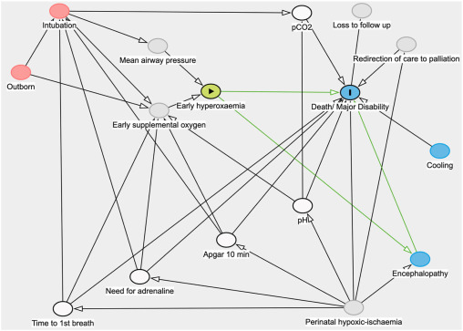

# Causal diagrams for this research study

## Context: Reasons for doing a caesarean

A key thing to know is what causes need for caesarean - and whether those are also things that cause HIE (similar to hypoxia).

Panda et al. 2018 - Clinicians’ views of factors influencing decision-making for caesarean section: A systematic review and metasynthesis of qualitative, quantitative and mixed methods studies - https://doi.org/10.1371%2Fjournal.pone.0200941 - some of the mentioned reasons across the world...
* Perceived risk of CS v.s. vaginal birth - e.g. concerns related to risk of urinary and fecal incontinence and pelvic floor collapse following vaginal births
* Perceived safety of CS - e.g. believing CS could reduce risks of and prevent complications for women living in isolated areas
* Women requesting CS (which itself is influenced by socio-cultural perspectives, women’s preferences, demands, obstetricians’ beliefs in women’s right and autonomy to choose a CS, and their perception of women’s anxiety and fear)
* Clinical reasons -
  * previous CS
  * risk of anorectal trauma
  * preventing perineal injury, urinary and anal incontinence
  * maternal age
  * obesity
  * previous birth complications
  * risk of pelvic prolapse
  * uterine rupture
  * medical conditions like mypoia and previous abortions
  * breech presentation
  * previous classical CS
  * fetal distress
  * malpresentation
  * dystocia
  * placenta previa
  * umbilical cord collapse
* Fear of litigation / medico-legal problems
* Lack of resources (e.g. not enough experienced clinicians to facilitate natural birth, availability of personal for emergency CS, availability of anaesthesia, access to basic infrastructure, access to emergency care facilities)
* Type of health care coverage (private/public)
* Hospital policies
* Clinician characteristics - personal convenience, clinician demographics, confidence and skills

## Research question

(1) Should we have done a caesarean? If we had done one, or if we had done one earlier, would it have prevented HIE?

(2) Should we have done that caesarean? Did doing the caesarean cause harm when infant was otherwise alright?

As I understand it, (1) is more the focus - the relationship of caesarean and HIE - rather than the relationship between caesarean and any outcome.

In that case, our DAG starts with:

````{mermaid}
  flowchart LR;

    A("Treatment (A)<br><b>Caesarean</b>"):::white;
    Y("Outcome (Y)<br><b>Hypoxic ischaemic<br>encephalopathy (HIE)</b>"):::white;

    A -->|?| Y;

    classDef white fill:#FFFFFF, stroke:#FFFFFF;
    classDef black fill:#FFFFFF, stroke:#000000;
    classDef empty width:0px,height:0px;
````

## DAGs

### Attempt 1

**Research question**: Should we have done a caesarean or not - did it prevent HIE, or would it have prevented HIE.

**Treatment (A)**: Caesarean

**Outcome (Y)**: Hypoxic ischaemic encephalopathy

**Unmeasured confounder (U)**: Hypoxia

**Confounders (L)**:
* Abnormal fetal heart rate (FHR) - since its an indicator of hypoxia - it causes our decision to do caesarean, and means that HIE is more likely.
* Sentinal events - since they cause hypoxia and can also cause decision to do a caesarean

**Moderator**: Timing of caesarean (as how soon notice abnormal FHR and how quickly decide to do caesarean (not just whether they do it) influences the likelihood of HIE).

It is time-varying, but I don't think there is treatment-confounder feedback, as the decision to do a caeasarean ends this (since you don't have caesarean, then see impact on FHR, and then do another caesarean).

````{mermaid}
  flowchart LR;

    L_sen("Confounder (L)<br><b>Sentinal event</b>"):::white;
    L_fhr("Confounder (L)<br><b>Abnormal FHR</b>"):::white;
    U("Unmeasured confounder (U)<br><b>Hypoxia/Asphyxia</b>"):::white;
    A("Treatment (A)<br><b>Caesarean</b>"):::important;
    Y("Outcome (Y)<br><b>Hypoxic ischaemic<br>encephalopathy (HIE)</b>"):::important;
    Empty[ ]:::empty;
    Mod("Moderator<br><b>Timing of caesarean</b>"):::white;
    
    L_sen --> U; L_sen --> A;
    Mod --> Empty;
    A --- Empty; Empty -->|?| Y;
    U --> L_fhr; L_fhr --> A; U --> Y;
  
    classDef white fill:#FFFFFF, stroke:#FFFFFF;
    classDef black fill:#FFFFFF, stroke:#000000;
    classDef empty width:0px,height:0px;
    classDef important fill:#DDF2D1, stroke: #FFFFFF;
````

### Attempt 2

Another representation with diagnostic error in HIE...

````{mermaid}
  flowchart LR;

    L_sen("Confounder (L)<br><b>Sentinal event</b>"):::white;
    L_fhr("Confounder (L)<br><b>Abnormal FHR</b>"):::white;
    U("Unmeasured confounder (U)<br><b>Hypoxia/Asphyxia</b>"):::white;
    A("Treatment (A)<br><b>Caesarean</b>"):::important;
    Y("Outcome (Y)<br><b>Hypoxic ischaemic<br>encephalopathy (HIE)</b>"):::important;
    Empty[ ]:::empty;
    Mod("Moderator<br><b>Timing of caesarean</b>"):::white;
    Y*("Y* Mismeasurement of HIE"):::white;
    Yerr("Measurement error in HIE"):::white;
    
    L_sen --> U; L_sen --> A;
    Mod --> Empty;
    A --- Empty; Empty -->|?| Y;
    U --> L_fhr; L_fhr --> A; U --> Y;
    Y --> Y*;
    Yerr --> Y*;
  
    classDef white fill:#FFFFFF, stroke:#FFFFFF;
    classDef black fill:#FFFFFF, stroke:#000000;
    classDef empty width:0px,height:0px;
    classDef important fill:#DDF2D1, stroke: #FFFFFF;
````

### Attempt 3

Another representation - instead of a moderator - of the time-varying treatment...

````{mermaid}
  flowchart LR;

    AK("A<sub>K</sub><br><b>Caesarean</b>"):::white;
    AK1("A<sub>K+1</sub><br><b>Caesarean</b>"):::white;

    YK1("Y<sub>K+1</sub><br><b>Hypoxic ischaemic<br>encephalopathy (HIE)</b>"):::white;
    YK2("Y<sub>K+2</sub><br><b>Hypoxic ischaemic<br>encephalopathy (HIE)</b>"):::white;
    U("U<br><b>Hypoxia/Asphyxia</b>"):::white;
    LK("Confounder (L<sub>K</sub>)<br>Abnormal FHR"):::white;
    LK1("Confounder (L<sub>K+1</sub>)<br>Abnormal FHR"):::white;

    AK --> YK1;
    LK --> AK;
    U --> LK;
    U --> YK1;
    U --> LK1;
    LK1 --> AK1;
    AK1 --> YK2;
    U --> YK2;


    classDef white fill:#FFFFFF, stroke:#FFFFFF;
    classDef black fill:#FFFFFF, stroke:#000000;
    classDef empty width:0px,height:0px;
````

### Attempt 4

A representation including cooling and later outcomes (don't think need all this...)...

````{mermaid}
  flowchart LR;

    A("Caesarean"):::white;
    Y("HIE at birth"):::white;
    U("Hypoxia/Asphyxia"):::white;
    L("Abnormal FHR"):::white;
    Cool("Cooling"):::white;
    Ylater("HIE a bit later"):::white;
    Dis("Morbidity and mortality"):::white;

    A -->|?| Y;
    U --> L;
    L --> A;
    U --> Y;
    Y --> Cool;
    Cool --> Ylater;
    Ylater --> Dis;


    classDef white fill:#FFFFFF, stroke:#FFFFFF;
    classDef black fill:#FFFFFF, stroke:#000000;
    classDef empty width:0px,height:0px;
````

## External examples that involve HIE

### Example: Leith et al. 2023

Leith et al. 2023 - A predictive model for perinatal hypoxic ischemic encephalopathy using linked maternal and neonatal hospital data - http://dx.doi.org/10.1016/j.annepidem.2023.11.011.

Focus: Predicting HIE

Due to the large number of factors in the final model, to make the graph easier to read we have combined similar factors into groups as follows:
* Maternal characteristics: age, race, payer, metropolitan residence, history of stillbirth, tobacco use.
* Chronic conditions: diabetes, hypertension, total number of chronic conditions.
* Antepartum complications: decreased fetal movement, polyhydramnios, amniotic fluid infection, intrauterine acidosis, cord compression, placental infarct.
* Intrapartum complications: septicemia, hypertonic contractions, uterine inertia, prolonged 2nd stage.
* Presentation: malpresentation, breech delivery, shoulder dystocia.
* Emergency: sentinel event, fetal heart rate abnormalities.

This DAG was created using DAGitty.


### Example: Badurdeen et al. 2024

Badurdeen et al. 2024 - Early Hyperoxemia and 2-year Outcomes in Infants with Hypoxic-ischemic Encephalopathy: A Secondary Analysis of the Infant Cooling Evaluation Trial - https://doi.org/10.1016/j.jpeds.2024.113902

Focus: Causal relationship between exposure to early hyperoxemia (following resus) and death or major disability in infants with hypoxic ischaemic encephalopathy

Context: Hyperoxemia is an increase in arterial oxygen partial pressure to more than 120mmHg. The exposure of interest with hyperoxemic exposure following resuscitation.



## Example of complicated relationships in obstetrics in context of treatment paradox

Pre-eclampsia is hypothesised to cause cerebral palsy. It is also associated with higher risk of medically indicated (ordered by the physician) pre-term birth - and pre-term birth is also associated with higher risk of cerebral palsy.

You could adjust for pre-term birth or gestational age like a confounding variable. However, pre-term birth is a intermediate between pre-eclampsia and cerebral palsy, and not a common cause of both. Therefore, this adjustment (overadjustment) takes away from the detrimental effect of pre-elcampsia, mediated through pre-term birth - attenuating the effect or event reversing it.

In an early study, pre-eclampsia was found to be protective in pre-term infants and detrimental for those born later. However, we expect pre-eclampsia to be detrimental for all infants. This finding could be as the analysis seperated out pre-term births and later births, closing the causal path between pre-eclampsia and cerebral palsy via pre-term birth.[[Williams et al. 2018]](https://doi.org/10.1038/s41390-018-0071-3)


````{mermaid}
  flowchart LR;

    %% Define the nodes and subgraphs
    eclam("Pre-eclampsia")
    preterm("Preterm birth")
    cp("Cerebral palsy")

    %% Produce the figure
    eclam --> preterm;
    preterm --> cp;
    eclam --> cp;
````

However, it's likely more complex. In a more realistic directed acyclic graph (DAG) below, chorioamnionitis is added. It is another cause of pre-term birth and cerebral palsy.

Gestational age, as a shared effect of pre-eclampsia and chorioamnionitis, acts as a **collider**. This is the opposite of a confounder (where a common cause of exposure and outcome is not controlled for) - instead, a collider is when the exposure and outcome (or factors causing) each influence a common third variable, and that variable is controlled for in the design. Controlling for a collider can result in a distorted association betwene the exposure and outcome, when actually none exists.

In this model, if we look in a group of pre-term infants:
* Babies born to mothers with pre-eclampsia will be less likely to have chorioamnionitis and vice versa
* The effect of pre-eclampsia will be compared with the effect of chorioamnionitis on cerebral palsy, and will falsy appear to be protective - the estimated direct causal effect of pre-eclampsia on the outcome will be biased (through the effect of chorioamnionitis)

Hence, although widely used, conditioning on gestational at birth in studies of prenatal exposures and their relationship to postnatal outcomes may not reduce but actually lead to bias through overadjustment and faulty comparisons, and generate counterintuitive results and apparent changes of effect in different groups of patients.[[Williams et al. 2018]](https://doi.org/10.1038/s41390-018-0071-3)

````{mermaid}
  flowchart LR;

    %% Define the nodes and subgraphs
    chor("Chorioamnionitis")
    eclam("Pre-eclampsia")
    preterm("Preterm birth")
    cp("Cerebral palsy")

    %% Produce the figure
    chor --> preterm;
    eclam --> preterm;
    chor --> cp;
    preterm --> cp;
    eclam --> cp;
````