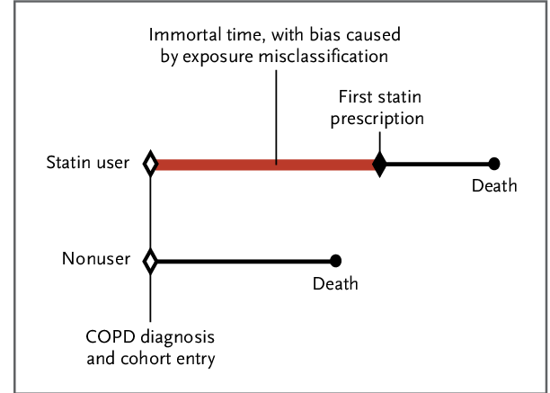

# Target trial emulation

## Introduction

'**Target trial emulation** is a **framework** for designing and analysing observational studies that aim to estimate the causal effect of interventions. For each causal question on an intervention, one can imagine the randomized trial (the “target trial”) that could have been conducted to answer that question. This target trial should be explicitly specified in a target trial protocol'. This then informs design of the observational study. [[Fu 2023]](https://doi.org/10.1681/ASN.0000000000000152)

Target trial emulation is recommended as the standard approach for causal observational studies that investigate interventions. Reasons for this include...

### Bias

It **improves the quality of these observational studies by preventing avoidable biases**. ' Although many practitioners worry about confounding in observational studies, the effect of these “self-inflicted” biases is often much more severe.' [[Fu 2023]](https://doi.org/10.1681/ASN.0000000000000152)

Examples:
* **Immortal time bias (ITB)** - 'occurs when there is variation in timing of treatment initiation from cohort entry and time-to-treatment is misclassified or ignored', meaning that a cohort is followed during times in which outcomes cannot occur. [[Agarwal et al. 2018]](https://doi.org/10.1177%2F1073274818789355) 

    Example from [Egom 2014](http://dx.doi.org/10.1056/NEJMc1408400#SA1):

* **Lead time bias** - 'when a disease is detected by a screening or surveillance test at an earlier time point than it would have been if it had been diagnosed by its clinical appearance' [[Rollinson and Sabel 2007]](https://doi.org/10.1016/B978-0-8151-4385-7.50009-6)

    Example by [Mcstrother - Own work, CC BY 3.0](https://commons.wikimedia.org/w/index.php?curid=15703636):

* **Selection bias** - 'occurs when individuals or groups in a study differ systematically from the population of interest leading to a systematic error in an association or outcome' [[Catalogue of Bias Collaboration]](https://catalogofbias.org/biases/selection-bias/)

A recent review of observational studies found that:
* 57% of observational studies suffer from immortal time bias
* 44% suffer from depletion of susceptibles/prevalent user selection bias.' [[Fu 2023]](https://doi.org/10.1681/ASN.0000000000000152)

### Relevant causal questions

Target trial emulation 'forces investigators to ask causal questions about interventions, leading to findings that are directly useful in decision-making'.

Example: *'Many observational studies have investigated the causal effect of BMI on outcomes. BMI is not an intervention; patients cannot be randomized to have a certain BMI—a certain BMI can only be achieved through a particular intervention, such as diet, physical exercise, bariatric surgery, or medications (e.g., semaglutide or tirzepatide). These observational studies thus lose the vital information on how a patient attained a different BMI level. Each of the interventions may lower BMI by the same amount but may have completely different causal effects on the outcome. Therefore, the association between BMI and outcomes becomes an amalgamation of each of these interventions, which makes the association difficult to interpret.'* [[Fu 2023]](https://doi.org/10.1681/ASN.0000000000000152)

## How to design your target trial protocol

## How to use this to inform your observational study

'To ensure that the target trial protocol properly emulates the design of a randomized trial, it is a key to align the following three components **at time zero** (often also referred to as baseline) in the observational study:
1. Eligibility criteria are met, that is, all included patients meet the specified inclusion and exclusion criteria.
2. Treatment strategies are assigned.
3. Follow-up is started, that is, we start counting outcomes.

Note that these three components are naturally aligned in randomized trials at the moment of randomization.' [[Fu 2023]](https://doi.org/10.1681/ASN.0000000000000152)