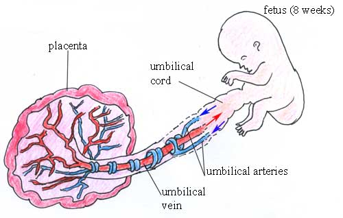
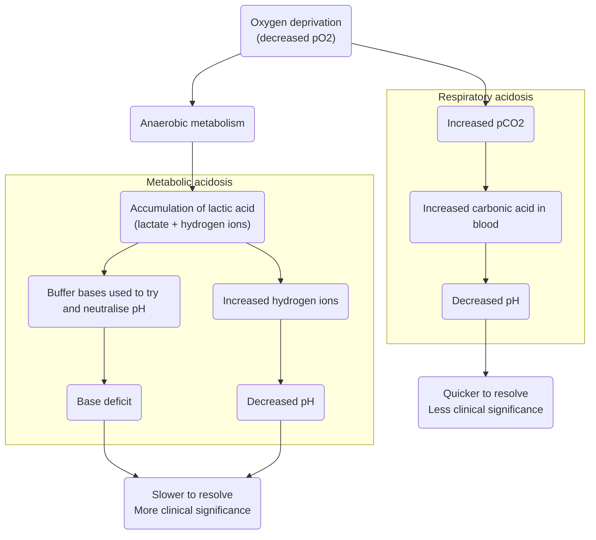

# Umbilical cord blood gas analysis

## When is umbilical cord blood gas analysed?

'Umbilical cord blood gas analysis is recommended by NICE **whenever there has been a concern** about the baby either in labour or immediately following birth.'[[source]]((https://www.nnuh.nhs.uk/publication/download/babies-with-severe-umbilical-artery-acidosis-cord-arterial-ph-7-1-jcg0322-v3/))

Examples of when NHS Milton Keynes guidelines suggest cord blood must be taken are:
* All emergency caesarean sections and instrumental births
* Delivery for presumed ‘ fetal distress’
* Shoulder dystocia
* If fetal blood sampling has been performed during labour
* Following birth if the baby’s condition is poor (low apgars = to / less than 7)
* Significant meconium stained liquor present
* APH/Abruption
* Preterm birth
* Multiple pregnancy
* Pyrexia in labour[[source]](https://www.mkuh.nhs.uk/wp-content/uploads/2018/10/4257-Cord-Blood-Analysis-Guideline.pdf)

## How is it collected?

Blood can be collected from the:
* **Umbilical artery** - 
    * Gives **more accurate** information about fetal metabolic condition and correlates better with neonatal outcomes - since blood rich in carbon dioxide eliminated by the fetus returns to the placental circulation through the umbilical arteries
* **Umbilical vein** -
    * Easier to sample due to large diameter
    * Less accurate as mainly reflects placental metabolism rather than fetal metabolism - as the umbilical vein carries oxygenated blood to the fetus from the placenta.
    * During umbilical cord compression, the venous flow will compress more than the arterial flow (as veins are more compressible than arteries). The fetus will respond by extracting more oxygen, hence eliminating more CO2 through the umbilical artieries, but the umbilical venous acid-base status will reamin equilibriated by the normally functioning placenta [[source]](https://www.ncbi.nlm.nih.gov/books/NBK545290/)

Due to these differences, it is important to take **paired** arterial and venous cord blood samples. If only a single sample is taken, there is no way of knowing if it is arterial or venous.[[source]]((https://www.nnuh.nhs.uk/publication/download/babies-with-severe-umbilical-artery-acidosis-cord-arterial-ph-7-1-jcg0322-v3/))

It is also important to note the **timing** of the samples:
* Clamped umbilical cord (isolated) will have reliable pH, pO2 and pCO2 up to 60 minutes after bith
* Unclamped (remianing in continuity with the placenta) will be unreliable as early as 20 minutes after delivery since ongoing placental metabolism will obscure the measurements
* Lactate levels obtained more than 20 minutes after birth will be unreliable regardless of whether they are from a clamped or unclamped cord.[[source]](((https://www.nnuh.nhs.uk/publication/download/babies-with-severe-umbilical-artery-acidosis-cord-arterial-ph-7-1-jcg0322-v3/)))

NHS Milton Keynes Guidelines state that the samples should be taken from a **double clamped** segment of cord so it's isolated from the placenta.[[source]](https://www.mkuh.nhs.uk/wp-content/uploads/2018/10/4257-Cord-Blood-Analysis-Guideline.pdf)



Diagram of the fetus, placenta and umbilical blood vessels[[source]](https://socratic.org/questions/what-type-of-blood-do-each-of-the-umbilical-blood-vessels-carry)

## What blood gases are analysed and why?

**Acidemia** is when there is a low blood pH, which occurs due to an increase in the hydrogen ion H<sup>+</sup> concentration. There are three types of acidemia: metabolic, respiratory and mixed.

**Metabolic acidosis**: During oxygen (O<sub>2</sub>) deprivation:
* The fetus will switch from aerobic metabolism (relies on oxygen) to anaerobic metabolism (does not use oxygen)
* This will result in the accumulation of lactic acid (which is a combination of lactate and H<sup>+</sup>), which leads to metabolic acidosis
* Buffer bases (primarily bicarbonate) are used to try and neutralise the lactice acid. If buffer bases are depleted, this can lead to metabolic acidemia
* Note: metabolic acidosis can refer to process that lowers the pH, whilst acidemia describes the state of having a low blood pH
* Hence, during metabolic acidosis, we see **decreased pH, low pO<sub>2</sub>, and increased base deficit**[[source]](https://admin.learningstream.com/files/DA1537B2-387C-452A-890E-A227518D8EB6_9/94228/5FetalAcidbase.pdf)

Fetal **respiratory acidosis** is a relatively common transitory state that resolves soon after birth when the baby starts to breathe and is of little clinical significance.[[source]](https://acutecaretesting.org/en/articles/umbilical-cord-blood-gas-analysis) It occurs when the fetus takes in less oxygen during hypoxia, and so more CO<sub>2</sub> builds up in the blood, which increases the level of carbonic acid (H<sub>2</sub>CO<sub>3</sub>), decreasing the pH.

**Mixed acidosis** is when it is caused by metabolic and respiratory factors. The initial cause of acidosis will often by respiratory, but without improvement in oxygenation, the fetus will resort to anaerobic metabolism, leading to metabolic acidosis.[[source]](https://www.nationalbirthinjurylaw.com/fetal-acidosis) 

Metabolic acidosis reflects tissue oxygen debt and therefore is of greater prognostic significance than respiratory acidosis.[[source]](https://www.ncbi.nlm.nih.gov/pmc/articles/PMC3952302/) It is therefore important to **distinguish** between metabolic and respiratory acidosis.
* Metabolised acidosis is characterised by reduced pH, decreased base excess (i.e. increased base deficit), and elevated pCO<sub>2</sub>
* Respiratory acidosis is characterise by reduced pH, but normal PCO<sub>2</sub> and base excess
* Mixed acidosis is characterises by low pH, increased PCO<sub>2</sub>, but normal base excess[[source]](https://admin.learningstream.com/files/DA1537B2-387C-452A-890E-A227518D8EB6_9/94228/5FetalAcidbase.pdf)

Infants with intrauterine growth retardation (IUGR)/growth-restricted infants are at increased risk of metabolic acidosis than normal growth (AGA) infants.[[source]](https://doi.org/10.1016/0002-9378(80)90695-X)



## What are the accepted thresholds for these blood gases?

Some degree of acidemia will always develop during labour, and it is normal to see some decrease in arterial and venous pH and bicarbonate and increase in base deficit.

According to NHS trust guidelines[source [1] and [2]], the normal blood gas values for a neonate born at term are:
| Location | pH | Base excess (mmol/L) | pO<sub>2</sub> (mm Hg) | pCO<sub>2</sub> (mm Hg) |
| --- | --- | --- | --- | --- |
| Umbilical artery | 7.10-7.38 | -9.0 to 1.8 | 4.1 to 31.7 | 39.1 to 73.5 |
| Umbilical vein | 7.20-7.44 | -7.7 to 1.9 | 30.4 to 57.2 | 14.1 to 43.3 |

In NHS guidelines, it doesn't include measurement of lactate.

'The generally accepted cut off value for a **pathological acidosis** (risk of seizures, moderate to severe HIE and cerebral palsy) is **umbilical arterial pH ≤ 7.0**. It is unlikely that acute acidosis with a pH value greater than 7.0 is directly associated with cerebral palsy.'[[source - Joint NHS Trust Guidelines]](https://www.nnuh.nhs.uk/publication/download/babies-with-severe-umbilical-artery-acidosis-cord-arterial-ph-7-1-jcg0322-v3/)

The American College of Obstetricians and Gynecologists suggests using a cord artery pH < 7.00 and base deficit >= 12.0 mmol/L to indicate metabolic acidosis, since this threshold was found to strongly associate with neonatal morbidity and death. However, use of stationary reference cut-off points can be an issue, as base deficit, pH, pCO2 and lactate can vary with **gestational age**.[[source]](https://obgyn.onlinelibrary.wiley.com/doi/pdfdirect/10.3109/00016349.2010.513426)

## Association with neonatal outcomes

In a systematic review and meta-analysis of 51 studies, low arterial cord pH was significantly associated with:
* Neonatal mortality (OR 16.9, 95% CI 9.7-29.5, I<sup>2</sub>=0%)
* Hypoxic ischaemic encephalopathy (OR 13.8, 95% CI 6.6-28.9, I<sup>2</sub>=0%)
* Intraventricular haemorrhage or periventricular leucomalacia (OR 2.9, 95% CI 2.1-4.1, I<sup>2</sub>=0%)
* Cerebral palsy (OR 2.3, 95% CI 1.3-4.2, I<sup>2</sub>=0%).[[source]](https://doi.org/10.1136%2Fbmj.c1471)

Although this is helpful to understand, ultimately we are interested in using pH for **prognosis**, and that is not the focus of that review.

'The American College of Obstetricians & Gynecologists (ACOG) and The American Academy of Pediatrics have also jointly set up the four essential criteria for establishing a causal link between intrapartum hypoxic events and cerebral palsy and included:
* Significantly low cord arterial pH (<7)
* Early onset of moderate or severe HIE in infants born at 34 weeks of gestation or more
* Cerebral palsy of the spastic quadriplegic or dyskinetic type
* Exclusion of other identifiable etiologies.'[[source]](https://doi.org/10.1111/aogs.14494)

These criteria were derived through consensus though, since existing observal studies can have inconsistent results, partly as a result of the different thresholds used to define abnormality, the variety of outcomes evaluated, and the different variables measured (arterial cord pH, venous cord pH, or base excess) - and it has been suggested that neonatal complications are associated with metabolic acidosis rather than respiratory acidosis.[[source]]( https://www.bmj.com/content/340/bmj.c1471)

**Neonates who just have low pH:** 'Interestingly, a pH as low as 7.00 is usually tolerated by the fetus without any adverse outcome. Most infants with a cord pH less than 7.00 do not develop neurologic problems after birth, nor even when followed for 6.5 years. An isolated respiratory acidosis is very rarely associated with poor outcomes. Thus, infants born with a pH less than 7.00 and without other abnormal clinical findings typically do not require any further investigation or NICU admission.'[[source]](https://www.ncbi.nlm.nih.gov/books/NBK545290/)

**Neonates with low pH, high base deficit, and other concerning indicators:** 'When a pH less than 7.00 and/or a base deficit of more than 12 mmol/L are associated with other abnormal findings such as abnormal fetal heart tracings, 5-minutes Apgar scores equal to or less than 5, a requirement for intubation, they become strong predictors of poor neurological sequelae. Eighty percent of these newborns with clinical indicators of acidemia with a low pH develop seizures in the first few days after birth. Previous studies have shown that cord pH less than 7.00 is proportional to the risk and the severity of neurologic abnormalities. Furthermore, 80% of infants born with a cord pH less than 6.70 develop symptoms and signs of neonatal encephalopathy.'[[source]](https://www.ncbi.nlm.nih.gov/books/NBK545290/)

## Suitability as a model outcome

Pros:
* The combination of pH, base deficit and other concerning outcomes can be a strong predictor of adverse neonatal outcomes.

Cons:
* Although pH has a strongly relationship with neonatal outcomes, using it for prognosis as a single indicator, pH alone is a poor marker of adverse neonatal outcomes
* Inconsistently recorded - won't measure it if expect things to be fine
* Inconsistently measured - anecdotally, it can be often measured from just artery or vein and not both - although guidelines state it should be a paired sample

## Conclusion

`````{admonition} Potentially suitable
:class: warning

Maybe - but not pH alone - would need a combination of pH and base deficit (to identify metabolic acidosis), and to combine it with other markers (e.g. Apgar, intubation) - and would need to know the source of the blood gas analysis (arterial/venous) - and design would need to consider that these are only measured when there were concerns during labour or birth.
`````
