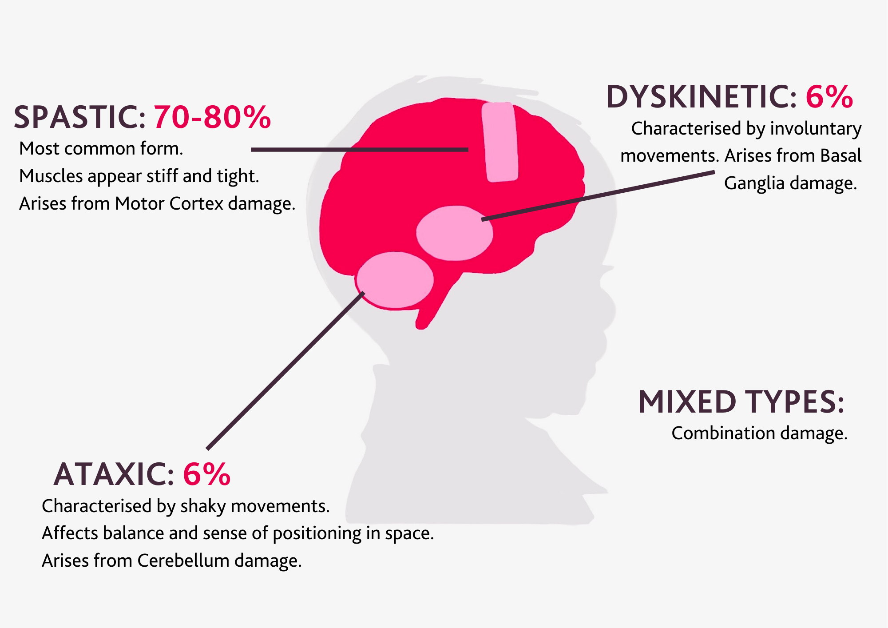

# Cerebral palsy

'Cerebral palsy (CP) is a neurologic disability affecting body movement, muscle tone, and posture'. It 'is caused by damage or developmental defects to the areas of the brain that control the movement of the body and coordination.'[[source]](https://www.birthinjuryhelpcenter.org/cerebral-palsy.html)

## Types

There are four types:
* **Spastic CP** - most common, due to cerebral cortex damage
* **Dyskinetic CP** (i.e. athetoid CP) - due to basal ganglia damage
* **Ataxic CP** - due to cerebelum damage
* **Mixed CP** - due to multiple areas of the brain being injury[[source]](https://www.cerebralpalsycymru.org/about-cerebral-palsy/what-is-cerebral-palsy/types-of-cerebral-palsy)



[[source]](https://www.cerebralpalsycymru.org/about-cerebral-palsy/what-is-cerebral-palsy/types-of-cerebral-palsy)

## Causes

'The abnormal development of the brain or damage that leads to CP can happen before birth, during birth, within a month after birth, or during the first years of a child’s life, while the brain is still developing.' It can be classified as:
* **Congenital CP** - if related to development/damage 'that occurred **before or during birth**' - this is the majority (85-90%)
* **Acquired CP** - if related to development/damage that occurred 'more than 28 days after birth' - usually 'an infection (e.g. meningitis) or head injury'[[source]](https://www.cdc.gov/ncbddd/cp/facts.html)

'Cerebral palsy is usually caused by a problem that affects the development of a baby's brain while it's growing in the womb. These include:
* Damage to part of the brain called white matter, possibly as a result of a reduced blood or oxygen supply – this is known as **periventricular leukomalacia** (PVL)[[source]](https://www.nhs.uk/conditions/cerebral-palsy/causes/)
* **Infections** - infections during pregnancy, labour and delivery, including viral infections (eg. rubella, cytomegalovirus) and parasitic infections (eg. toxoplasmosis) - as well as 'infections of the placental membranes and amniotic fluids (chorioamnionitis)'[sources [1](https://www.nhs.uk/conditions/cerebral-palsy/causes/) and [2](https://www.birthinjuryhelpcenter.org/cerebral-palsy.html)]
* A **stroke** – where there's bleeding in the baby's brain or the blood supply to their brain is cut off
* An **injury** to the unborn baby's head'[[source]](https://www.nhs.uk/conditions/cerebral-palsy/causes/)
* **Oxygen deprivation (asphyxia)** - a 'wide range of obstetrical complications and events during pregnancy can threaten the supply of oxygen to the baby's brain'[[source]](https://www.birthinjuryhelpcenter.org/cerebral-palsy.html)

**Premature babies** 'are 30 times more likely to be diagnosed with cerebral palsy' - this is often because 'premature babies frequently experience brain haemorrhages and periventricular leukomalacia (PVL)', which cause brain damage that can lead to cerebral palsy.[[source]](https://www.birthinjuryhelpcenter.org/cerebral-palsy.html)

Spastic cerebral palsy is associated with '**pre-term** delivery or **prolonged moderate-intensity hypoxic events** resulting in periventricular leukomalacia and diffuse white matter injury.' Dyskinetic cerebral palsy is 'associated with basal ganglia and thalamic injuries... usually seen with brief but **profound hypoxic insults**. Patients with dyskinetic CP are more commonly **term** infants versus those with spastic CP'.[[source]](https://www.ncbi.nlm.nih.gov/books/NBK563160/)

'Cerebral palsy is one of the most costly neurologic disabilities because of its frequency (2/1000 births) and persistence over the life span.'[[source]](https://doi.org/10.1016%2Fj.clp.2009.07.011)

## Suitability as a model outcome

Pros:
* It is a diagnosis.

Cons:
* Diagnosis often later in childhood, so unlikely to be in neonatal datasets
* Won't be able to distinguish congenital and acquired CP in the data.
* There are several possible causes - apparently, only around 15% of cases of CP are attributable to intrapartum hypoxia–ischemia[[source]](https://doi.org/10.1016/j.ejogrb.2022.04.021)
* CP is only one of the possible outcomes of fetal hypoxia[[source]](https://doi.org/10.1016/j.ejogrb.2022.04.021)


`````{admonition} Potentially suitable
:class: warning

This would be a concrete outcome - would be important to know type of cerebral palsy and whether it was congenital or acquired - however, we're unlikely to be able to get the data - and there would be many possible causes for the outcome.
`````