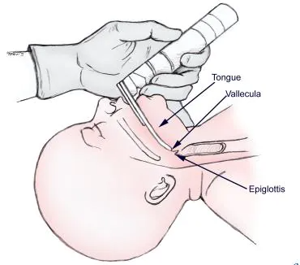

# Intubation

**Intubation**, also known as **tracheal or endotracheal intubation** is the insertion of a breathing tube into the trachea.[[Royal Blank Teaching Hospitals Critical Care Unit Information]](https://elht.nhs.uk/application/files/7016/6721/3334/Critical_Care_Procedures_and_Treatments_document_JULY_2022.pdf)

**Endotracheal suctioning** is a common procedure on intubated infants 'to clear secretions and maintain the airway patency'.[[Royal Children's Hospital Melbourne Nursing Guidelines]](https://www.rch.org.au/rchcpg/hospital_clinical_guideline_index/endotracheal_tube_suction_of_ventilated_neonates/)

Image from [[source]](https://emedicine.medscape.com/article/1413467-overview):



## Intubation for MSAF

In the 1980s and 1990s, 'all infants born through MSAF (both vigorous and non-vigorous) were routinely intubated after delivery', and intervention decisions were 'based on the consistency and thickness of the meconium'.

In 2000, the fourth edition of the Neonatal Resuscitation programme (NRP) guidelines stopped recommending intubation 'for vigorous infants born through MSAF'.

In 2016, the seventh edition of the NRP guidelines stopped recommending 'routine intubation and tracheal suctioning for non-vigorous infants born through MSAF'. This was on the basis of a lack of evidence to support intubation and tracheal suctioning, 'in the context of avoiding the potential harm of intubation and the subsequent delay in initiating the initial steps of neonatal resuscitation'.[[Gupta and Chong Lee 2020]](https://doi.org/10.1542/hpeds.2020-0002)

## Intubation during resuscitation

'Although intubation is an important method of establishing an airway, simpler methods including a correctly applied face mask or laryngeal mask airway. These are sufficient in the majority of infants requiring resuscitation and certainly until senior help arrives in those needing prolonged ventilation.'[[Scottish Clinical Guidelines]](https://www.clinicalguidelines.scot.nhs.uk/nhsggc-guidelines/nhsggc-guidelines/neonatology/neonatal-intubation/) 

We understand that now intubation and suctioning is only used if you are actively resuscitating and unable to move the chest.

'Most infants adapt well to extra-uterine life but some require help with stabilisation, or resuscitation. Up to 85% breathe spontaneously without intervention; a further 10% respond after drying, stimulation and airway opening manoeuvres; approximately 5% receive positive pressure ventilation. **Intubation rates vary between 0.4 and 2%**. Fewer than 0.3% of infants receive chest compressions and only 0.05% receive adrenaline.'[[source]](https://www.resus.org.uk/library/2021-resuscitation-guidelines/newborn-resuscitation-and-support-transition-infants-birth)

## Suitability as a model outcome

Using intubation as an indicator for meconium at delivery would not be a viable outcome as newborns are no longer intubated for this. In historical data, you would see a shift from it being used to not.

Intubation may be performed for other reasons, such as during resuscitation - but in that case, we would look more generally at resuscitation rather than specifically intubation.

`````{admonition} Unsuitable
:class: error

No longer perform for meconium, and resuscitation as a whole would be focus otherwise.
`````