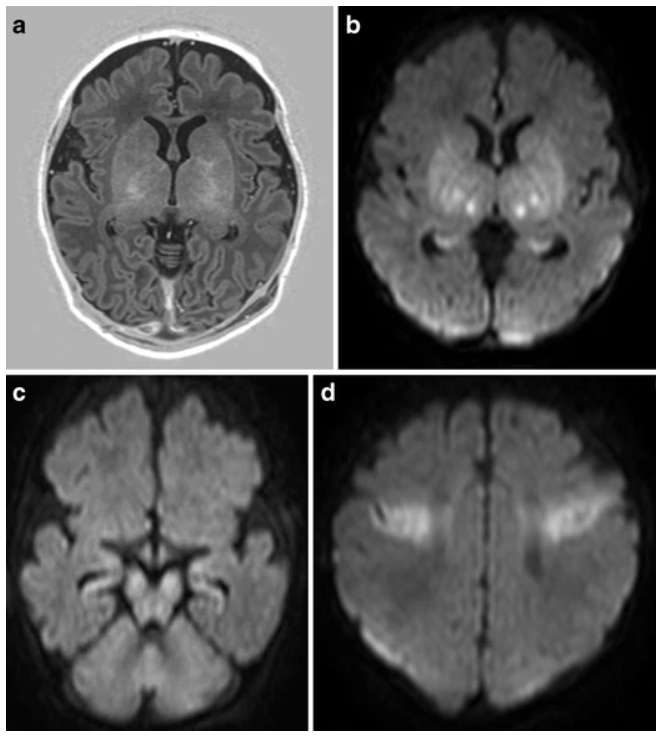

# Neuroimaging evidence

`````{admonition} Executive summary
:class: info

**Outcome:** MRI evidence of brain damage can help detect/diagnose HIE, and basal ganglia damage is associated with more severe asphyxia and outcomes like cerebral palsy.

**Specific to HIE?**
* Not certain whether it distinguishes cause of injury (i.e. HIE different patterns to NE of other causes) - but there are patterns typical of HIE infants, so it does help support the case for HIE in that sense.

**Which infants with HIE?**
* NHS guidelines recommend that all neonates with clinical signs of acquired brain injury or neonatal encephalopathy should undergo neuroimaging

**Any other benefits or caveats not already mentioned?**
* Uncertain on how this would be reported in medical records, and how available / what format this information would be

**Conclusion:** Potentially recommended. Not certain whether this data would be available, and whether it would be in a format we could interpret (i.e. without knowledge of MRI, just notes with conclusions of professional). Would definitely indicate brain injury occurred. Not certain whether it distinguishes cause of injury (i.e. HIE different patterns to NE of other causes) - but there are patterns typical of HIE infants, so it does help support the case for HIE in that sense.
`````

## Neuroimaging recommendations

NHS guidelines recommend that all neonates with clinical signs of acquired brain injury or neonatal encephalopathy should undergo neuroimaging.[[source]](https://www.eoeneonatalpccsicnetwork.nhs.uk/wp-content/uploads/2022/06/IMAGING-THE-ENCEPHALOPATHIC-INFANT.pdf) In terms of imaging, magnetic resonance imaging (MRI) is the preferred imaging technique used 'during the first week after birth to determine the extent of brain injury and predict neurodevelopmental outcome in infants with symptoms of HIE'. 

## Patterns of injury

From NHS guidelines:
* Following moderate or severe HIE, particularly following a documented sentinel event, abnormal signal intensity is most commonly detected in the basal ganglia and thalami, corticospinal tracts, the subcortical white matter, and regional cortex
* Extensive and dominant white matter and cortical injury is suggestive of additional chronic hypoxic ischaemic compromise as may be indicated by fetal growth restriction (FGR) and/or poor fetal movements. It may also complicate symptomatic hypoglycaemia and /or bacterial or viral infection e.g. Parecho virus.
* On MR spectroscopy high lactate (suggestive of tissue hypoxia and ischaemia) and low N-acetyl aspartate (reflects neuronal injury) within the basal ganglia and thalami is often seen.[[source]](https://www.eoeneonatalpccsicnetwork.nhs.uk/wp-content/uploads/2022/06/IMAGING-THE-ENCEPHALOPATHIC-INFANT.pdf)

'The pattern of injury in HIE depends on the severity, duration, and repetitiveness of the hypoxia-ischemia and can lead to involvement of basal ganglia, thalami, brain stem, and/or cerebral white matter in different combinations.'[[Molloy and Bearer 2018]](https://doi.org/10.1038/s41390-018-0169-7) 'The two main patterns of injury can be distinguished with MRI in the full-term neonate':
* **Basal ganglia-thalamus pattern (BGT)**.
    * More severe hypoxia ischamia
    * 'When the baby suffers severe or total hypoxia/asphyxia, the insult is called' **acute near total or acute profound asphyxia**.
    * 'With very severe insults, there will usually be a central pattern of focal neuronal injury (deep gray matter injury) to many levels of the central nervous system, with diffuse and pronounced neuronal necrosis (death of brain cells). When the insult is relatively abrupt and severe, there will be an injury to the deep nuclear brain structures, such as the basal ganglia, thalamus and brainstem.'
    * 'Children with the BGT pattern of injury tend to be severely disabled due to dyskinetic cerebral palsy (CP).'
* **Watershed predominant pattern of injury (WS)**
    * Less severe hypoxia ischaemia
    * This is the other pattern of injury, also referred to as **prolonged partial or partial prolonged asphyxia**
    * This 'usually lasts for more than 30 minutes, mainleading leading to cortical injury in the watershed and parasagittal regions, with relative sparing of damage to the deep gray matter.'

MRI section based on two sources - [[1]](https://doi.org/10.1007%2Fs00234-010-0674-9) and [[2]](https://www.abclawcenters.com/practice-areas/hypoxic-ischemic-encephalopathy-and-brain-imaging/)

CT scans and ultrasounds can also be used but are not as sensitive / specific.[[source]](https://hiehelpcenter.org/medical/identifying-hie/tests-evaluations-screening/)

Example of MRI from full-term infant with MRI pattern suggestive of acute near total asphyxia:



[[de Vries and Groenendaal 2010]](https://link.springer.com/article/10.1007/s00234-010-0674-9)