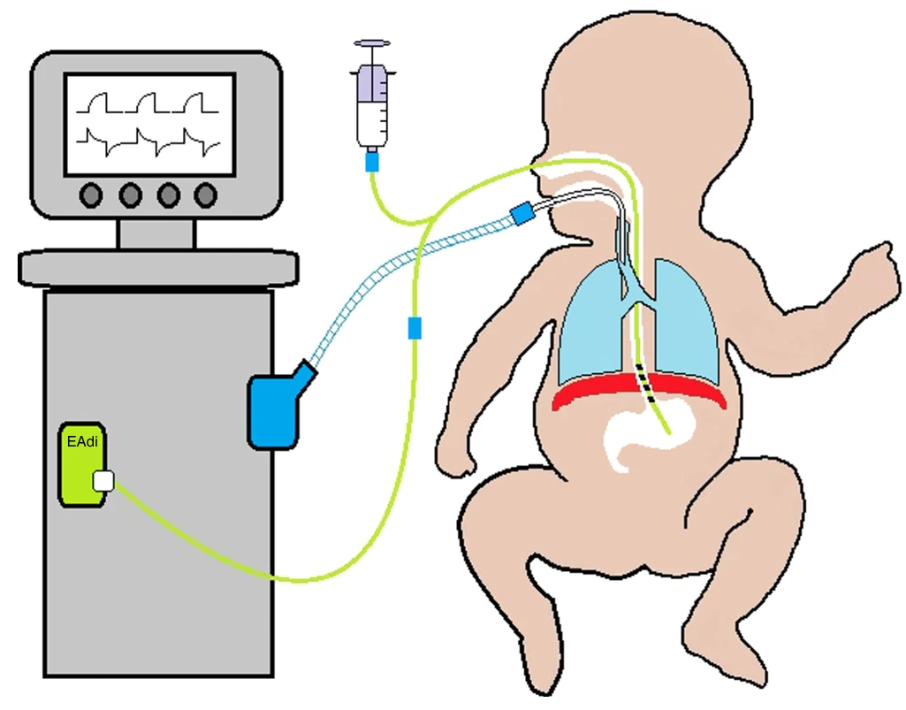

# Mechanical ventilation

`````{admonition} Executive summary
:class: info

**Outcome:** Mechnical ventilation, which is a procedure used for neonates with respiratory failure

**Specific to HIE?**
* No - although hypoxia and treatment with therapeutic hypothermia both increase the risk of needing treatment - there are many other reasons that respiratory failure occurs, such as newborn respiratory distress syndrome which usually affects premature babies

**Which infants with HIE?**
* Estimates vary, but studies of infants receiving therapeutic hypothermia have stimated that apx. 50 to 80% of those infants require mechnical ventilation

**Any other benefits or caveats not already mentioned?**
* NA

**Conclusion:** Potentially recommended. Half to three quarters of infants with HIE will receive mechanical ventilation - although it's important to note that these figures were all from infants who were receiving therapeutic hypothermia, so it wouldn't improve on just knowing infants received therapeutic hypothermia, and doesn't inform us on overall how many infants received it. Moreover, it woun't be the only reason infants are ventilated. Therefore, this indicator might be beneficial in combination with other indicators of HIE - or in absence of, for example, therapeutic hypothermia - but alone, is not reliable.
`````

## Mechanical ventilation

**Mechnical ventilation** is used for neonates with respiratory failure.  It aims to oxygenate the baby and to remove carbon dioxide. It carries risk of injury to the lungs, brain and other systems.[[source]](https://www.nhs.uk/conditions/neonatal-respiratory-distress-syndrome/) 'The basic goal of mechanical ventilation is to restore lung function while limiting ventilator-induced lung injury, which is considered an important risk factor in the development of bronchopulmonary dysplasia (BPD).'[[source]](https://doi.org/10.1038/s41390-019-0704-1)

'Most infants adapt well to extra-uterine life but some require help with stabilisation, or resuscitation. Up to 85% breathe spontaneously without intervention; a further 10% respond after drying, stimulation and airway opening manoeuvres; **approximately 5% receive positive pressure ventilation**. Intubation rates vary between 0.4 and 2%. Fewer than 0.3% of infants receive chest compressions and only 0.05% receive adrenaline.'[[source]](https://www.resus.org.uk/library/2021-resuscitation-guidelines/newborn-resuscitation-and-support-transition-infants-birth)

There are several different methods for mechanical ventilation, with new modalities introduce over the last decades, aiming to provide lung protective ventilation strategies. The range of methods for ventilation include:
* Pressure targeted ventilation (PTV)
* Volume targeted ventilation (VTV)
* Proportional assist ventilation (PAV)
* Neurally adjusted ventilatory assist (NAVA)
* Airwary pressure release ventilation (APRV)
* Mandatory minute ventilation (MMV)
* Variable ventilation (VV) [[source]](https://doi.org/10.1038/s41390-019-0704-1)

Example of diagram for NAVA from van Kaam et al. 2021 [[source]](https://doi.org/10.1038/s41390-019-0704-1)



## How is this linked to HIE?

Both **hypoxia** and treatment with **therapeutic hypothermia** can impact on respiratory functions.
* Perinatal hypoxia is often associated with elevated pulmonary vascular resistance or meconium aspiration syndrome (MAS). In addition, HI injury is typically followed by cerebral reperfusion and excessive oxidative stress.[[source]](https://www.nature.com/articles/s41372-019-0349-2)'Frequently observed symptoms in asphyxiated newborns, such as delayed initiation of spontaneous breathing, respiratory depression, pulmonary hypertension, and seizures often necessitate mechanical ventilation'. Newborns with more severe asphyxia are more likely to need mechnical ventilation.[[source]](https://doi.org/10.3390%2Fchildren8060430)
* Hypothermia causes a decrease in metabolic rate with a parallel reduction in oxygen (O2) consumption and carbon dioxide (CO2) production [[source]](https://www.nature.com/articles/s41372-019-0349-2)

Needing mechanical ventilation and/or ongoing resuscitation is part of the criteria used for therapeutic hypothermia.[[Mosalli 2012]](https://doi.org/10.4103/2249-4847.96777)

## Statistics

Proportion of infants with HIE who receive mechanical ventilation, these are all from during therapeutic hypothermia treatment:
* In a study of cohorts of babies receiving therapeutic hypothermia, **73.4 to 83.1%** had received mechanical ventilation on day of admission.[[Gale et al. 2021]](https://doi.org/10.1016/S2352-4642(21)00026-2)
* 'Approximately **50–70%** of asphyxiated infants without pulmonary disease have been reported to require mechanical ventilation during therapeutic hypothermia due to the poor respiratory drive, altered level of consciousness, or seizure burden secondary to encephalopathy'
* 'Data from the Vermont Oxford Network Neonatal Encephalopathy Registry 2006–2010 showed that **64%** of eligible infants received mechanical ventilation'
* 'While in some centers all infants are intubated and sedated through the course of hypothermia, centers that expanded their cooling protocol to include mild encephalopathy have reported only **30%** of babies receiving hypothermia needed mechanical ventilation'[[Szakmar et al. 2019]](https://doi.org/10.1038/s41372-019-0349-2)

## What other reasons are there for ventilation?

There are many reasons for ventilation, but something that commonly comes up is **newborn respiratory distress syndrome (NRDS)**. This is 'when a baby's lungs are not fully developed and cannot provide enough oxygen, causing breathing difficulties. It usually affects premature babies.' 'Around half of all babies born between 28 and 32 weeks of pregnancy develop NRDS. In recent years the number of premature babies born with NRDS has been reduced with the use of steroid injections, which can be given to mothers during premature labour.' Regarding treatment after birth, this may just be extra oxygen for mild symptoms via an incubator (small mask over nose/face or tubes into nose), but if symptoms are more severe, this can be mechnical ventilation which supports or takes over their breathing.[[source]](https://www.nhs.uk/conditions/neonatal-respiratory-distress-syndrome/)

## Other considerations

Anecdotally Harriet found there **wasn't much variation between true sites**, implying it's a true marker of a sick baby rather than something that varies alot with clinician practice.