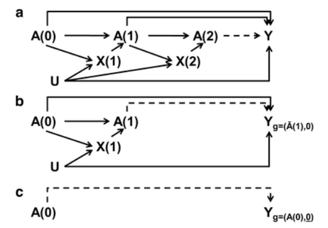

# Methods #3: G-methods

`````{admonition} Executive summary
:class: info

G-methods address intermediate confounding, i.e. treatment-confounder feedback.

**G-computation** - also known as parametric G-formula, G-standardisation, standardisation or outcome regression
* Predict outcomes in counterfactual populations that **assume all had treatment or not**, and compare

**Marginal structural models (MSM) with weights estimated using inverse probability of treatment weighting** - also known as inverse probability of treatment weighting with time-varying covariates
* Weight observations using IPTW, then use weights when estimate association between treatment and outcome (and this type of weighted model where you control for time-dependent confounding is a marginal structural model)

**G-estimation of structural nested models (SNM)**
* Work back in time, predicting counterfactual outcome (with parameters estimated using G-estimation) at each time point, given no exposure from that time point onwards, controlling for treatment and confounders prior to that point

`````

## G-methods

*The "G" stands for "generalised"*

G-methods are a family of methods that **address intermediate confounding, i.e. treatment-confounder feedback**, which is when a confounder is affected by prior exposure status. They do so by taking the by 'taking the observed distribution of intermediate confounders (in the population as well as over time) into account, instead of holding them constant; in other words, they estimate **marginal effects rather than conditional effects**'. [[Igelström et al. 2022]](https://doi.org/10.1136/jech-2022-219267) They were developed by James Robins. [[source]](https://stats.stackexchange.com/questions/612029/what-is-the-difference-between-the-g-formula-g-estmation-g-computation-and-g-m)

## G-computation

### Terminology

Names for this method:
* **G-computation**
* **Parametric G-formula**
* **G-standardisation**
* **Standardisation** [[Vansteelandt and Keiding 2011]](https://doi.org/10.1093/aje/kwq474)
* **Outcome regression** [[source]](http://www.statslab.cam.ac.uk/~qz280/talk/ssrmp-2020/slides.pdf)

There has been some debate around terminology. As quoted from [Vansteelandt and Keiding 2011](https://doi.org/10.1093/aje/kwq474):
> *'The term standardization is revealing and rather well-known to epidemiologists and therefore, in our opinion, is the terminology of choice. The term G-computation has so far been mostly reserved to refer to standardization of the effects of time-varying exposures; potentially the term “G-standardization” as nomenclature for “standardization with respect to generalized exposure regimens” would have been more enlightening. Despite the essential equivalence of G-computation for point exposures and standardization with the total population as the reference, we believe that the developments from the causal inference literature add to the literature on standardization. They give a precise meaning to standardized effect measures in terms of counterfactuals, provide insight into the delicate differences between conditional and marginal epidemiologic effect measures, and suggest novel standardization techniques that combine precision with robustness against model misspecification and extrapolation.'*

### About the method

G-computation involves using a statistical model (e.g. predict) to predict **potential** outcomes (counterfactuals - with and without exposure).[[Igelström et al. 2022]](https://doi.org/10.1136/jech-2022-219267) 

````{mermaid}
  flowchart LR;

    X("Binary treatment (X)"):::white;
    Y("Outcome (Y)"):::white;
    W("Confounder (W)"):::white;

    X --> Y;
    W --> X;
    W --> Y;
  
    classDef white fill:#FFFFFF, stroke:#FFFFFF;
    classDef black fill:#FFFFFF, stroke:#000000;
    classDef empty width:0px,height:0px;
    classDef green fill:#DDF2D1, stroke: #FFFFFF;
````

Key steps:
1. **Fit model on observed data** - regression model with Y as outcome and X and W as predictors (perhaps also with polynomials and/or interactions if there are multiple control variables)
2. Make identical copy of observed data, but just **replace** outcome so all X=1.
3. Create another where all to X=0.
4. Use our fitted model to **predict outcomes** in the two counterfactual datasets [[source]](https://marginaleffects.com/vignettes/gcomputation.html) [[Batten 2023]](https://causallycurious.com/posts/standardization/standardization) [[source]](http://www.statslab.cam.ac.uk/~qz280/talk/ssrmp-2020/slides.pdf)
5. Estimate the **Average treatment effect (ATE)** - this is the mean difference (+ 95% CI) in the predicted outcomes between the two groups.[[Batten 2023]](https://causallycurious.com/posts/standardization/standardization)  It essentially describes the average effect, at a population level, of moving an entire population from untreated to treated.[[Chatton et al. 2020]](https://doi.org/10.1038/s41598-020-65917-x)

For **average treatment effect on the treated (ATT)**:
* This is the average effect of treatment on those subjects who ultimately received the treatement [[Chatton et al. 2020]](https://doi.org/10.1038/s41598-020-65917-x)
* To calculate ATT, use **only the treated units in steps 2 and 3**. 'The control units are still used to fit the model in 1, but only the treated units are used to compute the predicted values.' [[source]](https://stats.stackexchange.com/questions/613569/estimating-and-interpreting-the-att-with-regression-adjustment-and-marginal-effe)

You could also compute **average treatment effect on the untreated (ATU).** [[Wang et al. 2017]](https://doi.org/10.1186/s12874-016-0282-4)

To get standard errors, you can use bootstrapping or the delta method. [[source]](https://stats.stackexchange.com/questions/613569/estimating-and-interpreting-the-att-with-regression-adjustment-and-marginal-effe)

### How does this method enable us to deal with treatment-dependent confounding?

See the example of treatment-dependent confounding below.

````{mermaid}
  flowchart LR;

    ak("A<sub>K</sub>: Treatment"):::green;
    ak1("A<sub>K+1</sub>: Treatment"):::green;
    yk1("Y<sub>K+1</sub>: Outcome"):::green;
    yk2("Y<sub>K+2</sub>: Outcome"):::green;
    lk("L<sub>K</sub>: Confounder"):::white;
    lk1("L<sub>K+1</sub>: Confounder"):::white;
    u("U: Unmeasured<br>confounder"):::white;

    ak --> yk1;
    u --> yk1;
    u --> lk;
    lk --> ak;
    lk --> ak1;
    ak --> ak1;
    ak --> lk1;
    u --> lk1;
    lk1 --> ak1;
    ak1 --> yk2;
    u --> yk2;
    lk --> yk1;
    lk --> lk1;
    lk1 --> yk2;
    yk1 --> yk2;

    classDef white fill:#FFFFFF, stroke:#FFFFFF
    classDef black fill:#FFFFFF, stroke:#000000
    classDef green fill:#DDF2D1, stroke: #FFFFFF;
````

If we regressed A<sub>K</sub> and A<sub>K+1</sub> on Y<sub>K+2</sub> while adjusting for confounders should we adjust for the time-varying L<sub>K+1</sub> and Y<sub>K+1</sub>? We can see that:
1. **L<sub>K+1</sub> is a collider** on the non-causal path A<sub>K</sub> --> L<sub>K+1</sub> <-- U --> Y<sub>K+2</sub>

````{mermaid}
  flowchart LR;

    ak("A<sub>K</sub>: Treatment"):::red;
    ak1("A<sub>K+1</sub>: Treatment"):::white;
    yk1("Y<sub>K+1</sub>: Outcome"):::white;
    yk2("Y<sub>K+2</sub>: Outcome"):::red;
    lk("L<sub>K</sub>: Confounder"):::white;
    lk1("L<sub>K+1</sub>: Confounder"):::red;
    u("U: Unmeasured<br>confounder"):::red;

    ak --> yk1;
    u --> yk1;
    u --> lk;
    lk --> ak;
    lk --> ak1;
    ak --> ak1;
    ak --> lk1;
    u --> lk1;
    lk1 --> ak1;
    ak1 --> yk2;
    u --> yk2;
    lk --> yk1;
    lk --> lk1;
    lk1 --> yk2;
    yk1 --> yk2;

    classDef white fill:#FFFFFF, stroke:#FFFFFF
    classDef black fill:#FFFFFF, stroke:#000000
    classDef red fill:#FFCCCB, stroke:red
    classDef green fill:#DDF2D1, stroke: #FFFFFF
    linkStyle 6,7,10 stroke:red;
````

2. **L<sub>K+1</sub> is a mediator** on the causal path A<sub>K</sub> --> L<sub>K+1</sub> --> A<sub>K+1</sub> --> Y<sub>K+2</sub>

````{mermaid}
  flowchart LR;

    ak("A<sub>K</sub>: Treatment"):::red;
    ak1("A<sub>K+1</sub>: Treatment"):::red;
    yk1("Y<sub>K+1</sub>: Outcome"):::white;
    yk2("Y<sub>K+2</sub>: Outcome"):::red;
    lk("L<sub>K</sub>: Confounder"):::white;
    lk1("L<sub>K+1</sub>: Confounder"):::red;
    u("U: Unmeasured<br>confounder"):::white;

    ak --> yk1;
    u --> yk1;
    u --> lk;
    lk --> ak;
    lk --> ak1;
    ak --> ak1;
    ak --> lk1;
    u --> lk1;
    lk1 --> ak1;
    ak1 --> yk2;
    u --> yk2;
    lk --> yk1;
    lk --> lk1;
    lk1 --> yk2;
    yk1 --> yk2;

    classDef white fill:#FFFFFF, stroke:#FFFFFF
    classDef black fill:#FFFFFF, stroke:#000000
    classDef red fill:#FFCCCB, stroke:red
    classDef green fill:#DDF2D1, stroke: #FFFFFF
    linkStyle 6,8,9 stroke:red;
````

3. **L<sub>K+1</sub> is a confounder** on the non-causal path A<sub>K+1</sub> <-- L<sub>K+1</sub> --> Y<sub>K+2</sub>

````{mermaid}
  flowchart LR;

    ak("A<sub>K</sub>: Treatment"):::white;
    ak1("A<sub>K+1</sub>: Treatment"):::red;
    yk1("Y<sub>K+1</sub>: Outcome"):::white;
    yk2("Y<sub>K+2</sub>: Outcome"):::red;
    lk("L<sub>K</sub>: Confounder"):::white;
    lk1("L<sub>K+1</sub>: Confounder"):::red;
    u("U: Unmeasured<br>confounder"):::white;

    ak --> yk1;
    u --> yk1;
    u --> lk;
    lk --> ak;
    lk --> ak1;
    ak --> ak1;
    ak --> lk1;
    u --> lk1;
    lk1 --> ak1;
    ak1 --> yk2;
    u --> yk2;
    lk --> yk1;
    lk --> lk1;
    lk1 --> yk2;
    yk1 --> yk2;

    classDef white fill:#FFFFFF, stroke:#FFFFFF
    classDef black fill:#FFFFFF, stroke:#000000
    classDef red fill:#FFCCCB, stroke:red
    classDef green fill:#DDF2D1, stroke: #FFFFFF
    linkStyle 8,9,13 stroke:red;
````

If we adjusted for for L<sub>K+1</sub> we would therefore:
* Eliminate confounding bias
* Introduce collider (stratification) bias
* Introduce over-adjustment bias in the effect of A<sub>K</sub> (from controlling for mediator)

The same argument applies when adjusting for the intermediate outcome Y<sub>K+1</sub>. In other words, its **impossible** as we need to simultaneously adjust for and not adjust for L<sub>K+1</sub> and Y<sub>K+1</sub>. 
'The **g-formula** resolves this problem by decoupling adjusting, and not adjusting, for treatment-dependent confounders' like L<sub>K+1</sub>.

1. **G-formula step 1** involves fitting a model with outcome, treatment and confounders. This adjusts for L<sub>K+1</sub> and Y<sub>K+1</sub>, to **avoid confounding bias**.

2. **G-formula step 2** involves predicting outcomes where all patients are set to no treatment, or all to treatment, and comparing the outcomes to get the average treatment effect. This marginalises/averages over the counterfactual distribution of L<sub>K+1</sub> and Y<sub>K+1</sub>, so they are **not adjusted for**, to avoid collider and over-adjustment biases

Hence, it simultaneously does and not adjust for L<sub>K+1</sub> and Y<sub>K+1</sub>. [[Loh et al. 2023]](https://doi.org/10.31234/osf.io/m37uc)

### Assumptions

* Sequential ignorability assumption i.e. **no unmeasured confounding** - 'when there is no causal effect, the treatment and outcome are conditionally independent given a set of pre-treatment covariates' [[Loh et al. 2023]](https://doi.org/10.31234/osf.io/m37uc)

## Marginal structural models (MSM)

Alternative names (often depending on method used to estimate weights):
* **Inverse probability-weighted marginal structural models** [[Naimi et a. 2017]](https://doi.org/10.1093%2Fije%2Fdyw323)
* **IPTW-based marginal structural models** [[Williamson and Ravani 2017]](https://doi.org/10.1093/ndt/gfw341)
* **Inverse probability of treatment weighting with time-varying covariates** [[Chesnaye et al. 2022]](https://doi.org/10.1093%2Fckj%2Fsfab158)
* **Marginal structural Cox proportional hazards model** (if you were using a Cox model) [[Xie et al. 2017]](https://doi.org/10.2215/CJN.00650117)

In marginal structural models, each observation is weighted, with weights most commonly estimated using IPTW.[[Williamson and Ravani 2017]](https://doi.org/10.1093/ndt/gfw341)

'Results of marginal structural models have similar interpretation as clinical trials (i.e. a marginal or population-level interpretation). Marginal structural models estimate what would happen if a person always received a certain treatment versus never, which is an idealized situation that does not reflect clinical practice, unless it is interpreted as an ‘intention to continue treatment’ similar to the ‘intention to treat’ interpretation of randomized controlled trials. Other methods that address time-varying confounding affected by previous treatment allow different types of inference based on a conditional, as opposed to marginal interpretation. For example, the sequential Cox approach estimates the effect of starting a treatment versus never, and ignoring previous treatment.' [[Williamson and Ravani 2017]](https://doi.org/10.1093/ndt/gfw341)

### Method

#### Step 1. Weight observations using IPTW

* Inverse probability of treatment weighting (IPTW) can be used to 'estimate the parameters of a marginal structural model.'

* 'Unlike the procedure followed for baseline confounders, which calculates a single weight to account for baseline characteristics, a separate weight is calculated for each measurement at each time point individually. To achieve this, the **weights are calculated at each time point as the inverse probability of being exposed, given the previous exposure status, the previous values of the time-dependent confounder and the baseline confounders**. This creates a pseudopopulation in which covariate balance between groups is achieved over time and ensures that the exposure status is no longer affected by previous exposure nor confounders.' 

* Extreme weights can be dealt with as described for IPTW with baseline covariates, but for weight stablisation, the numerator would be probability of being exposed given previous exposure status and baseline confounders. 'Although including baseline confounders in the numerator may help stabilize the weights, they are not necessarily required. If the choice is made to include baseline confounders in the numerator, they should also be included in the outcome model'. [[Chesnaye et al. 2022]](https://doi.org/10.1093%2Fckj%2Fsfab158)

* **Censoring weights** can also be estimated and included.

* Create the pseudo-population with confounding removed by multiplying each observation by its individual weights. [[Williamson and Ravani 2017]](https://doi.org/10.1093/ndt/gfw341)

#### Step 2. Use weights in model to estimate treatment-outcome association

* The re-weighted sample can then be used to estimate the treatment-outcome relationship. This type of weighted model where time-dependent confounding is controlled for is referred to as a **marginal structural model**.

* They are simple to implement. For example, 'a marginal structural Cox regression model is simply a Cox model using the weights as calculated in the procedure described above'[[Chesnaye et al. 2022]](https://doi.org/10.1093%2Fckj%2Fsfab158)

* Weighting each observation makes the exposed and unexposed groups groups exchangeable in terms of confounders, with the distribution of confounders similar in both groups. 'An ATE can then be calculated by a simple comparison or unadjusted regression model.' [[Igelström et al. 2022]](https://doi.org/10.1136/jech-2022-219267)

* 'Validity of marginal structural models is assessed with several sensitivity analyses. The distributions of treatment weights, censoring weights and final weights are usually assessed graphically. If extreme values are identified sensitivity analyses are conducted by comparing results of outcome analyses including and excluding outliers (see limitations section and alternative approaches). Often, however, marginal structural models require fitting several different variations of each of the weight-generating models to achieve optimal weight distributions.' [[Williamson and Ravani 2017]](https://doi.org/10.1093/ndt/gfw341)

### Strengths and limitations

Strengths:
* 'Don't suffer from collider stratification bias because weighting, as opposed to conditioning, is used to control for time-varying confounders affected by previous treatment' [[Williamson and Ravani 2017]](https://doi.org/10.1093/ndt/gfw341)

Limitations:
* As all causal models, MSMs can only balance on known factors, and the exchangeability assumption is not verifiable
* 'Number of balancing variables may be limited by sample size - unusual (or very common) covariates histories may result in failture to achieve stability of estimated weights' - hence the importance of sensitivity analyses - often through trimming or inc/excluding observations with extreme values
* 'IPTW-based marginal structural models need to include all covariates in the weight estimation. Interaction effect can be estimated for baseline modifiers but not for time-varying modifiers in standard marginal structural models (although history-adjusted marginal structural models have been formulated)' [[Williamson and Ravani 2017]](https://doi.org/10.1093/ndt/gfw341)

## G-estimation of structural nested models

'**G-estimation** refers to the method of estimating the parameter(s) (see below) and does not specify the model. Most implementations of g-estimation are for **structural nested models**.' G-estimation of structural nested models (SNM) is a method first proposed by Robins (1986). It's applications include:
* Adjusting for time-varying confounded affected by prior exposure/treatment (treatment-confounder feedback)
* Mediation analysis (when exposure affects a confounder of the mediator-outcome relationship) [[Picciotto and Neophytou 2016]](https://doi.org/10.1007/s40471-016-0081-9)

**Description of method:** 'G-estimation of structural nested models (SNM) predicts the counterfactual outcome at each time point given no exposure from that point onwards, conditional on prior values of the exposure and confounders.' [[Igelström et al. 2022]](https://doi.org/10.1136/jech-2022-219267) In other words, 'these models control for time-varying confounding affected by previous treatment (exposure) by modeling the outcome at each time as a function of the treatment and covariate history up to that time'. [[Williamson and Ravani 2017]](https://doi.org/10.1093/ndt/gfw341) The models are "nested" as we conceptualise the longitudinal data as a nested series of trials. In this approach:
1. **Analyse last trial** first. We adjust for past exposures and covariates.
2. Once the relationship between that exposure and the outcome is understood, the method analytically “removes” the effect of that final exposure from the outcome. This process is repeated at each time point m, for m taking every value down to the beginning of follow-up, after “intervening” to **remove exposures occurring at all later time points.**
3. At the end, the counterfactual outcome has been estimated for each individual under a regimen of being always unexposed/untreated, as a function of observed variables and the unknown parameter' [[Picciotto and Neophytou 2016]](https://doi.org/10.1007/s40471-016-0081-9)

**Estimation of the parameters using G-estimation**: 'In applications, the process entails a grid search or optimization algorithm in which hypothetical values for the parameter are used to calculate candidate values for counterfactual outcomes for each individual under no exposure/treatment. Unlike, for example, a maximum likelihood estimation procedure, g-estimation directly leverages the assumption of conditional exchangeability by determining which set of candidate counterfactual outcomes is statistically independent of observed exposures, conditional on previously measured covariates and treatments/exposures. This can be done by including the candidate counterfactual outcome along with earlier covariates and exposures in a model predicting observed exposure and checking whether the coefficient for the candidate counterfactual outcome is zero. The parameter value that was used to calculate that set of candidate counterfactual outcomes is the g-estimate' [[Picciotto and Neophytou 2016]](https://doi.org/10.1007/s40471-016-0081-9)

Diagram from [Picciotto and Neophytou 2016](https://doi.org/10.1007/s40471-016-0081-9):



**Assumptions:**
* Consistency - true if treatment is well-defined or various versions of treatment have equivalent effects
* Conditional exchangeability ("no unmeasured confounders")
* Correct specification of models
* No interference ("stable unit treatment value assumption")
* Does not require the positive assumption [[Picciotto and Neophytou 2016]](https://doi.org/10.1007/s40471-016-0081-9)

**Classes of structural nested models**:
* **Structural Nested Mean Models** - studies 'the change (difference or ratio) in the mean of an outcome that is a continuous variable (e.g., a biomarker) as a function of time-varying treatment or exposure, conditional on observed history of covariates'
* **Structural Nested Cumulative Failure Time Models** - 'outcome under study is the risk of a failure event at each time point, not just at the end of follow-up'
* **Structural Nested Accelerated Failure Time Models** - 'Rather than the risk of outcome at each time point, this class of models considers length of survival time as the outcome; time to event can be accelerated or delayed by exposure. Furthermore, instead of the change in counterfactual outcome due to a change in exposure, structural nested accelerated failure time models (SNAFTMs) model the counterfactual outcome itself: (median) counterfactual survival time if unexposed is modeled as a function of observed variables' [[Picciotto and Neophytou 2016]](https://doi.org/10.1007/s40471-016-0081-9)

**Variations:**
* Optimal Dynamic Treatment Regimen
* Double Robustness [[Picciotto and Neophytou 2016]](https://doi.org/10.1007/s40471-016-0081-9)

## G-computation + IPTW

'Some authors have proposed combinations of G-computation and propensity scores to improve the estimation of the marginal causal effect. These methods are known as doubly robust estimators (DRE) because they require the specification of both the outcome (for GC) and treatment allocation (for PS) mechanisms to minimise the impact of model misspecification'. [[Chatton et al. 2020]](https://doi.org/10.1038/s41598-020-65917-x)

## Sequential Cox models

'Sequential Cox models are a simple and intuitive approach to estimate treatment effects in the presence of time-varying confounding affected by previous treatment. This method uses longitudinal data (including repeated measures) to mimic several randomized controlled trials. Each trial is constructed based on individuals starting treatment in a certain time interval. An overall effect estimate for all such trials is obtained with stratified Cox analysis on the joint data set of all trials, where each trial is one stratum. Although sequential Cox models are an alternative to marginal structural models, they may provide different estimates when applied to the same set of data (conditional as opposed to marginal), and require a different interpretation. They estimate the effect of starting (as opposed to receiving) treatment versus remaining untreated. Sequential Cox models allow adjustment for dependent censoring (using weights) and testing the potential modification effect of time (changing effect over time) or other variables, including timevarying covariates. One recent study applied this methodology to assess the role of high erythropoietin doses on mortality accounting for the time-varying confounding effect of anemia' [[Williamson and Ravani 2017]](https://doi.org/10.1093/ndt/gfw341)

## Comparing methods

### G-computation v.s. IPTW

'Standardization models the outcome, whereas inverse probability weighting models the treatment'.  If we were to do IPW and standardisation '**without using any models** (i.e. non-parametrically) then we would expect both methods to give the exact same result'. [[Batten 2023]](https://causallycurious.com/posts/standardization/standardization)

However, we expect them to differ if we use **models** to estimate them since some degree of misspecification is inescapable in models, 'but misspecification in the treatment model (IP weighting) and outcome model (standardisation) will not generally result in the same magnitude and direction of bias in the effect estimate'.

'Both IP weighting and standardization are estimators of the **g-formula**, a general method for causal inference first described in 1986... We say that standardization is a **plug-in g-formula** estimator because it simply replaces the conditional mean outcome in the g-formula by its estimates. When those estimates come from parametric models, we refer to the method as the **parametric g-formula**. Because here we were only interested in the average causal effect, we estimated parametrically the conditional mean outcome.'

'Often there is no need to choose between IP weighting and the parametric g-formula. When both methods can be used to estimate a causal effect, **just use both methods**. Also, whenever possible, use **doubly robust methods** that combine models for treatment and for outcome in the same estimator'. [[Hernán and Robins 2024]](https://www.hsph.harvard.edu/miguel-hernan/causal-inference-book/)

### Comparing G-methods

'Although G-computation and G-estimation methods have advantages over marginal structural models (e.g. more flexible modeling of time-varying effect modification and robustness to situations that would threaten the positivity assumption of IPTW-based procedures) they remain under-used; partly for limited implementation in standard statistical packages' [[Williamson and Ravani 2017]](https://doi.org/10.1093/ndt/gfw341)

