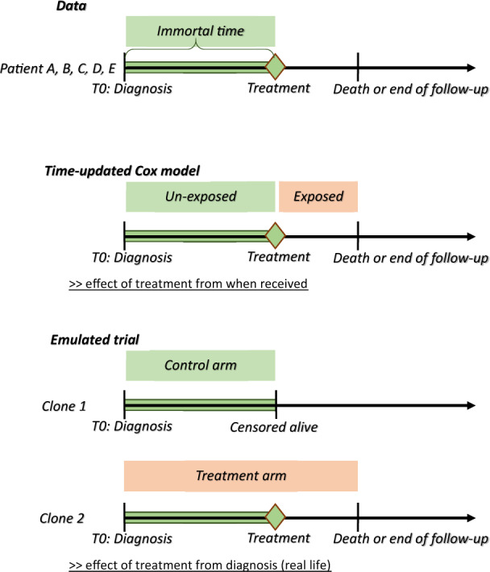

# Observational study designs

`````{admonition} Executive summary
:class: info

There are several study designs that attempt to minimise bias in observational research. These include...

**Active comparator (AC), new user (NU) (ACNU)** design
* AC: Compares between two active treatment strategies, as no treatment can mean no indication for treatment (e.g. mild) or contraindications (e.g. severe co-existing conditions) - avoiding bias from contraindications
* NU: Follow from treatment initation, don't include current users

**Clone-censor-weight** design
* Clone (each patient starts on every treatment arm) and then censor (when no longer on arm) to reduce confounding at baseline and immortal-time bias
* This introduces informative censoring, which then adjust for by weighting (using inverse-probability weights)

**Sequential trial** design
* Series of artifical trials that divide at time points (e.g. study visits), and then within each trial, people are censored when their treatment deviates from what it was at the start of that artifical trial. Inverse probability weighting used to adjust for artifical censoring.
* Can then estimate effect of sustained treatment v.s. no treatment, starting at each time point
`````

## Active comparator, new user (ACNU) design

Used to compare effect of initiating two treatments [[Fu 2023]](https://doi.org/10.1681/ASN.0000000000000152)

Designed to 'emulate the intervention part of a RCT', comparing two cohorts of drug users.

* **Active comparator (AC)** design: restrict 'study to individuals with an indication for treatment and without contraindications' [[Lund et al. 2015]](https://doi.org/10.1007%2Fs40471-015-0053-5)
    * Compares with **active comparator** (another drug/treatment) rather than **non-active comparator** (no active treatment... non-users). Patients in that group - who have disease but are not on active treatment - can include those with no indication for treatment (e.g. mild disease), or people for whom all treatment is contraindicated (e.g. if have severe co-existing conditions) - and as such, are often not included in RCTs
    * Avoids **bias from contraindications**: In practice, 'physicians carefully choose who should or should not be treated with the drug of interest , causing imbalance between treatment groups in the baseline level of risk for the outcome of interest in observational studies—that is, confounding by indication'
    * 'The active-comparator design has three main advantages: increased similarity in measured patient characteristics between treatment groups; reduced potential for unmeasured confounding; and possibly improving the clinical relevance of the research question' [[Yoshida et al. 2015]](https://doi.org/10.1038/nrrheum.2015.30)
* **New user (NU)** design: align 'individuals at a uniform point in time to start follow-up (i.e., treatment initiation) and ensuring the correct temporality between covariate and exposure assessment' [[Lund et al. 2015]](https://doi.org/10.1007%2Fs40471-015-0053-5)
    * Also known as incident-user design or initator design
    * This 'includes a cohort of patients initiating treatment with a drug of interest who are followed up from treatment initiation, similar to RCTs. By contrast, the prevalent-user design includes both current and new users of a drug of interest within the study period, and follow-up thus starts at a different time point in the course of each individual's treatment'
    * 'The new-user design has three main advantages: time-varying hazards and drug effects associated with treatment duration can be assessed; appropriate adjustment for confounding is ensured by capturing pretreatment variables; and potential for immortal time bias is reduced when this design is combined with the active-comparator design' [[Yoshida et al. 2015]](https://doi.org/10.1038/nrrheum.2015.30)

Illustration of ACNU and confounding by indication from [Sendor and Stürmer 2022](https://doi.org/10.1002/pds.5407):


## Clone-censor-weight design

Useful for grace periods, treatment duration, or when treatment is started based on a biomarker level [[Fu 2023]](https://doi.org/10.1681/ASN.0000000000000152)

The approach involves three steps:
1. '**"Clone"** each patient once for each treatment regimen of interest.' [[source]](https://www.targetrwe.com/news-events/one-model-to-rule-them-all-using-a-single-model-to-control-for-confounding-and-informative-censoring/)
    * 'Cloning patients allows us to assign patients to both arms for the duration for which treatment allocation is unknown. At baseline, in our illustration, we assumed that all patients were equally likely to be offered surgery or not. As such, all patients entered both arms of the trial, independently of their subsequent surgery status. Thus, we created two clones of each patient with one clone allocated to each study arm, hence doubling the size of our dataset. The study arms are therefore identical with respect to demographics and clinical characteristics at the time of diagnosis. This removes confounding bias, at baseline only.' [[Maring et al. 2020]](https://doi.org/10.1093%2Fije%2Fdyaa057)
2. '**"Censor"** each clone when their person-time is no longer consistent with the corresponding treatment regimen.' [[source]](https://www.targetrwe.com/news-events/one-model-to-rule-them-all-using-a-single-model-to-control-for-confounding-and-informative-censoring/)
3. '**"Weight"** the remaining person-time by the inverse probability of being censored.' [[source]](https://www.targetrwe.com/news-events/one-model-to-rule-them-all-using-a-single-model-to-control-for-confounding-and-informative-censoring/)
    * 'If the decision to perform surgery was completely random or made based on patients’ characteristics that were not associated with the outcome, the artificial censoring done... would be ignorable, and would not bias the results. However, in most observational studies, treatment decision is based on characteristics also associated with the outcome, i.e. the confounders. In our example, the decision to perform surgery is associated with age, performance status and comorbidity index, which are also associated with survival. In such situations, the artificial censoring introduces selection bias... The proposed approach to address this problem is to use inverse-probability-of-censoring weighting (IPCW)' [[Maring et al. 2020]](https://doi.org/10.1093%2Fije%2Fdyaa057)

Explanation of how this addresses bias: 'When the start of follow-up and the time of treatment initiation do not coincide i.e. when the exposure (or treatment) status is not defined at the inclusion within the study, immortal-time bias is a concern if the study groups are defined based on the observed treatment allocation. Indeed, treatment receipt at a given time t is conditional on having survived up to time t, and consequently, treatment receipt is more likely to be observed among patients with longer survival. We illustrated how cloning patients at the start of follow-up, carefully defining the survival time and vital status for each clone, and choosing the length of the grace period, as proposed by Hernàn et al.,9,10 can address both confounding and immortal-time biases. However, by cloning and censoring the patients to account for confounding at baseline and immortal-time bias, we introduce an informative censoring, which does not exist in the original dataset. This artificial censoring can be adjusted for by inverse-probability weights in the statistical analysis, which is the main complexity of this approach' [[Maring et al. 2020]](https://doi.org/10.1093%2Fije%2Fdyaa057)

Illustration of design from [Maring et al. 2020](https://doi.org/10.1093%2Fije%2Fdyaa057):



## Sequential trial design

Appropriate when one group starts with treatment and other does not [[Fu 2023]](https://doi.org/10.1681/ASN.0000000000000152)

This design was first described by Hernan et al. in 2008 and Gran et al. in 2010. It 'was originally proposed as a simple way of making efficient use of longitudinal observational data, as it enables use of a larger sample size than if an artificial trial were formed from a single time origin'. However, it is also an approach that can be used as an alternative to inverse probability weighted estimation of marginal structural models (MSM-IPTW)

In this design:
* Artifical "trials" are created from a sequence of new time origins (e.g. 'study visits at which new information recorded for each individual who remains under observation').
* 'At each time origin individuals are divided into those who have just initiated the treatment under investigation and those who have not yet initiated the treatment.'
* 'Within each trial, individuals are artificially censored at the time at which their treatment status deviates from what it was at the time origin, if such deviation occurs.'
* 'Inverse probability of censoring weighting is used to account for dependence of this artificial censoring on time-dependent characteristics'
* ' The overall effects of sustained treatment versus no treatment, starting from each time origin, can then be estimated using, for example, weighted pooled logistic or Cox regression' [[Keogh 2023]](https://doi.org/10.1002%2Fsim.9718)