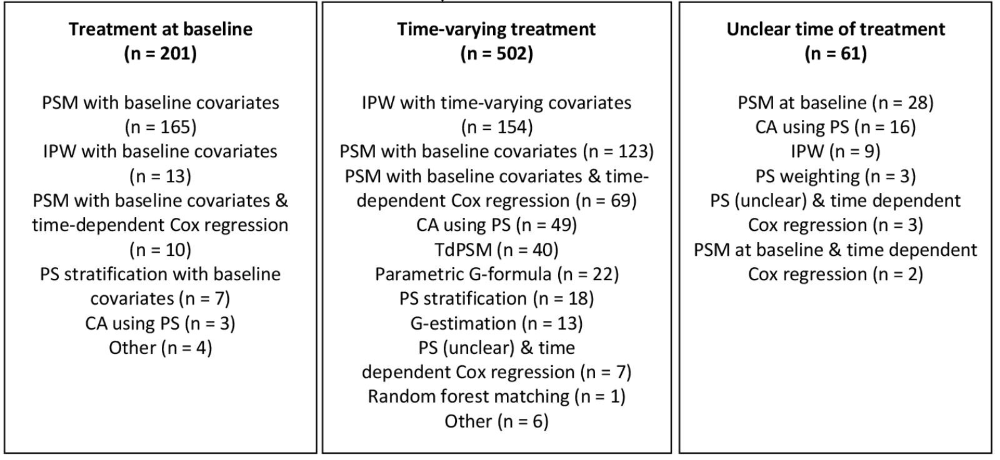

# Methods #1: Introduction to methods to adjust for confounding

`````{admonition} Executive summary
:class: info

Methods for causal effect estimation.

**Conventional methods:**
* (Principal) Stratification
* Matching
* Inverse probability of treatment weighting (IPTW)
* Multivariable regression

**G-methods:**
* G-computation (/ parametric G-formula / G-standardisation / standardisation / outcome regression)
* Marginal structure models
* G-estimation

**Methods to address unobserved confounding:**
* Instrumental variables
* Regression discontinuity (RD)
* Interrupted time series (ITS)
* Difference in differences (DiD)

**Other methods:**
* Marginal, asymmetric conditional, and causal SHAP values
* Synthetic control
* Matrix completion
* Causal discover
* Double machine learning
* Causal forests
* Strucrtural estimation

`````

<mark> where does difference in differences fit in? </mark> https://dimewiki.worldbank.org/Difference-in-Difference

<mark>continue to use this textbook throughout</mark> https://www.hsph.harvard.edu/miguel-hernan/wp-content/uploads/sites/1268/2024/01/hernanrobins_WhatIf_2jan24.pdf

<mark>read this - may help with where difference in differences fits in - andjust generally looks good</mark> https://www2.stat.duke.edu/~fl35/CausalInferenceClass.html

<mark>Will need to integrate with the page on methods to account for treatment paradox</mark>

<mark>haven't covered bayesian causal inference</mark>... https://royalsocietypublishing.org/doi/10.1098/rsta.2022.0153 and http://www2.stat.duke.edu/~fl35/BayesianCausalInference.html

erik shared these to have a look at:
* I would also very much recommend [The Effect: An Introduction to Research Design and Causality by Nick Huntington-Klein](https://theeffectbook.net/)
* I’ve heard good things about [Causal Inference: The Mixtape by Scott Cunningham](https://mixtape.scunning.com/)

<mark>this is all about how you deal with confounders - but what about what to do with moderators and mediators?</mark>

## Designing a study to estimate a causal effect from observational data

The gold standard method for inferring causality is randomisation - e.g. randomising patients to receive a treatment or not. This is because it removes confounding - it removes the common cause of the treatment and outcome, since the only cause of treatment was randomisation.[[HarvardX PH559x]](https://learning.edx.org/course/course-v1:HarvardX+PH559x+2T2020/home)

When we are using **observational data**, there are a variety of possible methods for **causal effect estimation**. They all rely on assumptions (although those cannot always be tested).

When designing a study, you need to:
1. Clearly specify the **research question** in terms of a **causal estimand**
2. This allows you to **choose an appropriate method** for this estimand, and to carefully interrogate the influence of biases using **sensitivity and quantitative bias analysis**. [[Igelström et al. 2022]](https://doi.org/10.1136/jech-2022-219267)

## Groups of methods for causal effect estimation

Methods for causal effect estimation can be broadly grouped into:
* **Conventional methods**
* **G-methods** (which address treatment-confounder feedback)
* **Methods to address unobserved confounding** [no source]

Alternatively, they can be grouped into:
* **Causal inference without models** - randomisation, standardisation, IPTW, matching
* **Causal inference with models** - IPTW and marginal structural models, standardisation and parametric G-formula, G-estimation of structural nested models, outcome regresison and propensity scores, instrumental variable estimation, causal survival analysis
* **Causal inference with models and time-varying treatments** -G-formula, IP weighting, G-estimation, target trial emulation, causal mediation [[Hernan and Robins 2024]](https://www.hsph.harvard.edu/miguel-hernan/wp-content/uploads/sites/1268/2024/01/hernanrobins_WhatIf_2jan24.pdf)

### Conditional v.s. marginal effect measures

Different methods will produce effect measures that are **conditional** (specific to certain population) or **marginal** (relevant to whole population).

**Non-collapsibility** refers to a phenomenon where a conditional effect measure differs from the marginal effect measure even in the absence of confounding. This is true for certain non-linear effect measures like the odds ratio 
* This may make conditional measures more **difficult to compare** between studies (since different studies typically adjust for different sets of covariates)
* On the other hand, marginal effeccts may be **less transportable** between populations [[Vansteelandt and Keiding 2011]](https://doi.org/10.1093/aje/kwq474)

## Current practice

### 2022 mapping review of confounding adjustment methods used for longitudinal observational data

Wijn et al. 2022 conducted a mapping literature review to determine which confounding adjustment methods were used in longitudinal observational data to estimate a treatment effect. They identified the following studies:



*Abbreviations: CA, covariate adjustment; IPW, inverse probability weighting; PS, propensity score; PSM, propensity score matching; TdPSM, time-dependent propensity score matching.*

You can see that in the context of **longitudinal observational** data
* 66% time-varying treatment, 26% treatment at baseline, 8% time of treatment not clearly defined
* For **treatment at baseline**, majority of papers use propensity score matching with baseline covariates (82%)
* For **time-varying treatment**:
    * 30% inverse probability weighting
    * 25% propensity score matching with baseline coavariates
    * 14% propensity score matching with baseline covariates combined with time-dependent Cox regression
    * 10% covariate adjustment using propensity score
    * 8% time-dependent propensity score
    * 4% parametric G-formula
    * 2% propensity score stratification
    * 3% G-estimation
* Hence, for time-varying treatment, often **inappropriate methods** are use - 25% used probability score matching with baseline covariates 'which can potentially result in a biased treatment effect' - and only 45% of the papers used g-methods. [[Wijn et al. 2022]](https://doi.org/10.1136/bmjopen-2021-058977)

Other reviews include - 
* 2019 systematic review of studies adjusting for time-dependent confounding, finds **inverse probability of treatment weighting estimated marginal structure models** to be the most common technique [[Clare et al. 2019]](https://doi.org/10.1093/ije/dyy218)

## What you shouldn't do

### All possible confounders

'Many analysts take the strategy of putting in **all possible confounders**. This can be bad news, because adjusting for **colliders and mediators can introduce bias**, as we’ll discuss shortly. Instead, we’ll look at **minimally sufficient adjustment sets**: sets of covariates that, when adjusted for, block all back-door paths, but include no more or no less than necessary. That means there can be many minimally sufficient sets, and if you remove even one variable from a given set, a back-door path will open.'[[source]](https://cran.r-project.org/web/packages/ggdag/vignettes/intro-to-dags.html)

[Schisterman et al. 2009](https://doi.org/10.1097/EDE.0b013e3181a819a1) 'define **unnecessary adjustment** as control for a variable that does not affect bias of the causal relation between exposure and outcome but may affect its precision.' - so:
* Adjusting for a variable completely outside the system of interest (C1)
* Adjusting for a variable that causes the exposure only (C2)
* Adjusting for a variable whose only causal association with variables of interest is as a descendent of the exposure and not in the causal pathway (C3)
* Adjusting for a variable whose only causal association with variables of interest is as a cause of the outcome (C4)

Adjusting for these varaibles should not impact the total causal effect on the outcome, but may be gain or loss in precision of relationship between exposure of interest, the unnecessary adjustment variables, and the outcome of interest.[[Schisterman et al. 2009]](https://doi.org/10.1097/EDE.0b013e3181a819a1)

````{mermaid}
  flowchart LR;

    C1:::white
    C2:::white
    C3:::white
    C4:::white
    E(Exposure):::white
    D(Outcome):::white

    C2 --> E;
    E --> C3;
    E --> D;
    C4 --> D;

    classDef white fill:#FFFFFF, stroke:#FFFFFF
````


## Data-driven selection of confounders

'Though generally not advisable, data-driven confounder selection may be employed in small datasets, under the condition that the data has been pre-processed to entail that covariates fed into the statistical selection method are only potential confounders and free of mediators'.[[Ramspek et al. 2021 (supplementary)]](https://doi.org/10.1007/s10654-021-00794-w)

## Adjust for time-varying confounders using conventional methods

'Adjusting for time-dependent confounders using conventional methods, such as time-dependent Cox regression, often fails in these circumstances, as adjusting for time-dependent confounders affected by past exposure (i.e. in the role of mediator) may inappropriately block the effect of the past exposure on the outcome (i.e. overadjustment bias). For example, we wish to determine the effect of blood pressure measured over time (as our time-varying exposure) on the risk of end-stage kidney disease (ESKD) (outcome of interest), adjusted for eGFR measured over time (time-dependent confounder). As eGFR acts as both a mediator in the pathway between previous blood pressure measurement and ESKD risk, as well as a true time-dependent confounder in the association between blood pressure and ESKD, simply adding eGFR to the model will both correct for the confounding effect of eGFR as well as bias the effect of blood pressure on ESKD risk (i.e. inappropriately block the effect of previous blood pressure measurements on ESKD risk).' [[Chesnaye et al. 2022]](https://doi.org/10.1093%2Fckj%2Fsfab158)

## Guidelines and tools

### Prediction of Counterfactuals Guideline (PRECOG)

'While there are guidelines for reporting on observational studies (eg, Strengthening the Reporting of Observational Studies in Epidemiology, Reporting of Studies Conducted Using Observational Routinely Collected Health Data Statement), estimation of causal effects from both observational data and randomised experiments (eg, A Guideline for Reporting Mediation Analyses of Randomised Trials and Observational Studies, Consolidated Standards of Reporting Trials, PATH) and on prediction modelling (eg, Transparent Reporting of a multivariable prediction model for Individual Prognosis or Diagnosis), none is purposely made for deriving and validating models from observational data to predict counterfactuals for individuals on one or more possible interventions, on the basis of given (or inferred) causal structures.'. A 2022 protocol proposes to draw up rporting guidelines for such studies. [[Xu et al. 2022]](https://doi.org/10.1136/bmjopen-2021-059715)

### TrAnsparent ReportinG of observational studies Emulating a Target trial (TARGET) guideline

'Observational studies are increasingly used to inform health decision-making when randomised trials are not feasible, ethical or timely. The target trial approach provides a framework to help minimise common biases in observational studies that aim to estimate the causal effect of interventions. Incomplete reporting of studies using the target trial framework limits the ability for clinicians, researchers, patients and other decision-makers to appraise, synthesise and interpret findings to inform clinical and public health practice and policy. This paper describes the methods that we will use to develop the TrAnsparent ReportinG of observational studies Emulating a Target trial (TARGET) reporting guideline.' [[Hansford et al. 2023]](https://doi.org/10.1136/bmjopen-2023-074626)

Systematic review demonstrating inconsistencies in reporting of target trials - [[Hansford et al. 2023]](https://doi.org/10.1001/jamanetworkopen.2023.36023)
