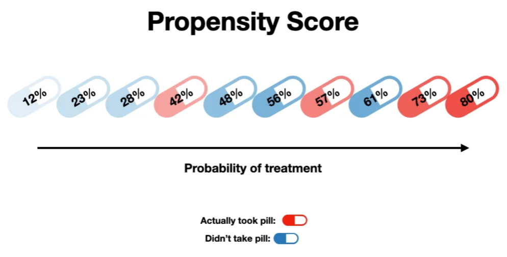

# Methods #2: Conventional approaches

`````{admonition} Executive summary
:class: info

Conventional methods for causal effect estimation (not suitable for time-varying or unobserved confounding). Often using **propensity scores**, which are the probability of being in the treatment/exposure group, given your baseline characteristics.

Create pseudo-population to mimic randomised population using:
* (Principal) **Stratification** - seperate participants based on their values of the confounder
* **Matching** - create same distribution of confounders in treated and untreated groups
* **Inverse probability of treatment weighting (IPTW)** - weight each individual by the inverse of their probability of receiving their actual treatment, resulting in equal distribution of confounders in the treated and untreated groups

Or:
* **Multivariable regression** - inclusion of confounders as covariates in the model

`````

## Conventional approaches for causal effect estimation

The most common methods typically focus on conditioning on some set of common causes of the exposure and outcome.

In RCTs, you are controlling for **intercurrent events** (ICEs), which are defined 'a post-randomization event that “affect either interpretation or existence of the measurements associated with clinical questions of interest.”'. Examples include compliance to an assigned treatment, death before follow-up, treatment switching, etc.[[Lipkovich et al. 2022]](https://doi.org/10.1002/sim.9439)

Although these are very common - 'described in a zillion publications' - they only work in simpler settings, and cannot handle causal inference with time-varying treatments (such as is the case for complex longitudinal data).[[Hernán and Robins 2024]](https://www.hsph.harvard.edu/miguel-hernan/causal-inference-book/)

These approaches are:
* Stratification
* Matching
* Inverse probability of treatment weighting
* Multivariable regression / covariate adjustment

**Propensity score matching** is recommended over stratification or covariate adjustment (multivariable regression) as it eliminates a greater proportion of systemic differences in baseline characteristics between treated and untreated. [[Wijn et al. 2022]](https://doi.org/10.1136/bmjopen-2021-058977)

**Inverse probability weighting** can be used for baseline imbalances or time-varying confounding - so is expanded on in the G-methods page.

However, I first introduce **propensity scores**, as these are used within variants of several methods.

## Propensity scores

A **propensity score** is the 'probability of treatment assignment conditional on observed baseline characteristics'. It was defined by was Rosenbaum and Rubin (1983). It is a 'balancing score: conditional on the propensity score, the distribution of measured baseline covariates is similar between treated and untreated subjects'. [[Austin 2011]](https://doi.org/10.1080%2F00273171.2011.568786)

Propensity scores are often estimated using a **logistic regression model** with:
* Outcome = Treatment *(e.g. insulin therapy)*
* Predictors = Observed baseline characteristics *(e.g. blood pressure, BMI, lipid profile)*
* Propensity score = **Predicted probability of treatment** from the fitted model [[Valojerdi et al. 2018]](https://doi.org/10.14196%2Fmjiri.32.122)

Image from Shaw Talebi on [Towards Data Science](https://towardsdatascience.com/propensity-score-5c29c480130c):



Use of a propensity score enables incorporation of 'a larger number of background covariates because it uses the covariates to estimate a single number'. [[Valojerdi et al. 2018]](https://doi.org/10.14196%2Fmjiri.32.122)

Four different propensity scores methods are used for removing the effects of confounding:
* **Stratification** on the propensity score
* Propensity score **matching**
* **Inverse probability of treatment weighting (IPTW)** using the propensity score
* **Covariate adjustment** using the propensity score [[Austin 2011]](https://doi.org/10.1080%2F00273171.2011.568786)

Assumptions of propensity score analysis/methods:
* All covariates related to outcome and treatment (exposure) are measured and included
* SUTVA - treatment effect for one individual is not affected by the treatment status of another
* The assumptions of logistic regression [[Valojerdi et al. 2018]](https://doi.org/10.14196%2Fmjiri.32.122)

## Stratification

Stratification or **principal stratification** is the **simplest** method to control confounding.[[Tripepi et al. 2010]](https://doi.org/10.1159/000319590) It is represented by drawing a box on the DAG.[[HarvardX PH559x]](https://learning.edx.org/course/course-v1:HarvardX+PH559x+2T2020/home)

It was proposed by Frangakis and Rubin 2002.[[source]](https://doi.org/10.1111/j.0006-341X.2002.00021.x) It has gained popularity since the ICH E9 addendum on statistical principles for clinical trials, which listed it as a valid approach to ICEs.[[source]](https://cran.r-project.org/web/packages/PStrata/vignettes/PStrata_JSS.pdf) The use of stratification to adjust for confounding is so common that some investigators consider the terms 'stratification' and 'adjustment' synonymous. Whilst it can be used to adjust for confounding - but it can also be used to **identify effect modification**.[[Hernán and Robins 2024]](https://www.hsph.harvard.edu/miguel-hernan/causal-inference-book/)

Principal stratification involves partitioning participants into **principal strata** - i.e. particular values of a variable. 'Stratification necessarily results in multiple stratum-specific effect measures (one per stratum defined by the variables L). Each of them quantifies the average causal effect in a nonoverlapping subset of the population but, in general, none of them quantifies the average causal effect in the entire population.' Instead, they are **conditional effect measures**. [[Hernán and Robins 2024]](https://www.hsph.harvard.edu/miguel-hernan/causal-inference-book/)

'Often, one of the principal strata is the focus of inference, but sometimes it is of interest to combine principal effects across several (or all) principal strata while accounting for a confounding effect of a post-randomization variable.'[[Lipkovich et al. 2022]](https://doi.org/10.1002/sim.9439) Hence, stratification involves either:
* **Restricting analysis to subset** of study population with particular value of confounder.[[HarvardX PH559x]](https://learning.edx.org/course/course-v1:HarvardX+PH559x+2T2020/home) This type of stratification is referred to as **restriction**. When positivity fails for some strata of the population (i.e. impossible to get a certain exposure), restriction is used to limit causal inference to the strata where it does hold. [[Hernán and Robins 2024]](https://www.hsph.harvard.edu/miguel-hernan/causal-inference-book/)
* **Performing analysis in each stratum** of confounder.[[HarvardX PH559x]](https://learning.edx.org/course/course-v1:HarvardX+PH559x+2T2020/home) For causal inference, stratification is simply applies restriction to several mutually exclusive subsets of the population, with exchangeability within each subset. [[Hernán and Robins 2024]](https://www.hsph.harvard.edu/miguel-hernan/causal-inference-book/)

### Simple example

* Exposure: Birth order
* Outcome: Down syndrome
* Potential confounder: Maternal age

````{mermaid}
  flowchart LR;

    order("Birth order"):::white;
    down("Down syndrome"):::white;
    age("Maternal age"):::black;

    order -->|?| down;
    age --> order;
    age --> down;

    classDef white fill:#FFFFFF, stroke:#FFFFFF
    classDef black fill:#FFFFFF, stroke:#000000
````

See figure:
* (a) Association of down syndrome with birth order and age groups seperately
* (b) Down syndrome cases stratified by birth order and maternal age

Can observe that crude association between birth order and Down syndrome was just due to maternal age (as in each age category, birth order did not affect down syndrome frequency, but in each birth order category, age did). [[Tripepi et al. 2010]](https://doi.org/10.1159/000319590)


### Mantel-Haenszel Formula

The **Mantel-Haenszel formula** can be used to provide a pooled odds ratio across different strata. There are alternative methods (e.g. Woolf and inverse variance) but the Mantel-Haenszel method is generally the most robust.[[source]](https://www.statsdirect.co.uk/help/meta_analysis/mh.htm)

Key steps:
1. Calculate crude relative risks (RR) or odds ratio (OR) (i.e. **without stratifying**)
2. Stratify by confounding variable and calculate **stratum-specific** RR or OR
3. Assess whether effect estimates are roughly homogenous across strata and do not differ from that in the whole group
    * If they are **homogeneous**, this means there is **no confounding**, and you can calculate the overall adjusted RR or OR by the **Mantel-Haenszel formula**. The pooling estimate provides an **average** of the stratum-specific RRs or ORs with **weights proportional to the number of individuals** in each stratum.
    * If they are **heterogeneous** and we are interested in effect modification, stratum-specific effect estimates should be reported separately. [[Tripepi et al. 2010]](https://doi.org/10.1159/000319590)

### Stratification on the propensity score

You can stratify subjects based on their propensity scores. 'The literature showed that five strata are adequate to reduce at least 90% of the bias associated with a confounding variable. With a large sample size, we can use between 10 or 20 strata.' [[Valojerdi et al. 2018]](https://doi.org/10.14196%2Fmjiri.32.122)

### Limitations of stratification

* Computes **conditional** effect measures (not average effect measures)
* Requires computation of effect measures in subsets of population defined by combining *all* variables required for conditional exchangeability[[Hernán and Robins 2024]](https://www.hsph.harvard.edu/miguel-hernan/causal-inference-book/)
    * This can be laborious and demands a large sample **size** when there is more than one confounder.[[Tripepi et al. 2010]](https://doi.org/10.1159/000319590) It is therefore 'prone to sparse-data problem (it occurs when there are few or no study participants at some combinations of the outcome, exposure, and covariates) and unstable estimates', and as such, 'is rarely used in practice'. [[Gharibzadeh et al. 2016]](https://journalaim.com/Article/1060)
    * This is even if we're **not interested** in such effect modification. Solution: Stratification by something of interest (i.e. effect modifier) followed by IP weighting or standardisation (to adjust for confounding) allows you to deal with exchangeability (confounders) and effect modification (modifiers)
* **Noncollapsibility** of certain effect measures like the odds ratio [[Hernán and Robins 2024]](https://www.hsph.harvard.edu/miguel-hernan/causal-inference-book/) - i.e. 'the crude OR from the marginal table cannot be expressed as the weighted average of the stratum-specific ORs even in the absence of confounding' - as 'the magnitude of the OR is different when comparing the aggregate analysis to the subgroup analysis' - but both estimates are still valid. Other effect measures are **collapsible** e.g. stratified risk ratios [[Pang et al. 2013]](https://doi.org/10.1016/j.amjcard.2012.09.002)
* Requires **continuous** confounders to be **constrained** to a limited number of categories, which could generate **residual confounding** [[Tripepi et al. 2010]](https://doi.org/10.1159/000319590)

### Exclude treated individuals

A variant on stratification is an anlysis which simply exclude treated individuals. This is proposed in the context of a treatment paradox, where you're interested in the direct causal effect of an exposure on the outcome that is not mediated via decision to treat, which is based on presence of the exposure.

````{mermaid}
  flowchart LR;

    %% Define the nodes and subgraphs
    exp("Exposure"):::white;
    treat("Treatment"):::white;
    out("Outcome"):::white;

    %% Produce the figure
    exp --> treat;
    treat --> out;
    exp --> out;
  
    classDef white fill:#FFFFFF, stroke:#FFFFFF;
    classDef black fill:#FFFFFF, stroke:#000000;
````

Limitations:
* Will 'decrease the effective **sample size**' (which could cause you to not see an effect if you don't have the power). This, for example, leads to 'the precision of estimates of both the observed:expected ratio and c-index (area under the ROC curve) decreased due to the reduction in effective sample size'.
* Results in loss of information about **high risk individuals**, if treatment allocation was dependent on risk (and so very few were untreated), with the discriminative ability of the model worsening with the exclusion of high-risk individuals and consequently narrower case mix.
* 'In the presence of a strong **unmeasured predictor of the outcome associated with treatment use**, exclusion of treated individuals resulted in an underestimation of the performance of the model.'

[[Pajouheshnia et al. 2017]](https://doi.org/10.1186%2Fs12874-017-0375-8)

## Matching

**Matching** involves selecting a sample where exposed and unexposed groups have the same distribution of confounders.[[HarvardX PH559x]](https://learning.edx.org/course/course-v1:HarvardX+PH559x+2T2020/home) We often start with the group with fewer individuals, and then use the other group to find matches. It does not have to be **one-to-one (matching pairs)** - it can be **one-to-many (matching sets)**. Matching is often based on a combination of confounders. [[Hernán and Robins 2024]](https://www.hsph.harvard.edu/miguel-hernan/causal-inference-book/)

Matching can't be represented in DAG, because **non-faithfulness** - the association to a backdoor path is exactly cancelled by the matched subset.[[HarvardX PH559x]](https://learning.edx.org/course/course-v1:HarvardX+PH559x+2T2020/home)

We make an assumption of conditional exchangeability given L (the confounder), meaning that matching results in '(unconditional) **exchangeability** of the treated and untreated in the matched population', and so we **directly compare** their outcomes. Matching ensures **positivity** since strata with only treated or untreated individuals are excluded. [[Hernán and Robins 2024]](https://www.hsph.harvard.edu/miguel-hernan/causal-inference-book/)

### Matching methods

Above describes **individual matching**, but you can also use **frequency matching**. For example, randomly selected individuals but ensuring 70% have L=1 (certain value of confounder), and then repeating for the other population. [[Hernán and Robins 2024]](https://www.hsph.harvard.edu/miguel-hernan/causal-inference-book/)

There are a few approaches to matching, which include:
* **Propensity score matching** - matched based on propensity scores
    * This is commonly one-to-one matching based on similar values of the propensity score, which can be done with or without replacement, but **with replacement can decrease** bias and is helpful where the numbers of controls are limited. [[Valojerdi et al. 2018]](https://doi.org/10.14196%2Fmjiri.32.122)
    * Selecting the propensity score 'close' to the treated subject is done using either **nearest neighbour matching** or nearest neighbour matching within a specific caliper distance.
    * You can choose between **greed matching** or **optimal matching**
    * Outcomes...
        * 'If the outcome is continuous (e.g., a depression scale), the effect of treatment can be estimated as the difference between the mean outcome for treated subjects and the mean outcome for untreated subjects in the matched sample'
        * 'If the outcome is dichotomous (self-report of the presence or absence of depression), the effect of treatment can be estimated as the difference between the proportion of subjects experiencing the event in each of the two groups (treated vs. untreated) in the matched sample. With binary outcomes, the effect of treatment can also be described using the relative risk or the NNT.'
        * 'Once the effect of treatment has been estimated in the propensity score matched sample, the variance of the estimated treatment effect and its statistical significance can be estimated.' [[Austin 2011]](https://doi.org/10.1080%2F00273171.2011.568786)
* **Matched difference-in-differences** - perform matching then compute difference-in-differences - this controls for unobserved, time-invariant characteristics between the groups
* **Synthetic control method** - weight one group in a manner to it closely resembles the other group
Above, we are describing the **synthetic control method**. [[source]](https://dimewiki.worldbank.org/Matching)

### Limitations of matching

* Requires extensive datasets to properly match, with detailed information on baseline characteristics, but this is not always available
* Assumes there are no unobserved characteristics between the matched groups. Possible solution: Matched difference-in-differences. [[source]](https://dimewiki.worldbank.org/Matching)
* Computes **conditional** effect measures (not average effect measures) - i.e. only for certain subset of population [[Hernán and Robins 2024]](https://www.hsph.harvard.edu/miguel-hernan/causal-inference-book/)

## Inverse probability of treatment weighting (IPTW) with baseline covariates

Names:
* **Inverse probability weighting (IPW)**
* **Inverse probability of treatment weighting (IPTW)**
* **Propensity score weighting**

IPTW is one of the various propensity score methods. Below describes IPTW to account for confounders at baseline, but it can be used to:
* Estimate parameters of a marginal structure model and adjust for confounding measured over time (see page on G-methods).
* Account for informative censoring (pateitsn censored when lost to follow-up or reach study end without encountering event) - calculating **inverse probability of censoring weights** or each time point as the inverse probability of remaining in the study up to the current time point, given the previous exposure, and patient characteristics related to censoring [[Chesnaye et al. 2022]](https://doi.org/10.1093%2Fckj%2Fsfab158)

IPTW involves using the propensity scores to balance the baseline characteristics in the treated and untreated (or 'exposed and unexposed') groups. This is done by **weighting each individual by the inverse probability of receiving their actual treatment**. [[Chesnaye et al. 2022]](https://doi.org/10.1093%2Fckj%2Fsfab158)

| Actual group | Estimated probability of being in this group | Inverse  |
| --- | --- | --- |
| Exposed / Treated | `propensity_score` | `1/propensity_score` |
| Unexposed / Untreated | `1-propensity_score` | `1/(1-propensity_score)` |

This means that larger weights go to:
* Exposed individuals with a lower probability of exposure
* Unexposed individuals with a higher probability of exposure

Conceptually, IPTW can be considered mathematically equivalent to standardisation.

As IPTW aims to balance patient characteristics in the exposed and unexposed groups, it is considered good practice to assess the **standardized differences** between groups for all baseline characteristics both before and after weighting. The advantage of checking standardized mean differences is that it allows for comparisons of balance across variables measured in different units. As a rule of thumb, a standardized difference of <10% may be considered a negligible imbalance between groups. If the standardized differences remain too large after weighting, the propensity model should be revisited (e.g. by including interaction terms, transformations, splines). [[Chesnaye et al. 2022]](https://doi.org/10.1093%2Fckj%2Fsfab158)

### Example

* Study on receiving extended-hours haemodialysis (EHD) treatment v.s. conventional HD (CHD)
* Want to balance distribution of diabetes - at baseline, **higher % diabetes patients in CHD group** than in EHD group
* Patients with diabetes have 25% probability of receiving EHD = propensity score of 0.25
* To balance distribution, weight-up patients in EHD group by inverse of propensity score, which is 1/0.25=4, so conceptually each **EHD diabetes patient represents four patients**, creating a "pseudo-population"
* Similarly, CHD diabetes patients weighted by 1/(1-0.25)=1.33.
* **Diabetes now equally distributed** across the EHD and CHD groups
* These weights can then be incorporated into an outcome model to get an estimate of the **average treatment effect** adjusted for confounders 

'As the weighting creates a pseudopopulation containing ‘replications’ of individuals, the sample size is artificially inflated and correlation is induced within each individual. This lack of independence needs to be accounted for in order to correctly estimate the variance and confidence intervals in the effect estimates, which can be achieved by using either a robust ‘sandwich’ variance estimator or bootstrap-based methods.' [[Chesnaye et al. 2022]](https://doi.org/10.1093%2Fckj%2Fsfab158)

| Diabetes + Group | Estimated probability<br>of EHD (given<br>diabetes status) | Estimated probability<br>of actual treatment<br>received | Inverse |
| --- | --- | --- | --- |
| Diabetes + CHD | 0.25 | 0.75 | 1/0.75 = 1.33 |
| No diabetes + CHD | 0.75 | 0.25 | 1/0.25 = 4 |
| Diabetes + EHD | 0.25 | 0.25 | 1/0.25 = 4 |
| No diabetes + EHD | 0.75 | 0.75 | 1/0.75 = 1.33 |

Image from [Chesnaye et al. 2022](https://doi.org/10.1093%2Fckj%2Fsfab158):


### Strengths and limitations

Strengths:
* (As for all propensity score-based methods) able to summarise all characteristics in a single covariate
* Retains more individuals than propensity score matching
* Can be used for categorical or continuous exposures (whilst matching generally compares a single treatment group with a control group)
* Estimates hazard ratios with less bias than propensity score stratification or adjustment using the propensity score
* Can be used in marginal structural models to correct for time-dependent confounders

Limitations:
* Simulation studies have shown IPTW can be no better than multivariable regression
* IPTW cautioned against for sample sizes under 150 due to underestimation of the variance (i.e. standard error, confidence interval and P-values) of effect estimates
* 'Sensitive to misspecifications of the propensity score model, as omission of interaction effects or misspecification of functional forms of included covariates may induce imbalanced groups, biasing the effect estimate' [[Chesnaye et al. 2022]](https://doi.org/10.1093%2Fckj%2Fsfab158)
* 'Propensity values near 0 and 1 yield extreme weights (after taking the inverse)'[[source]](https://www2.stat.duke.edu/~fl35/teaching/640/Chap3.4_observational_weighting.pdf) - i.e. not recommended when propensities are small (close to 0) as weights can be unstable
* ATE may not always be the sensible estimand [[source]](https://www2.stat.duke.edu/~fl35/teaching/640/Chap3.4_observational_weighting.pdf)

### Assumptions

'Treatment effects obtained using IPTW may be interpreted as causal under the following assumptions:
* Exchangeability
* No misspecification of the propensity score model
* Positivity
* Consistency' [[Chesnaye et al. 2022]](https://doi.org/10.1093%2Fckj%2Fsfab158)

### IPTW variants

One of the limitations described above is that propensity values near 0 and 1 yield **extreme weights**. This can 'inflate the variance and confident intervals of the effect estimate. This may occur when the exposure is rare in a small subset of individuals, which subsequently receives very large weights, and thus have a disproportionate influence on the analysis.' It's worth considering **why** these individuals have such a low probability of being treatment but actually receive the treatment, or vice versa - they may be **outliers**. For example, 'patients with a 100% probbaility of receiving a particular treatment would not be eligible to be randomised to both treatments'. There are variants to IPTW that attempt to address some of its limitations. [[Chesnaye et al. 2022]](https://doi.org/10.1093%2Fckj%2Fsfab158)

#### Weight stabilisation

* Replace 'numerator (which is 1 in the unstabilized weights) with the **crude probability of exposure** (i.e. given by the propensity score model without covariates).'
* 'In case of a binary exposure, the numerator is simply the proportion of patients who were exposed. Stablised weights can therefore be calculated as:'
    *  `exposed / propensity_score`, instead of `1 / propensity_score`
    * `unexposed / (1-propensity score)`, instead of `1 / (1-propensity score)`
* '**Stabilized weights should be preferred** over unstabilized weights, as they tend to reduce the variance of the effect estimate' [[Chesnaye et al. 2022]](https://doi.org/10.1093%2Fckj%2Fsfab158)

In other weights, weight stabilisation invovles multiplying the unstabilised weight by the probability of the observed exposure without conditioning on the confounders, and so it the stablised weight is the 'ratio of the unconditional probability (the numerator) to the conditional probability (the denominator)'.[[Xie et al. 2017]](https://doi.org/10.2215/CJN.00650117)

#### Propensity score trimming and truncation

* **Symmetric trimming** - exclude patients with a score outside [a, 1-a], with often a=0.1, so [0.1, 0.9] [[source]](https://www2.stat.duke.edu/~fl35/teaching/640/Chap3.4_observational_weighting.pdf) - typically 1st and 99th percentiles, but lower thresholds can reduce variance [[Chesnaye et al. 2022]](https://doi.org/10.1093%2Fckj%2Fsfab158)
* **Asymmetric trimming** - exclude patients with a score outside the common range formed by the treated and control patients, and below the q quantile of treated and above the 1-q quantile of control
* **Propensity score truncation** - set patients with a score below a to a, and above 1-a to 1-a  [[source]](https://www2.stat.duke.edu/~fl35/teaching/640/Chap3.4_observational_weighting.pdf)

'Truncating weights change the population of inference and thus this reduction in variance comes at the cost of increasing bias'. [[Chesnaye et al. 2022]](https://doi.org/10.1093%2Fckj%2Fsfab158)

#### Augmented inverse propensity weighting (AIPW)

Augmented inverse propensity weighting (AIPW) involves:
1. Fitting a **propensity score** model (i.e. estimated probability of treatment assignment conditional on baseline characteristics)
2. Fit **two seperate models** that estimate the outcome - one under treatment and one under control
3. **Weight** each outcome by the propensity scores

This improves on IPW to combine information about the probability of treatment and predictive information about the outcome variable. It is a **doubly robust** estimator / has the property of double robustnesss. This means 'that it is consistent (i.e., it converges in probability to the true value of the parameter) for the ATE if either the propensity score model or the outcome model is correctly specified'.

AIPW is more flexible as it doesn't require the **same set of covariates** to be used for the propensity score model and model estimaing treatment-outcome relationship. [[Kurz 2022]](https://doi.org/10.1177%2F0272989X211027181)

#### Excluding treated individuals

Pajouheshnia et al. 2017 propose to exclude treated individuals after IPTW - i.e. stratifying the sample but focussing only on untreated - so that the resulting validation set resembles the untreated target population.
[[Pajouheshnia et al. 2017]](https://doi.org/10.1186%2Fs12874-017-0375-8) This is proposed in the context of the treatment paradox, with the intention of finding the direct effect of the exposure on outcome not mediated by treatment.

In their simulation study, Pajouheshnia et al. 2017 find that **IPW alone did not improve calibration** (compared to when we did nothing to account for the treatment paradox), but IPW followed by the **exclusion of treated individuals** provided correct estimates for calibration. IPW alone or followed by the exclusion of treated individuals improved estimates of the c-index in all scenarios where the assumptions of positivity and no unobserved confounding were met. In scenario 4, **where treatment allocation was determined by a strict risk-threshold and thus the assumption of positivity was violated, IPW was ineffective, and resulted in the worst estimates of discrimination across all methods**. In addition, the extreme weights calculated in scenario 4 led to very large standard errors. In scenarios 13–15, the presence of an unobserved confounder led to the failure of IPW to provide correct estimates of the c-index. Weight truncation at the 98% percentile increased precision, but was less effective in correcting of the c-index for the effects of treatment.

'Although the use of IPW prior to the exclusion of treated individuals is a promising solution in data where treatments are non-randomly allocated, it **should not be used when there are severe violations of the underlying assumptions, e.g. in the presence of non-positivity (where some individuals had no chance of receiving treatment), or when there is an unobserved confounder, strongly associated with both the outcome and treatment use.** There is thus a need to explore alternative methods to IPW to account for the effects of treatment use when validating a prognostic model in settings with non-random treatment use.' [[Pajouheshnia et al. 2017]](https://doi.org/10.1186%2Fs12874-017-0375-8)

## Multivariable regression

In **multivariable regression**, the confounders are **included as covariates**. [[Valojerdi et al. 2018]](https://doi.org/10.14196%2Fmjiri.32.122)

This can be through including individual covariaties, or by just including the estimated **propensity score as a covariate** in the regression model. This can be attractive as it allows the incorporation of many covariates. However, it should be used with caution, as 'bias may increase when the variance in the treated and untreated groups are very different (actually, the untreated group variance is much larger than the treated groups variance).' [[Valojerdi et al. 2018]](https://doi.org/10.14196%2Fmjiri.32.122)
