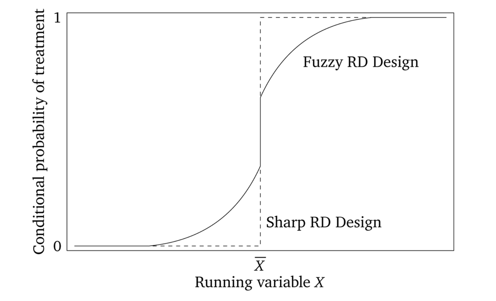
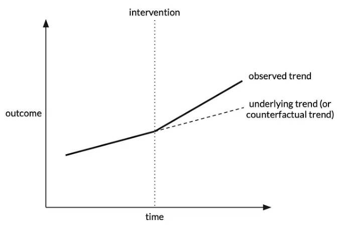

# Methods #4: Methods for unobserved confounding

`````{admonition} Executive summary
:class: info

These methods attempt to address unmeasured confounding.

**Instrumental variables (IV)**
* IV cause variation in treatment, but are unrelated to outcome and therefore unrelated to unmeasured confounders. Randomisation is an example of an IV.
* You can then use two-stage least squares to estimate causal effect (regress exposure on instrumental variable to get estimate of exposure independent of confounders, then regress outcome on that estimate)

**Regression discontinuity design (RDD)**
* Can use RDD when exposure status is determined by a continuous variable exceeding an arbitrary threshold.
* We look at individuals who fall just above and below the threshold. We expect the relationship between that variable and the outcome to be continuous (i.e. they're a similar group with similar values of variable, who would've otherwise expect to have similar outcomes if no exposure/treatment was triggered).
* Therefore, any discontinuity/jump in that relationship indicates a causal relationship with the exposure. *"If you see a turtle on a fencepost, you know he didn’t get there by himself".*

**Interrupted time series (ITS)**
* Compare change over time in a continuous population-level outcome before and after an exposure is introduced. Assuming the trend would have been unchanged without the exposure, a change in trend at point of introduction can be attributed to the exposure

**Difference in differences (DiD)**
* Compare change over time in a continuous population-level outcome between a group that becomes exposed/treated, and a group that does not
`````

## Addressing unobserved confounding

'The above methods rely on an assumption of no unmeasured confounding (ie, conditional exchangeability), which is often not plausible in observational study designs. The following methods attempt to address unmeasured confounding, subject to certain unprovable assumptions, by exploiting some assignment mechanism (akin to randomisation in an RCT) that determines exposure status but is thought to be unrelated to any unobserved confounders.' [[Igelström et al. 2022]](https://doi.org/10.1136/jech-2022-219267)

---

## Instrumental variables

### What is an instrumental variable?

An **instrumental variable (IV)** is a variable that satisfies the following assumptions:
1. It **causes variation in the exposure/treatment** (i.e. relevance assumption - it is correlated with X, an endogenous explanatory variable)
2. It is **unrelated to the outcome**
3. As it is unrelated to the outcome, is is therefore **unrelated to unmeasured confounders** (unmeasured differences in characteristics that affect outcomes) (i.e. **exogeneity** assumption - it is an exogneous variable) [[McClellan et al. 1994]](https://doi.org/10.1001/jama.1994.03520110039026)[[Igelström et al. 2022]](https://doi.org/10.1136/jech-2022-219267) [[source]](https://towardsdatascience.com/instrumental-variables-a-practical-explanation-1a583408a5b9)

This is illustrated below:
````{mermaid}
  flowchart LR;

    iv("Instrumental variable"):::white;
    e("Exposure/treatment"):::white;
    o("Outcome"):::white;
    u("Unmeasured confounders"):::white;

    iv --> e;
    e --> o;
    u -.-> e;
    u -.-> o;
  
    classDef white fill:#FFFFFF, stroke:#FFFFFF;
    classDef black fill:#FFFFFF, stroke:#000000;
    classDef empty width:0px,height:0px;
    classDef green fill:#DDF2D1, stroke: #FFFFFF;
````

Due to these characteristics, instrumental variables enable us to mimic randomisation to treatment. [[McClellan et al. 1994]](https://doi.org/10.1001/jama.1994.03520110039026) In fact, **randomisation to treatment** in an RCT is an example instrumental variable (it meets the above assumptions).

````{mermaid}
  flowchart LR;

    iv("RCT randomisation to treatment"):::white;
    e("Exposure/treatment"):::white;
    o("Outcome"):::white;
    u("Unmeasured confounders"):::white;

    iv --> e;
    e --> o;
    u -.-> e;
    u -.-> o;
  
    classDef white fill:#FFFFFF, stroke:#FFFFFF;
    classDef black fill:#FFFFFF, stroke:#000000;
    classDef empty width:0px,height:0px;
    classDef green fill:#DDF2D1, stroke: #FFFFFF;
````

You have likely identified an instrumental variable 'if people are confused when you tell them about the instrument's relationship to the outcome'.
* No-one is confused if you say family size will reduce labour supply of women
* They will be confused if you use gender composition of first two children as instrumental variable, and find 'that mothers whose first two children were the same gender were employed outside the home less than those whose two children had a balanced sex ratio', as they don't expect gender composition to incentive work outside home - but it is related as if both the same gender, they're more likely to try again for child of another gender [[Causal Inference: The Mixtape - Scott Cunningham]](https://mixtape.scunning.com/06-regression_discontinuity)

### Two-stage least squares (2SLS)

You can use the two-stage least squares (2SLS) method to estimate the causal effect, using instrumental variables for individual-level data.

1. **Regress exposure (${x}$) on instrumental variable (G) to produce $\hat{x}$ (estimate of exposure independent of confounders)**
2. **Regress outcome (Y) on $\hat{x}$**. Here, $\hat{x}$ is replacing the actual value of the problematic predictor, ${x}$. [BSc Medical Sciences]

The 'groups being compared differ only in likelihoods of treatment, as opposed to a division into pure treatment and control groups'. Hence, this 'method estimates an incremental or "marginal" effect of treatment only over the range of variation in treatment across the IV groups'. [[McClellan et al. 1994]](https://doi.org/10.1001/jama.1994.03520110039026)

'IV analysis estimates a local average treatment effect (LATE) among 'compliers' - individudals whose exposure status is affected by the instrument. This group cannot be precisely identified, and the LATE may therefore sometimes be of limited practical or policy relevance'. [[Igelström et al. 2022]](https://doi.org/10.1136/jech-2022-219267)

### Assumptions of instrumental variable analysis

(1) **Instrumental variable assumptions**(as above)

(2) **Homogeneity assumption** - the association between the instrumental variable and the exposure is homogenous (same for everyone in the population), or the effect of the exposure on the outcome is homogenous [BSc Medical Sciences]

### Limitations

'A concern with any IV strategy is that the instrumental variable is correlated with unobserved determinants of the outcome of interest.' Can address by estimating models for held=back risk factors pre-determined at delivery date, looking for correlation with the IV. [[Card et al. 2018]](http://www.nber.org/papers/w24493)

### Example: Mendelian randomisation

Disease association with non-genetic risk factors are often confounded - for example:
````{mermaid}
  flowchart LR;

    e("Drinking alcohol"):::green;
    o("Lung cancer"):::green;
    c("Smoking"):::white;

    e --> o;
    c --> e; c --> o;
  
    classDef white fill:#FFFFFF, stroke:#FFFFFF;
    classDef black fill:#FFFFFF, stroke:#000000;
    classDef empty width:0px,height:0px;
    classDef green fill:#DDF2D1, stroke: #FFFFFF;
````

Genotype-phenotype associations are much less likely to be confounded. They are aetiological associations (causing or contributing to disease/condition development). 

If we know of a gene closely linked to the phenotype without direct effect on the disease, it can often be reasonably assumed that the gene is not itself associated with any confounding factors - a phenomenon called **Mendelian randomization**. Genetic variants (G) should influence the exposure (X) but should not be directly associated with confounders (U) or the outcome (Y).

We can then identify the causal relationship between X and Y - if it doesn't cause Y, then G should be independent of Y. This is the same logic as we use for an RCT (where G would be randomisation to treatment).
 
````{mermaid}
  flowchart TD;

    con:::outline;
    subgraph con["If X doesn't cause Y..."]
      G:::white;
      X:::white;
      Y:::white;
      U:::white;
    end

    G --> X;
    U --> X;
    U --> Y;

    uncon:::outline;
    subgraph uncon["If X causes Y..."]
      G2("G"):::white;
      X2("X"):::white;
      Y2("Y"):::white;
      U2("U"):::white;
    end

    G2 --> X2;
    U2 --> X2;
    U2 --> Y2;
    X2 --> Y2;

    classDef white fill:#FFFFFF, stroke:#FFFFFF;
    classDef black fill:#FFFFFF, stroke:#000000;
    classDef outline fill:#FFFFFF;
````

[BSc Medical Sciences]

### Example: Effect of intensive treatment on mortality in patients with acute myocardial infarction

Example from [McClellan et al. 1994](https://doi.org/10.1001/jama.1994.03520110039026): Want to determine the effect of more intensive treatments (e.g. catheterisation and revascualisation) on mortality in elderly patients with acute myocardial infarction. They use distance from hospital as an 'instrumental variable to account for unobserved case-mix variation (selection bias) in observational Medicare claims data' [[McClellan et al. 1994]](https://doi.org/10.1001/jama.1994.03520110039026)

Why is distance an instrumental variable?
* Intensive treatment only performed at certain hospitals
* Comparing treatments and outcomes between patients treated at different hospitals risks selection bias, 'because physician and patient decisions that influence treatment choice may ALSO influence choice of hospital to go to - e.g. AMI patients who appear to be better candidates for catheterisation may be disproportionately admitted to catheterisation hospitals' [[McClellan et al. 1994]](https://doi.org/10.1001/jama.1994.03520110039026)
* Distance from hospital (specifically, differential distance to hospital providing intensive treatment):
   * **Affects** probability of receiving intensive treatment
   * **Does not affect** patient characteristics
* Hence, distance from hospital can be used as an instrumental variable [[Igelström et al. 2022]](https://doi.org/10.1136/jech-2022-219267) - it meets the IV assumptions:
    1. Causes variation in whether receive intensive treatment
    2. Unrelated to mortality
    3. Unrelated to unmeasured confounders (like the physician and patient decisions)

````{mermaid}
  flowchart LR;

    treat("<b>Intensive treatment</b><br>(e.g. catheterisation)"):::green;
    mortality("<b>Mortality</b>"):::green;
    hosp("<b>Hospital</b> attended<br>(i.e. whether it<br>offers the treatment)"):::white;
    dist("<b>Differential distance</b> to<br> hospital providing<br>intenstive treatment"):::white;
    decisions("Physician and patient<br><b>decisions</b>"):::white;

    dist --> hosp;
    decisions --> hosp;
    hosp --> treat;
    treat --> mortality;
  
    classDef white fill:#FFFFFF, stroke:#FFFFFF;
    classDef black fill:#FFFFFF, stroke:#000000;
    classDef empty width:0px,height:0px;
    classDef green fill:#DDF2D1, stroke: #FFFFFF;
````

First, checked for presence of selection bias (i.e. whether hospital type affects treatment intensity - and therefore whether simple comparisons of treatments and outcomes across hospital types are valid). Then, as was present, used IV methods to estimate effect of intensive treatment on mortality. **Differential distance approximately randomises patients to different likelihoods of receiving intensive treatments**, uncorrelated with health status.
* First, compared two groups of apx. equal size - patients near to catheterisation hospital (differential distance <= 2.5 miles) and patients far from them (> 2.5 miles). This evidenced assumption that distribution of health status in AMI patients is independent of differential distance, and illustrates IV method, estimating the 'average effect of invasive treatment for all patients who are marginal from the standpoint of the near-far IVs - those who undergo catheterisation in the relatively near group and not in the relatively far group - if the two groups are balanced and if catheterisation is the only treatment that differs between the groups'
* Then used more general IV estimation netchniques with wide range of differential distance groups, and account for small remaining observable differences between differential-distance groups [[McClellan et al. 1994]](https://doi.org/10.1001/jama.1994.03520110039026)

### Example: SAMueL

This doesn't suffer with problem as above, as here, we're assuming that all patients would simply go to their closest unit.

You could test that assumption, although we don't have the data.

````{mermaid}
  flowchart LR;

    treat("<b>Thrombolysis</b><br>(e.g. catheterisation)"):::green;
    out("<b>Stroke outcome</b>"):::green;
    con("NIHSS<br>Pre-stroke disability<br>Atrial fibrillation"):::white;
    hosp("Hospital propensity<br>to thrombolyse"):::white;

    hosp --> treat;
    treat --> out;
    con --> treat;
    con --> out;
  
    classDef white fill:#FFFFFF, stroke:#FFFFFF;
    classDef black fill:#FFFFFF, stroke:#000000;
    classDef empty width:0px,height:0px;
    classDef green fill:#DDF2D1, stroke: #FFFFFF;
````

### Example: Neonatal

We could apply the same logic as in SAMueL - although we anticipate this might be more influenced by patient choice on where they want to give birth - in which case, would you use some kind of distance measure as above?

````{mermaid}
  flowchart LR;

    treat("<b>Caesarean</b>"):::green;
    out("<b>HIE</b>"):::green;
    con("Confounders"):::white;
    hosp("Hospital propensity<br>to do caesarean"):::white;
    choice("Physician and patient choice of hospital<br>(e.g. better candidates for caesarean<br>may be sent to hospitals with more propensity?)"):::white;
    dist("Hospital distance measure"):::white;

    choice --> hosp;
    dist --> hosp;
    hosp --> treat;
    treat --> out;
    con --> treat;
    con --> out;
  
    classDef white fill:#FFFFFF, stroke:#FFFFFF;
    classDef black fill:#FFFFFF, stroke:#000000;
    classDef empty width:0px,height:0px;
    classDef green fill:#DDF2D1, stroke: #FFFFFF;
````

### Variants

'**Three-Stage Least Squares (3SLS)** - this method is an extension of the 2SLS method and is used when there are more than two endogenous variables in the model. The 3SLS method is based on the idea that the endogenous variables are correlated with each other, and therefore, the coefficients of these variables need to be estimated simultaneously.' [[source]](https://fastercapital.com/content/Econometric-Techniques--Understanding-Tinbergen-s-Statistical-Innovations.html)

---

## Regression discontinuity (RD)

Regression Discontinuity Design (RDD) was first used by Thistlethwaite and Campbell (1960). It's appeal is that it can convinvingly **eliminate selection bias**.

It can be used when the **exposure status** (wholly or partly) is determined by some **continuous variable exceeding some arbitrary threshold**. [[Igelström et al. 2022]](https://doi.org/10.1136/jech-2022-219267) It works best when the cut-off is known, precise and free of manipulation - and is most effect when the exposure 'has a "hair trigger" that is not tightly related to the outcome being studied'. Examples:
* Arrest for DWI when > 0.08 blood-alcohol content
* Probably of receiving healthcare insurance at 65
* Probability of receiving medical attention jumping when birthweight falls below 1,500 grams
* Probability of attending summer school when grades fall below some minimum level [[Causal Inference: The Mixtape - Scott Cunningham]](https://mixtape.scunning.com/06-regression_discontinuity)

'If the **relationship between the forcing variable and the outcome is otherwise continuous, any discontinuity or jump in the relationship can be attributed to the exposure**.' RD estimates a local average treatment effect (LATE) 'among the individuals who fall **just above or just below the threshold**.' For this reason, we require **large datasets**.

'As with IV analysis, bias can occur if the forcing variable is connected to the outcome through a back-door path or any other pathway besides the exposure.' [[Igelström et al. 2022]](https://doi.org/10.1136/jech-2022-219267)

Why does this work? See below...

### How does RDD work?

To understand RDD, we first focus on **continuity**, which is a core assumption that is illustrated below.

In the **first graph** observe that:
* X (often called the "running variable" or "assignment variable" or "forcing variable") is a confounder (causes D and Y)
* As treatment assignment is based on cut-off, we can never observe units in both treatment and control with same value of X (does not satisfy overlap condition, can't meet backdoor criterion)

The **second graph** illustrates that:
* We can identify causal effects for subjects with **values of X close to the cut-off c<sub>0</sub>**. This is possible because the cut-off is the sole point where treatment and control subjects overlap.
* There are lots of assumptions in this graph
* One of the assumptions is **continuity**
  * This means X has no direct effect on Y
  * i.e. **At c<sub>0</sub>, X no longer has a direct effect on Y**
  * i.e. The cut-off c<sub>0</sub> **cannot be triggering a competing intervention** at the same time it triggers treatment D
  * i.e. Expected potential outcomes are continuous at the cut-off (which would necessarily rule out competing interventions occurring at the same time)
  * **The null hypothesis is continuity** (i.e. things changes gradually), and **any discontinuity implies some cause** ("nature does not make jump" - 'if you see a turtle on a fencepost, you know he didn’t get there by himself')

[[Causal Inference: The Mixtape - Scott Cunningham]](https://mixtape.scunning.com/06-regression_discontinuity)

````{mermaid}
  flowchart TD;

    graphb:::outline;
    subgraph graphb[" "]
      X2("<b>X near c<sub>0</sub></b>"):::white;
      D2("<b>D</b>"):::white;
      U2("<b>U</b>"):::white;
      Y2("<b>Y</b>"):::white;
    end

    X2 --> D2;
    D2 --> Y2;
    U2 --> Y2;

    grapha:::outline;
    subgraph grapha[" "]
      X1("<b>X</b> (continuous variable)"):::white;
      D1("<b>D</b> (treatment)<br><i>receive if X > cut-off c<sub>0</sub></i>"):::white;
      U1("<b>U</b>"):::white;
      Y1("<b>Y</b> (outcome)"):::white;
    end

    X1 --> D1;
    D1 --> Y1;
    X1 --> Y1;
    U1 --> Y1;
    X1 <-.-> U1;

    classDef white fill:#FFFFFF, stroke:#FFFFFF;
    classDef black fill:#FFFFFF, stroke:#000000;
    classDef outline fill:#FFFFFF;
````

An example of RDD is Hoekstra (2009)
* Aim: Estimate causal effect of college on earnings
* Problem: **Selection bias**. State flagship universities are more selective than public universities in the same state. State flagship schools have individuals with higher observed and unobserved ability, and due to their ability, expected them to earn more regardless of their university.

See first image from Hoekstra (2009), which is about admission to flagship college based on SAT points:
* Horizontal axis (SAT points above/below admission cut-off) is centred around 0 (cut-off). Cut-off was binding but not deterministic - some students below cut-off still get in - they likely had qualifications compensating for low SAT scores. Re-centred SAT scores are the running variable
* This is not individual data - it is binned, with each dot the conditional mean (enrollment rate)
* Lines are least squares fitted values of running variable, and regression could include higher-order terms, so line is above to more flexibly track central tendencies of data, with lines fit seperately for left and right
* There is a discontinuous jump at cut-off
* **Looking at a large sample of students just either side of the cut-off, we expect them to be pretty similar to one another in terms of observable and unobservable characteristics**.

[[Causal Inference: The Mixtape - Scott Cunningham]](https://mixtape.scunning.com/06-regression_discontinuity)


In this figure, notice:
* Estimated discontinuity 0.095 means that those just above cut-off earn 9.5% higher wages on average than those just below. With a variety of bins, estimates range from 7.4 to 11.1%.
* He has found that '**where workers experienced a jump in the probability of enrolling at the state flagship university, there is, ten to fifteen years later, a separate jump in logged earnings of around 10%**. Those individuals who just barely made it in to the state flagship university made around 10% more in long-term earnings than those individuals who just barely missed the cutoff.'
* 'Insofar as **the two groups of applicants right around the cutoff have comparable future earnings in a world where neither attended the state flagship university, then there is no selection bias confounding his comparison**'.

[[Causal Inference: The Mixtape - Scott Cunningham]](https://mixtape.scunning.com/06-regression_discontinuity)


### Sharp v.s. fuzzy RDD

**Sharp RDD** - when probability of treatment goes from 0 to 1 at cut-off - and so running variable is deterministic of X (dashed line)

**Fuzzy RDD** - when probability of treatment discontinuously increases at cut-off (as in example above) (solid line)



### Applying to our work

This might be less relevant for caesarean (no single one cut-off for a single treatment).

However, it would be relevant to stroke, which has much clearer cut-offs. Although maybe focus per hospital would you need to? If you think hospital has impact on threshold?

---

## Interrupted time series (ITS)

The **interrupted time series (ITS)** design compares 'the **trend over time in a population-level outcome before and after an exposure** is introduced.'

'Assuming that the trend **would have been unchanged** if the intervention was not introduced, a **change in trend at the point of introduction** (in terms of level and/or slope) can be attributed to the exposure.' [[Igelström et al. 2022]](https://doi.org/10.1136/jech-2022-219267)

Image from Tam D Tran-The 3 Feb 2022 [Towards Data Science blogpost](https://towardsdatascience.com/sample-size-planning-for-interrupted-time-series-design-in-health-care-e16d22bba13f):


'ITS can be regarded as a special case of IV or RD, with time being the instrument or forcing variable. ITS addresses time-invariant confounding but can be biased if other events that influence the outcome happen at the same time as the exposure'. [[Igelström et al. 2022]](https://doi.org/10.1136/jech-2022-219267)

### Things to consider

It is vitally important to carefully design an ITS study. Considerations include...

**Number of time-points before and after the intervention**
* Usually equally spaced intervals, recommendations from 3 - 50 time points per segment, depends on methods used for analysis (e.g. OLS can have fewer than ARIMA)
* General consensus: 'longer time series tend to have more power than shorter time series'

**Sample size per time point**:
* Larger sample --> more stable estimates --> less variability and outliers

**Frequency of time points**
* 'Trade-off between number of time points and sample size per time point, depending on the choice of time interval'
* 'When possible, choose frequency that have clinical or seasonal meaning so that a true underlying trend can be established. Also consider whether there may be a delay or waning intervention effect, especially when the impact occurs gradually, so you can choose frequency accordingly.'

**Location of intervention**
* Intervention can be be early (e.g. 1/3 time points before), midway (most commonly), or late (e.g. 2/3 time points before) - as long as sufficient time points per segment + sample size

**Expected effect size**
* Two effect types - **slope change** (gradual change in gradient of trend) and **level change** (instant change in level) - and can be a combination of both

[[Tam D Tran-The 2022]](https://towardsdatascience.com/sample-size-planning-for-interrupted-time-series-design-in-health-care-e16d22bba13f)

Image from Tam D Tran-The 3 Feb 2022 [Towards Data Science blogpost](https://towardsdatascience.com/sample-size-planning-for-interrupted-time-series-design-in-health-care-e16d22bba13f):


---

## Difference in differences (DiD)

The **difference-in-differences** (DiD) design predates the randomised experiment by roughly 85 years. It was first used in 1855 by John Snow in his analysis of the cause of cholera. However, it is used relatively infrequently nowadays. [[Canglia and Murray 2020]](https://doi.org/10.1007%2Fs40471-020-00245-2)

In its simplest form, the Did method compares the **change over time in a continuous population-level outcome** between:
* An **exposed** group
* An **unexposed** group

(Compares change over time in the exposed group, to change over time in the unexposed group, as just comparing the exposed group before and after has issues).

It 'attempts to control for changing time trends, by using a comparison group to represent the counterfactual outcome trend in the exposed.' 'DiD also addresses time-invariant confounding but requires assuming that there would have been no difference in trend between the groups in the absence of the intervention (the **"parallel trends" assumption**).' [[Igelström et al. 2022]](https://doi.org/10.1136/jech-2022-219267)

Image from Figarri Keisha 25 March 2022 [Medium blog post](https://medium.com/bukalapak-data/difference-in-differences-8c925e691fff):


### Example: John Snow and cholera

In 1855, the cause of cholera was unknown. John Snow suspected it was waterborne. He compared:
* Southwark and Vauxhall Company
* Lambeth Water company

Both used water from River Thames. Neighbourhoods served by them both had very high mortality during the 1849 outbreak. In 1852, Lambeth Water Company moved its water intake to a site upstream of the sewage outflow.

Question: Did the rate of cholera death decrease when water intake moved upstream, compared to if it had remained downstream? He couldn't just compare before and after for Lambeth due to the change in cholera cases over time - so instead, answered by comparing the change in deaths, to the changes in deaths for Southwark and Vauxhall Company

Answer by estimating the average causal effect in the treated, or average treatment effect in the treated, or ATT.

Snow observed from 1849 to 1854 that:
* Southwark: increased by 118 deaths per 100,000
* Lambeth: decreased by 653 deaths per 100,000

[[Canglia and Murray 2020]](https://doi.org/10.1007%2Fs40471-020-00245-2)

### Assumptions

**Consistency** - 'the observed exposure of interest is equal to the counterfactual exposure of interest'
* e.g. 'Moving the water source from opposite Hungerford Market to Thames Ditton maps to a sufficiently well-defined intervention'

**Exchangeability and parallel trends** - 'any unmeasured determinants of the outcome are either time-invariant or group-invariant'
* e.g. 'Any unmeasured determinants of the cholera death rate either do not vary with time or do not vary by district.'

**Exchangeability and strict exogeneity** - 'implementation of the change in exposure was not related to the baseline value of the outcome variable'
* e.g. 'The decisions to move or not move the Lambeth Company and the Southwalk & Vauxhall Company water intake sources were independent of the cholera mortality rates in neighborhoods supplied by those companies.'

**Positivity** - 'all individuals or subgroups of individuals are eligible to receive all levels of exposure'
* e.g. 'The decision to move or not move the water intake source was available to both the Lambeth and Southwalk & Vauxhall Companies.'

[[Canglia and Murray 2020]](https://doi.org/10.1007%2Fs40471-020-00245-2)
