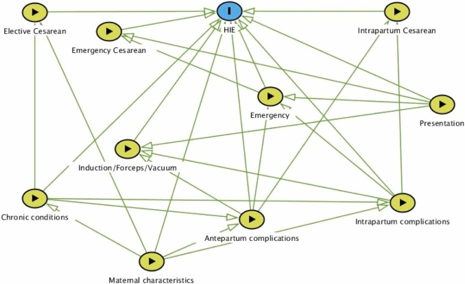

# Obstetric studies that address the treatment paradox

`````{admonition} Executive summary
:class: info

This page summarises examples of studies in obstetrics that have attempted to account for the treatment paradox - or are focussed on estimating the causal relationship between the treatment and exposure (and so )

**Instrumental variable** - Costa-Ramón et al. 2018; Costa-Ramón et al. 2022; Halla et al. 2016; Jachetta 2015; Card et al. 2018; Tonei 2018; Chen and Pan 2022; Dawe et al. 2017;

**Difference-in-differences** - Costa-Ramón et al. 2022;

**Treatment as predictor** - Thangaratinam et al. 2017;

**Propensity score matching** - Helenius et al. 2019; Pyykönen et al. 2017;

**Marginal structural model** - Ladeira et al. 2021;

**Inverse probability of treatment weighting** - Cooray et al. 2020; Cavalcante et al. 2022;

**Regression discontinuity design** - Jensen and Wüst 2015;

**Randomised trial data** - Badurdeen et al. 2024;

**Exclusion of treated** - Steer et al. 2023;
`````

## Costa-Ramón et al. 2018

Study: It's about time: Cesarean sections and neonatal health. [[Costa-Ramón et al. 2018]](https://doi.org/10.1016/j.jhealeco.2018.03.004)

Aim: Estimate causal relationship between caesarean section and newborn health:
* Apgar-1 and Apgar-5
* Reanimation (assisted ventilation)
* ICU admission
* Neonatal death
* Umbilical cord pH

Reason for causal inference: Comparing women who had C-section to those who had vaginal birth...
* Suffers from omitted variable bias - they differ in characteristics that influence outcome - and analysis found observable characteristics that can relate to newborn health differed significantly (age, gestational length, obstetric risk, education achievement)
* 'Does not allow to identify which kind of c-section is causing whatever health effects are found, since we observe the outcomes of both medically and non-medically indicated interventions'

Method:
* **Instrumental variable approach** - use time of birth as instrument for mode of delivery
    * Time of birth is associated by whether receive the treatment - unplanned C-sections more likely in early hours of the night
    * Time of day unrelated to outcome and to other confounders - mothers giving birth at different times of day are observationally similar - suggesting excess number of C-sections observed are due to non-medical reasons
* OLS regression with outcome of neonatal health, and predictors of:
    * Mother's personal and pregnancy characteristics
    * Estimate from a regression with outcome of whether delivery was unplanned C-section or vaginal delivery and predictor is whether woman gave before from 11pm-4am or not (which is when obstetricians are more likely to, to get time for rest or leisure)


My DAG:

````{mermaid}
  flowchart LR;

    iv("<b>Time of day of birth</b><br>Instrumental variable"):::white;
    e("<b>Caesarean section</b><br>Exposure/treatment"):::white;
    o("<b>Neonatal health</b><br>(Apgar-1, Apgar-5, assisted<br>ventilation, ICU admission,<br>neonatal death, umbilical pH)<br>Outcome"):::white;
    u("Unmeasured confounders"):::white;

    iv --> e;
    e --> o;
    u -.-> e;
    u -.-> o;
  
    classDef white fill:#FFFFFF, stroke:#FFFFFF;
    classDef black fill:#FFFFFF, stroke:#000000;
    classDef empty width:0px,height:0px;
    classDef green fill:#DDF2D1, stroke: #FFFFFF;
````

## Costa-Ramón et al. 2022

Study: The Long-Run Effects of Cesarean Sections. [[Costa-Ramón et al. 2022]](https://doi.org/10.3368/jhr.58.2.0719-10334R1)

Aim: Estimate causal relationship between potentially avoidable caesarean sections and health outcomes:
* Neonatal - 'Apgar scores one minute after birth, admission to intensive care unit (ICU), need of assisted ventilation, and early neonatal mortality (defined as neonatal death in the first week of life)'
* Longer-term - 'asthma, atopic diseases (atopic dermatitis and allergic rhinitis), type 1 diabetes, and obesity'

Methods:
* **(1) Instrumental variable approach**
    * Use combination of (1) type of day - working or pre-leisure day, and (2) work shift - normal or not - as found that unplanned C-section more likely during the normal working shift on pre-leisure days compared to regular working days
    * Use 2SLS estimator to identify a local average treatment effect (LATE)
* **(2) Difference-in-differences**
    * For sample of sibling pairs, where older sibling was born by vaginal delivery, then 'compare the health gap between siblings in families where the second child was born by an unplanned C-section with families where the second child was born by vaginal delivery'
    * This controls for 'time-invariant unobserved heterogeneity at the family level and the effect of birth order'
    * My explanation: Difference in differences compares change in continuous population-level outcome (neonatal health) between exposed (caesarean) and unexposed group (vaginal)

Extracts from results:
* 'We find that the OLS results replicate existing findings. Cesarean sections are associated with adverse outcomes at birth and higher neonatal mortality. Our 2SLS estimates are not significant for any of the outcomes. However, the magnitude of coefficients and large standard errors suggest that we cannot reject that there is a (potentially large) effect on neonatal outcomes... 2SLS estimates are expected to be particularly uninformative with low treatment and outcome probabilities.'
* 'Bivariate probit marginal effects are substantially more precisely estimated than the 2SLS coefficients, yet all point estimates from the bivariate probit models are within the confidence intervals of the 2SLS estimates. The bivariate probit results suggest that unplanned C-sections increase the probability of having a low Apgar score (Apgar lower than seven), being admitted to the intensive care unit, and receiving assisted ventilation. The magnitudes of the bivariate probit marginal effect estimates are similar to OLS estimates. However, we do not find significantly increased mortality risk within seven days after birth. The results from the differences-in-differences models give support to these findings with similarly sized and more precise coefficients. Overall, our results suggest that unplanned C-sections have a negative impact on neonatal health. However, these adverse effects do not translate into a higher probability of early neonatal mortality.'

'Our empirical strategy builds on numerous studies that have used siblings fixed effects to estimate the impact of health shocks while in utero or after birth' - for example:
* [[Oreopoulos et al. 2008]](https://doi.org/10.3368/jhr.43.1.88) - Short-, Medium-, and Long-Term Consequences of Poor Infant Health: An Analysis Using Siblings and Twins
* [[Almond, Edlund, and Palme 2009]](https://doi.org/10.1162/qjec.2009.124.4.1729) - Chernobyl’s Subclinical Legacy: Prenatal Exposure to Radioactive Fallout and School Outcomes in Sweden
* [[Almqvist et al. 2012]](https://doi.org/10.1111/j.1365-2222.2012.04021.x) - The impact of birth mode of delivery on childhood asthma and allergic diseases–a sibling study
* [[Aizer, Stroud, and Buka 2016]](https://doi.org/10.3368/jhr.51.3.0914-6664R) - Maternal Stress and Child Outcomes: Evidence from Siblings

My DAG for the instrumental variable part:

````{mermaid}
  flowchart LR;

    iv("<b>Type of day + work shift</b><br>Instrumental variable"):::white;
    e("<b>Caesarean section</b><br>Exposure/treatment"):::white;
    o("<b>Neonatal health</b><br>(Apgar-1, assisted ventilation,<br>ICU admission, neonatal death)<br><i>Also long-term (asthma, diabetes, etc)</i><br>Outcome"):::white;
    u("Unmeasured confounders"):::white;

    iv --> e;
    e --> o;
    u -.-> e;
    u -.-> o;
  
    classDef white fill:#FFFFFF, stroke:#FFFFFF;
    classDef black fill:#FFFFFF, stroke:#000000;
    classDef empty width:0px,height:0px;
    classDef green fill:#DDF2D1, stroke: #FFFFFF;
````

## Halla et al. 2016

Study: Cutting fertility? The effect of cesarean deliveries on subsequent fertility and maternal labor supply. [[Halla et al. 2016]](https://doi.org/10.1016/j.jhealeco.2020.102325)

Aim: Identify effect of caesarean delivery on subsequent fertlity and maternal labour supply

Method:
* **Instrumental variable approach** - uses day of week as instrumental variable
    * Obstetricians less likely to do caesarean deliveries on weekends and public holidays, and are incentivised to do them on Fridays and days before public holidays
    * 'Women giving birth on different days of the week are pre-treatment observationally identical'

My DAG:

````{mermaid}
  flowchart LR;

    iv("<b>Day of week</b><br>Instrumental variable"):::white;
    e("<b>Caesarean section</b><br>Exposure/treatment"):::white;
    o("<b>Fertility & Maternal labour supply</b><br>Outcome"):::white;
    u("Unmeasured confounders"):::white;

    iv --> e;
    e --> o;
    u -.-> e;
    u -.-> o;
  
    classDef white fill:#FFFFFF, stroke:#FFFFFF;
    classDef black fill:#FFFFFF, stroke:#000000;
    classDef empty width:0px,height:0px;
    classDef green fill:#DDF2D1, stroke: #FFFFFF;
````

## Jachetta 2015

*Cannot find paper, so notes are from Costa-Ramón et al. 2018's description of the study*

Study: Cesarean Sections and Later Health Outcomes. Jachetta 2015.

Aim: Estimate causal relationship between caesarean section and hospitalisation (total or resulting in asthma)

Method:
* **Instrumental variable approach** - use 'variation in medical malpractice premia at the Metropolitan Statistical Area (MSA) level in the US as an instrument for the rate of risk-adjusted cesarean sections' - though note some threats to the validity of the instrument

````{mermaid}
  flowchart LR;

    iv("<b>Medical malpractice premia</b><br>Instrumental variable"):::white;
    e("<b>Caesarean section</b><br>Exposure/treatment"):::white;
    o("<b>Hospitalisation</b><br>Outcome"):::white;
    u("Unmeasured confounders"):::white;

    iv --> e;
    e --> o;
    u -.-> e;
    u -.-> o;
  
    classDef white fill:#FFFFFF, stroke:#FFFFFF;
    classDef black fill:#FFFFFF, stroke:#000000;
    classDef empty width:0px,height:0px;
    classDef green fill:#DDF2D1, stroke: #FFFFFF;
````


## Williams et al. 2018

Study: Directed acyclic graphs: a tool for causal studies in paediatrics. [[Williams et al. 2018]](https://doi.org/10.1038/s41390-018-0071-3)

This study is a slight exception as it is just explaining the likely existence of the treatment paradox in a previous study.

Pre-eclampsia is hypothesised to cause cerebral palsy. It is also associated with higher risk of medically indicated (ordered by the physician) pre-term birth - and pre-term birth is also associated with higher risk of cerebral palsy. Steve Thornton comments that "pre-eclampsia leads to pre-term birth because women are induced or delivered early because of the pre-eclampsia to prevent it getting worse".

You could adjust for pre-term birth or gestational age like a confounding variable. However, pre-term birth is a intermediate between pre-eclampsia and cerebral palsy, and not a common cause of both. Therefore, this adjustment (overadjustment) takes away from the detrimental effect of pre-elcampsia, mediated through pre-term birth - attenuating the effect or event reversing it.

In an early study, pre-eclampsia was found to be protective in pre-term infants and detrimental for those born later. However, we expect pre-eclampsia to be detrimental for all infants. This finding could be as the analysis seperated out pre-term births and later births, closing the causal path between pre-eclampsia and cerebral palsy via pre-term birth.[[Williams et al. 2018]](https://doi.org/10.1038/s41390-018-0071-3)


````{mermaid}
  flowchart LR;

    %% Define the nodes and subgraphs
    eclam("Pre-eclampsia")
    preterm("Preterm birth")
    cp("Cerebral palsy")

    %% Produce the figure
    eclam --> preterm;
    preterm --> cp;
    eclam --> cp;
````

However, it's likely more complex. In a more realistic directed acyclic graph (DAG) below, chorioamnionitis is added. It is another cause of pre-term birth and cerebral palsy.

Gestational age, as a shared effect of pre-eclampsia and chorioamnionitis, acts as a **collider**. This is the opposite of a confounder (where a common cause of exposure and outcome is not controlled for) - instead, a collider is when the exposure and outcome (or factors causing) each influence a common third variable, and that variable is controlled for in the design. Controlling for a collider can result in a distorted association betwene the exposure and outcome, when actually none exists.

In this model, if we look in a group of pre-term infants:
* Babies born to mothers with pre-eclampsia will be less likely to have chorioamnionitis and vice versa
* The effect of pre-eclampsia will be compared with the effect of chorioamnionitis on cerebral palsy, and will falsy appear to be protective - the estimated direct causal effect of pre-eclampsia on the outcome will be biased (through the effect of chorioamnionitis)

Hence, although widely used, conditioning on gestational at birth in studies of prenatal exposures and their relationship to postnatal outcomes may not reduce but actually lead to bias through overadjustment and faulty comparisons, and generate counterintuitive results and apparent changes of effect in different groups of patients.[[Williams et al. 2018]](https://doi.org/10.1038/s41390-018-0071-3)

````{mermaid}
  flowchart LR;

    %% Define the nodes and subgraphs
    chor("Chorioamnionitis")
    eclam("Pre-eclampsia")
    preterm("Preterm birth")
    cp("Cerebral palsy")

    %% Produce the figure
    chor --> preterm;
    eclam --> preterm;
    chor --> cp;
    preterm --> cp;
    eclam --> cp;
````

## Thangaratinam et al. 2017

Study: Development and validation of Prediction models for Risks of complications in Early-onset Pre-eclampsia.[[Thangaratinam et al. 2017]](https://doi.org/10.1186/s12916-017-0827-3)

Aim: Predict adverse maternal outcomes outcomes in patients with early-onset pre-eclampsia

Methods:
* Survival model 'censored at 34 completed weeks’ gestation to predict the risk over time at daily intervals from diagnosis of early onset pre-eclampsia'
* Logistic regression model 'to predict the overall risk of maternal complications by postnatal discharge'
* Account for treatment paradox by **including treatment as predictor:** baseline treatment with hypertensives and magnesium sulfate as predictors in both models [[Thangaratinam et al. 2017]](https://doi.org/10.1186/s12916-017-0827-3)

In a 2016 commentary in the British Journal of Obstetrics and Gynaecology (BJOG)[[Cheong-See et al. 2016]](https://doi.org/10.1111/1471-0528.13859), they examined this model to identify what made it succesful and highlighted:
* Large sample size
* Standardisation of treatment or intervention
* Consideration of the initiation of treatment being an outcome itself - i.e. "when starting a treatment is likely to prevent an adverse outcome, those who received the treatment could also be considered to have experienced the outcome"[[Murphy et al. 2019]](https://doi.org/10.5772/intechopen.87311)

## Helenius et al. 2019

Study: Association of early postnatal transfer and birth outside a tertiary hospital with mortality and severe brain injury in extremely preterm infants: observational cohort study with propensity score matching. [[Helenius et al. 2019]](https://doi.org/10.1136/bmj.l5678)

Aim: Relationship between birth in non-tertiary hospital, or birth then transfer to tertiary, and adverse outcomes.
* Studies have found care extremely pre-term infants in tertiary hospitals (provide specialist care) gives optimal outcomes
* It is unclear whether the association between postnatal transfer and adverse outcomes persists in the context of modern neonatal care and dedicated neonatal transfer services. Harms associated with postnatal transfer might relate to suboptimal stabilisation at a non-tertiary hospital, the transfer of sicker infants, or the transfer itself. - *this is the causality issue*

Methods:
* UK National Neonatal Research Database (NRRD)
* Groups of infants:
    * Non-tertiary care (non-tertiary, no transfer)
    * Upward transfer (non-tertiary --> tertiary within 48h)
    * Horizontal transfer (tertiary --> tertiary within 48h)
    * Control (tertiary, no transfer)
* Primary analysis: matched groups of infnats from non-tertiary, upward and control (**propensity score matching** to create matched groups for comparison with near identical distributions of background and potential confounder variables).
    * Matching 'entailed fitting a logistic regression of the treatment assignment (a variable that indicates upward transfer, non-tertiary care, or control) as the outcome and all the available background variables as the covariates'
    * Then trimmed to exclude extreme propensities
    * Then matched 1:1:1, Caliper matching
* Outcomes: 'death before discharge from neonatal care, severe brain injury, and their combination: survival without severe brain injury'

Results example:
* 'Compared with controls, infants in the upward transfer group had no significant difference in the odds of death before discharge (1.22, 95% confidence interval 0.92 to 1.61) but significantly higher odds of severe brain injury (2.32, 1.78 to 3.06) and significantly lower odds of survival without severe brain injury (0.60, 0.47 to 0.76). The NNT to prevent one case of severe brain injury was 8 (95% confidence interval 6 to 11) and to prevent one case of death or severe brain injury was 9 (6 to 17). Compared with controls, infants in the non-tertiary care group had significantly higher odds of death before discharge (1.34, 95% confidence interval 1.02 to 1.77) but no significant difference in the odds of severe brain injury (0.95, 0.70 to 1.30) or survival without severe brain injury (0.82, 0.64 to 1.05). The NNT to prevent one case of death was 20 (95% confidence interval 10 to 435). Compared with infants in the upward transfer group, infants in the non-tertiary care group had no significant difference in the odds of death before discharge (95% confidence interval 1.10, 0.84 to 1.44) but significantly lower odds of severe brain injury (0.41, 0.31 to 0.53) and significantly higher odds of survival without severe brain injury (1.37, 1.09 to 1.73). The NNT to prevent one case of severe brain injury was 8 (95% confidence interval 6 to 11) and to prevent one case of death or severe brain injury was 14 (8 to 58).'

[[Responses to the article here]](https://doi.org/10.1136/bmj.l5678).

## Ladeira et al. 2021

Study: Caesarean delivery and early childhood caries: Estimation with marginal structural models in Brazilian pre-schoolers [[Ladeira et al. 2021]](https://doi.org/10.1111/cdoe.12634)

Aim: Association between caesarean section and early childhood caries (ECC) (study hypothesized that caesarean-born children would be at a higher risk of ECC). ECC is tooth decay in children under 6.

Methods:
* Bivariate Poisson regresison model
* Multivariate analysis adjusted for minimal set of variables according to DAG rules
* **Marginal structural model** - estimate weights using IPTW, then Poisson regressions weighted by the inverse probability of caesrean

Theoretical model:


Results:
* Caesarean protective in bivariate and multivariate models, but not in MSM
* 'socioeconomic factors may underlie the spurious association between caesarean section protective for ECC, as observed in bivariate regression models.'

## Cooray et al. 2020

Study: Protocol for development and validation of a clinical prediction model for adverse pregnancy outcomes in women with gestational diabetes [[Cooray et al. 2020]](http://dx.doi.org/10.1136/bmjopen-2020-038845)

Aim: Predicting adverse outcomes (neonatal and maternal) in women with gestational diabetes (in presence of treatment paradox from insulin)

Method:
* 'Sensitivity analyses to address the confounding effect of insulin treatment on predictor-outcome associations and hence the performance of the prediction model. These are:
    * **IPTW** - propensity of being treated with insulin based on pre-treatment characteristics
    * **Insulin as component of outcome**
    * **Exclude insulin treatment** cases
    * Multinomial regression for combinations of composite outcome of adverse pregnancy outcome and insulin treatment
* The three possible results from the **sensitivity analysis** to evaluate the effect of including the decision to treat with insulin will be informative and may be interpreted as follows. If the sensitivity analyses find that the inclusion of the decision to treat with insulin within the outcome:
    1. Positively affects model performance, then this suggests the presence of treatment paradox, that is, pregnancy complications are more likely to occur in the absence of insulin therapy;
    2. Has no significant effect on model performance then this suggests that the model is robust with predictive performance not affected by the decision to treat, that is, the absolute risk of adverse pregnancy outcomes for an individual woman with GDM is not affected by insulin therapy;
    3. Negatively affects model performance, then this would suggest that adverse pregnancy outcomes are more likely to occur in women treated with insulin, and thus imply more ‘severe’ GDM or a harmful effect for this treatment. (unlikely)

Other notes:
* Addressing the treatment paradox (in this case with insulin) is a challenge in prediction modelling studies. The traditional approach has been to accept predictions in the context of current care. However, this does not remove the possibility that a potentially useful model may appear to perform poorly due to the confounding effect of the judicious application of effective interventions to individual’s whom clinicians subjectively assess to be at high risk of the outcome of interest.
* Two solutions to address the problem of treatment paradox in prediction modelling studies have been advocated.50
    * First, the use of treatments suspected to confound the predictor-outcome relationship can be set as a **predictor** in the final model.
    * Second, the use of such effective treatments can be included within a composite **outcome** to be predicted.
* For this study, both approaches were considered but deemed **inappropriate**. For the former, the inclusion of the requirement for insulin therapy as a predictor is not possible as this information is not available at the intended moment of prediction—the time of GDM diagnosis, usually around 24 to 28 weeks gestation. For the later, inclusion of the requirement for insulin therapy within the composite outcome would impair its interpretability as this outcome occurs at a significantly higher frequency than the other component outcomes (31% vs approximately 10% based on our prior work).44 This is likely to lead to a less meaningful composite that is primarily driven by the need for insulin therapy and no longer predicts what we want (adverse pregnancy outcomes). While many promising novel approaches have been proposed in the statistical literature, such as multistate modelling or marginal structural models for ‘treatment drop-ins’,51 52 at time of writing all are primarily based on empirical data and are yet to be applied to clinical prediction problems.

## Pyykönen et al. 2017

Study: Propensity score method for analyzing the effect of labor induction in prolonged pregnancy [[Pyykönen et al. 2017]](https://doi.org/10.1111/aogs.13214)

Aim: Relationship between timing of labour induction and adverse outcomes

Methods:
* **Propensity score matching** - covariated balanced PS using parity; maternal age; body mass index; smoking; previous section; infertility treatment; labor unit, year, month and weekday of birth along with 450 most typical diagnostic codes for pregnant women (according to ICD-10) grouped into 12 categories
* PS-matched Poisson and logistic regression
    * Timing of labour induction
    * Outcome: 'emergency CS (vs. all vaginal deliveries), operative delivery (both emergency CS and instrumental vaginal delivery vs. spontaneous vaginal delivery), obstetric trauma (3rd or 4th degree perineal lacerations), five-minute Apgar <7, the use of a respirator on neonate, meconium aspiration syndrome, prolonged hospitalization of a neonate (more than seven days), intrapartum death, and perinatal mortality.'

Other notes:
* 'Induction seems to improve neonatal outcomes but the impact on the risk for emergency cesarean section (CS) is not clearly established. Observational setups are justifiably criticized for their methodological issues; unrecognized or uncontrollable confounders, and even wrong control groups (comparing labor induction with spontaneous labor instead of ongoing pregnancies), resulting in false causal inferences.'

## Card et al. 2018

Study: The Health Effects of Caesarean Delivery for Low-Risk First Biths [[Card et al. 2018]](http://www.nber.org/papers/w24493)

Aim: Relationship between caesarean delivery and various outcomes

Methods:
* **Instrumental variable approach** - use relative distance from hospitals with high and low C-section rates as instrument for C-section
* Outcomes at birth (eg. labour, birth-related injuries, apgar, ventilation), in year after brith (eg. ED visits, in-patient visits), longer-term (eg. fertility, later births), and infant death

## Tonei 2018

Study: Mother's mental health after childbirth: Does the delivery method matter? [[Tonei 2019]](https://doi.org/10.1016/j.jhealeco.2018.11.006)

Aim: Effect of unplanned caesarean on mother's mental health

Method:
* **Instrumental variable approach**, combined with **hospital fixed effects** (the latter to control for time-invariant characteristics at hospital level)
* The instrument is **position of baby in womb** at time of delivery - conditional on mother's observable characteristics, probability of having babies in abnormal position (i.e. with shoulders or feet first) is random and mothers cannot affect it with their behaviour

Other notes:
* Two main sources of endogeneity:
    1. Unobserved hospital characteristics that affect both delivery method and risk of postnatal depression
    2. Mothers who have unplanned caesarean might be systematically different from mothers who give birth naturally, in terms of own health and health of baby - can control for some characteristics, but will be many that can't due to data limitations
* Most studies assume 'that the treatment (i.e. giving birth through an unplanned caesarean delivery) is randomly assigned. In other words, they implicitly assume that women who have an unplanned caesarean do not differ from those who give birth naturally except through observable characteristics for which we can control. However, because of data limitations and the multiplicity of factors that can have an impact on both the delivery method and the mothers’ mental health, it is very unlikely to be the case. As a result, the estimates reported in these studies may be (downward) biased.'

## Jensen and Wüst 2015

Study: Can Caesarean section improve child and maternal health? The case of breech babies [[Jensen and Wüst 2015]](https://doi.org/10.1016/j.jhealeco.2014.07.004)

Aim: Caesarean and outcomes (e.g. APGAR, number of doctor visits, severe morbidity, hospitalisations, post-birth complications or infections) and costs

Method:
* 'Use exogenous variation in the probability of CS in a fuzzy **regression discontinuity** design' - CS rates smoothly increased for singleton pregnancies but sharply increased for breech pregnancies - and this was due to dissemintation of trial results changing best practice for breech births very rapidly
* Thus, can 'use this exogenous variation in the CS rate for breech babies to evaluate the health effects for the marginal child. Our strategy entails the condition that OBs’ change of behavior, rather than maternal self-selection (potentially based on unobservables correlated with outcomes), drive the increase of CS' - which argue to be case as (1) was little media coverage of trial results so expect driven by obstetric behaviour rather than maternal request, and (2) even if mothers did have info from the trial, difficult for them to select into hospitals according to their knowledge on the hospitals’ propensity to perform a CS for breech babies


## Chen and Pan 2022

Study: The causal effect of delivery volume on severe maternal morbidity: an instrumental variable analysis in Sichuan, China [[Chen and Pan 2022]](https://doi.org/10.1136/bmjgh-2022-008428)

Aim: Demonstrate causal effect of delivery volume on severe maternal morbidity

Method:
* **Instrumental variable** method - using the surrounding average number of delivery cases per institution as IV
    * 'Based on the assumption that the number of delivery cases in the surrounding area of a specific hospital is positively related to its actual delivery volume without directly affecting the maternal health outcomes produced by that specific hospital'

Other notes:
* 'In the obstetric field, scholars have conducted several studies to investigate the relationship between delivery volume and maternal health outcomes, which, however, provided mixed findings. While some studies indicated that delivery volume is positively correlated with maternal health outcomes, other studies reported the absence of a statistically significant correlation between them'
* 'Existing studies had to merely rely on observational data for analysis. It should be noticed that these studies generally adopted empirical analytical strategies to investigate such association. Due to the presence of confounding factors, such association identified might be a biased estimate. In other words, confounding factors or endogenous problems come from two aspects. First, the two study objects are in a simultaneous relationship where delivery volume and obstetric health outcomes affect each other. Specifically, while the delivery volume would affect maternal health outcomes, such outcomes would also affect the choice of mothers in seeking hospital services, thus further affecting the delivery volume. Second, unobservable heterogeneous confounding factors might be induced by patients in the association analyses. For instance, high-risk women might prefer to seek hospital services from healthcare institutions with better health outcomes, while they are more likely to have adverse outcomes.'

## Dawe et al. 2017

Study: Cesarean delivery rates among family physicians versus obstetricians: a population-based cohort study using instrumental variable methods [[Dawe et al. 2017]](https://doi.org/10.9778/cmajo.20170081)

Aim: Risk of caesarean delivery in women attended by family physician v.s. obstetrician

Method:
* **Instrumental variable** adjusted regression. The IV was the proportion of women in the catchment area of each local hospital whose baby was being delivered by a familiy physician
    * This assumes that living in an area with a relatively high frequency of delivery by family physician increases the likelihood of delivery by a family physician (treatment) without directly acting as a risk factor for cesarean delivery (outcome) itself
    * Institutional culture may influence cesarean delivery rates and may itself be influenced by the proportion of delivery providers who are family physicians; however, this association is not clear. If this association between family physicians, institutional culture and cesarean rates is real, this would violate the assumptions necessary for instrumental variable analyses. However, because the association is small, if any, we feel that it is unlikely to explain the large difference between the results from conventional and instrumental variable analyses outlined below.

## Badurdeen et al. 2024

Study: Early Hyperoxemia and 2-year Outcomes in Infants with Hypoxic-ischemic Encephalopathy: A Secondary Analysis of the Infant Cooling Evaluation Trial. [[Badurdeen et al. 2024]](https://doi.org/10.1016/j.jpeds.2024.113902)

Aim: Estimate causal relationship between exposure to early hyperoxemia (following resus) and death or major disability in infants with hypoxic ischaemic encephalopathy
* Hyperoxemia is an increase in arterial oxygen partial pressure to more than 120mmHg. The exposure of interest with hyperoxemic exposure following resuscitation.

Method: Uses data from randomised trial. Used DAG to establish minimally sufficient adjustment set of variables. Analyse using log-binomial regression.


Interpretation:
* Green lines: causal relationship under investigration
* Grey circles: unmeasured covariates
* Blue circles: ancestors of outcome
* Red circles: ancestors of exposure and outcome
* White circles: minimal sufficient adjustment set

## Cavalcante et al. 2022

Study: Cesarean section and body mass index in children: is there a causal effect? [[Cavalcante et al. 2022]](https://doi.org/10.1590/0102-311X00344020)

Aim: Estimate causal relationship between caesarean section and BMI.

Method: **Inverse probability of treatment weighting** (birth by caesarean section), with "**minimum set** of confounding variables by teffects ipwra (inverse probability weighting linear regression adjustment) routine, a **doubly robust** method".

DAG:


Exposure: Type of delivery

Outcome: BMI-for-age

Minimum adjustment set:
* Pre-gestational BMI
* CCEB
* Schooling years
* Maternal age
* Number of children
* Prenatal care adequacy
* Weight gain during pregnancy
* Birth weight for gestational age 

## Steer et al. 2023

Study: Risk factors for a serious adverse outcome in neonates: a retrospective cohort study of vaginal births. [[Steer et al. 2023]](https://doi.org/10.1111/1471-0528.17531)

Aim: Identify risk factors for adverse neonatal outcomes:
1. 5-minute Apgar <7 - as it is proxy that indicates higher risk of HIE, CP and death
2. Composite of:
    * (i) 5-minute Apgar
    * (ii) Neonatal resuscitation by intubation and positive pressure ventilation - as its a major intervention requiring expert input, particularly relevant for MSAF
    * (iii) Perinatal death - as its the most important outcome to avoid

Method: Exclusion of mothers who delivery by caesarean (i.e. only include vaginal deliveries) - as when included, emergency caesarean is a "major effect modifier and itself associated significantly with different maternal and labour risk factors"

## Examples to look at

* **Paired availability and principal stratification** - Clarifying the Role of Principal Stratification in the Paired Availability Design [[Baker et al. 2011]](https://doi.org/10.2202%2F1557-4679.1338)
* **G-computation** - Perfluoroalkyl Mixture Exposure in Relation to Fetal Growth: Potential Roles of Maternal Characteristics and Associations with Birth Outcomes [[Shen et al. 2022]](https://doi.org/10.3390/toxics10110650)
* Adjustment for compliance behavior in trials of epidural analgesia in labor using instrumental variable meta-analysis [[Bannister-Tyrrell et al. 2015]](https://doi.org/10.1016/j.jclinepi.2014.11.005)
* Adverse infant outcomes associated with caesarean section delivery in India [[Gondwe et al. 2020]](https://doi.org/10.1093%2Finthealth%2Fihz111)
* https://doi.org/10.1093%2Fpch%2Fpxz051 - Caesarean section and neonatal survival and neurodevelopmental impairments in preterm singleton neonates - Lodha et al. 2020
* https://doi.org/10.1016/j.ejogrb.2015.09.011 - Elective repeat cesarean delivery compared with trial of labor after a prior cesarean delivery: a propensity score analysis - Kok et al. 2015
* https://jamanetwork.com/journals/jamapediatrics/fullarticle/2792041 - Developmental Outcomes for Children After Elective Birth at 39 Weeks’ Gestation - Lindquist et al. 2022
* https://doi.org/10.1186%2Fs12887-018-1324-3 - Mode of delivery and short-term infant health outcomes: a prospective cohort study in a peri-urban Indian population - Gondwe et al. 2018
* https://www.ncbi.nlm.nih.gov/pmc/articles/PMC7755743/ - Mode of delivery, type of labor, and measures of adiposity from childhood to teenage: Project Viva - Mueller et al. 2021
* Unexpected predictor–outcome associations in clinical prediction research: causes and solutions [[Schuit et al. 2013]](https://doi.org/10.1503/cmaj.120812) and The outcomes of pregnancies with reduced fetal movements: A retrospective cohort study [[Bhatia et al. 2019]](https://doi.org/10.1111/aogs.13671)
    * Incorporation of treatment in the model: 'In the prediction of metabolic acidosis in neonates (example 1) there could be an intervention effect present owing to cesarean delivery. An unexpected finding was observed for the relation between intrapartum fever and metabolic acidosis (OR 0.86 [95% CI 0.68–1.08]). Upon inclusion of cesarean delivery in the model, intrapartum fever was positively related to metabolic acidosis (OR 1.08 [95% CI 0.86–1.34]), which was in line with expectations.'[[Schuit et al. 2013]](https://doi.org/10.1503/cmaj.120812)
    * Including an alternative outcome not impacted by treatment paradox: By including abnormal CTG as a neonatal outcome (alongside stillbirth, early neonatal death, mean birthweight, incidence of small-for-gestational age, neonatal unit admission, and composite of Apgar5<7, pH<7 or neonatal encephalopathy).[[Bhatia et al. 2019]](https://doi.org/10.1111/aogs.13671)

## Not addressing treatment paradox

### Odd et al. 2017

Study: Hypoxic-ischemic brain injury: Planned delivery before intrapartum events [[Odd et al. 2017]](https://doi.org/10.3233/NPM-16152)

Aim: Predict risk of HIE

Dataset: Avon Longitudinal Study of Parents and Children (ALSPAC) - cohort of 14000+ infants around Bristol born 1991-92.

Outcome: Need resuscitation and then have symptoms of NE.

Predictors: 
* 'Booking factors (maternal age, smoking, primiparity, previous lower segment caesarean section (LSCS), multiple births)
* Antenatal factors (preeclampsia, gestational diabetes, prelabor abruption, placenta previa, oligohydramnios, polyhydramnios, threatened preterm labor, gender, concerns of IUGR infant)
* Labor factors (induction of labor, pre-labor rupture of membranes, planned LSCS, gestation at birth, presentation, prelabor breech, breech delivery, duration of ruptured membranes)'

*Planned LSCS is lower segment caesarean section.*

Model: Logistic regression.
* Develop model in half the data
* Test model in other half of the data
* Then 'to give some indication of possible avoidable disease, the proportion of infants with HIE, potentially avoidable by earlier delivery was estimated by assuming that elective delivery would remove intrapartum risk of HIE for those infants undelivered at this point. This was calculated for the whole cohort and for each antenatal risk strata at each gestational age between 36 and 40 weeks. The a-priori clinical cut-off used was “clinical intervention” (e.g. elective LSCS) at 39 weeks'

### Leith et al. 2023

Study: A predictive model for perinatal hypoxic ischemic encephalopathy using linked maternal and neonatal hospital data. [[Leith et al. 2023]](http://dx.doi.org/10.1016/j.annepidem.2023.11.011)

Aim: Predict HIE - building on [[Odd et al. 2017]](https://doi.org/10.3233/NPM-16152), but with a model in a larger dataset of births. They describe Odd et al. 2017 as a paer in which "researchers in England published the first predictive model accounting for multiple risk factors to estimate the probability of an individual HIE injury".

Method: They include the intervention as a predictor in the model, but not as a way to enable causal inferences. They state that "drawing causal inferences should be done with caution. For instance, some factors were found to be significantly protective against HIE injury, such as malpresentation and uterine inertia, which logically should not decrease risk. It is likely that such conditions heighten clinical awareness of risk, thus resulting in more timely initiation of protective interventions."

Dataset: US dataset of 836,216 births - of which, 376 (0.00045%) had a diagnosis of HIE (0.45 per 1000 live births). (They incorrectly state "0.045%").

Their DAG: Due to the large number of factors in the final model, to make the graph easier to read we have combined similar factors into groups as follows:
* Maternal characteristics: age, race, payer, metropolitan residence, history of stillbirth, tobacco use.
* Chronic conditions: diabetes, hypertension, total number of chronic conditions.
* Antepartum complications: decreased fetal movement, polyhydramnios, amniotic fluid infection, intrauterine acidosis, cord compression, placental infarct.
* Intrapartum complications: septicemia, hypertonic contractions, uterine inertia, prolonged 2nd stage.
* Presentation: malpresentation, breech delivery, shoulder dystocia.
* Emergency: sentinel event, fetal heart rate abnormalities.

They use a logistic regression model to predict cases of HIE (i.e. presence of HIE diagnostic code). The model includes a range of maternal, antepartum and intrapartum characteristics - including the delivery type (with predictors including forceps, vacuum, elective C-section, emergency C-section, and intrapartum C-section).



### Syngelaki et al. 2022

Study: Competing-risks model for pre-eclampsia and adverse pregnancy outcomes. [[Syngelaki et al. 2022]](https://doi.org/10.1002/uog.26036)

There is another paper that is quite relevant to this - [[Wright et al. 2020]](https://doi.org/10.1016/j.ajog.2019.11.1247) - The competing risk approach for prediction of preeclampsia

Aim: Estimate risk of delivery with pre-eclampsia

Methods: Competing-risks model