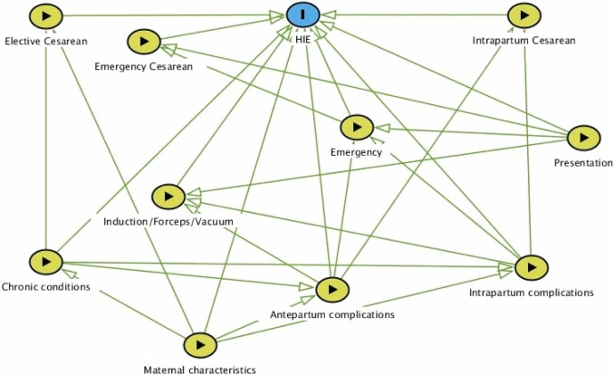
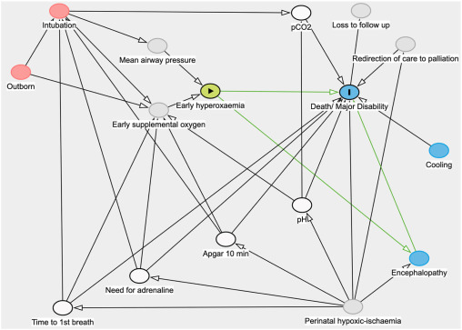
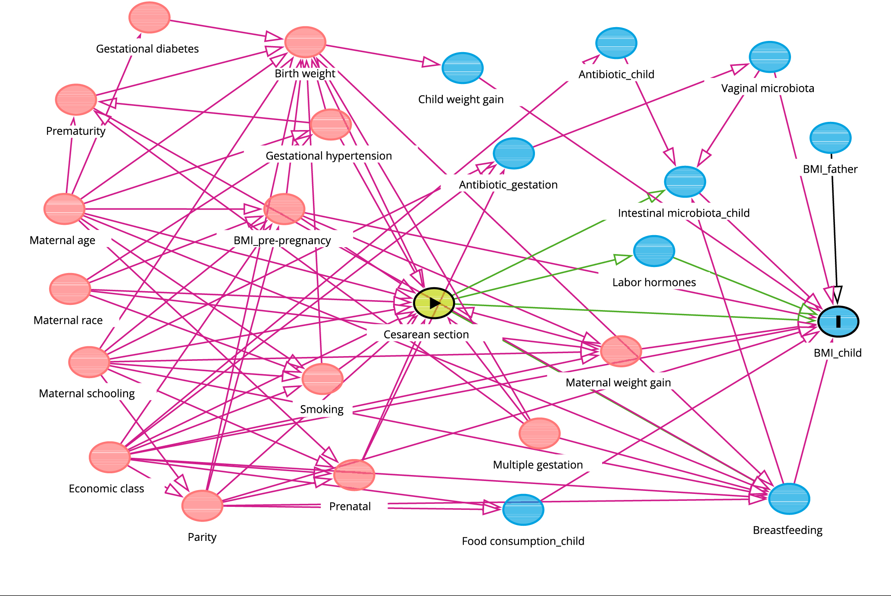

# HIE DAG

`````{admonition} Executive summary
:class: info

On this page, I have attempted to draw causal diagrams for our research study, and included examples of diagrams from papers that involve caesareans or HIE.
`````

## Context

**Starting point** from Mike's email (25th January):
* Focussed on avoidable harm, like hypoxic ischaemic encephalopathy (HIE)
* Ultimate target: to build a machine learning algorithm that monitors live data during childbirth, accounts for pre-existing risk factors, and alerts clinicians when infant health is at increased risk if intervention is delayed or missed
* How well can we predict poor neonatal outcomes?
* Can we predict the likely effect of intervention (ceasarean) when predicted outcome is poor?
* Can we predict the likely effect of intervention (ceasarean) dependent on timing during labour, when predicted outcome is poor?

**Concern:** Treatment paradox - that predictors of poor outcome (e.g. FHR) will trigger an effective intervention (caesarean), impacting relationship with outcome, and making it hard to understand what was associated with poor outcomes or not.

**Why do we want to do causal inference?** To understand true cases where they needed a ceasarean and it prevented poor outcomes, or cases where it wasn't needed. We're not interested in just being able to predict what happens - we're interested in the causal relationship, and ultimately a counterfactual of when should we and when should we not do caesareans: *Should we have done a caesarean? If we had done one, or if we had done one earlier, would it have prevented HIE?*

**So what's our research question?** In causal inference, you start with drawing a DAG, which beings with your research question, which should be composed of an **exposure/treatment** and an **outcome**, for which you are interested in their causal relationship.

## Proposed DAG

### Research question

If we're interested in whether we should do a caesarean to prevent HIE, then proposed research question is:

````{mermaid}
  flowchart LR;

    A("Treatment<br><b>Caesarean</b>"):::green;
    Y("Outcome<br><b>Hypoxic ischaemic<br>encephalopathy (HIE)</b>"):::green;

    A --> Y;

    classDef white fill:#FFFFFF, stroke:#FFFFFF;
    classDef black fill:#FFFFFF, stroke:#000000;
    classDef green fill:#DDF2D1, stroke: #FFFFFF;
````

### Add confounders

We want to add confounders (which cause both the treatment and the outcome). These can be measured or unmeasured.
* Hypoxia is an unmeasured confounder, but it is indicated by abnormal fetal heart rate (FHR), which then triggers a decision to do a caesarean
* Sentinal events - since they cause hypoxia and can also cause decision to do a caesarean - not certain if these are "measured" or indicated by something else

````{mermaid}
  flowchart LR;

    L_sen("Confounder (L)<br><b>Sentinal event</b>"):::white;
    L_fhr("Confounder (L)<br><b>Abnormal FHR</b>"):::white;
    U("Unmeasured confounder (U)<br><b>Hypoxia/Asphyxia</b>"):::white;
    A("Treatment (A)<br><b>Caesarean</b>"):::green;
    Y("Outcome (Y)<br><b>Hypoxic ischaemic<br>encephalopathy (HIE)</b>"):::green;
    
    L_sen --> U; L_sen --> A;
    A --> Y;
    U --> L_fhr; L_fhr --> A; U --> Y;
  
    classDef white fill:#FFFFFF, stroke:#FFFFFF;
    classDef black fill:#FFFFFF, stroke:#000000;
    classDef green fill:#DDF2D1, stroke: #FFFFFF;
````

### Add other causes of at least two things in the DAG

````{mermaid}
  flowchart LR;

    L_sen("Confounder (L)<br><b>Sentinal event</b>"):::white;
    L_fhr("Confounder (L)<br><b>Abnormal FHR</b>"):::white;
    U("Unmeasured confounder (U)<br><b>Hypoxia/Asphyxia</b>"):::white;
    A("Treatment (A)<br><b>Caesarean</b>"):::green;
    Y("Outcome (Y)<br><b>Hypoxic ischaemic<br>encephalopathy (HIE)</b>"):::green;
    age("Gestational age<br>BMI"):::white;
  
    age --> L_sen; age --> A;
    L_sen --> U; L_sen --> A;
    A --> Y;
    U --> L_fhr; L_fhr --> A; U --> Y;
  
    classDef white fill:#FFFFFF, stroke:#FFFFFF;
    classDef black fill:#FFFFFF, stroke:#000000;
    classDef green fill:#DDF2D1, stroke: #FFFFFF;
````

### Timing of the caesarean

I think there might be two ways to view timing of the caesarean:
1. As a moderator
2. As a time-varying treatment

Since this is about timing of the treatment, rather than some other factors that moderates effectiveness of treatment, I think the latter is a more appropriate way of handling this.

````{mermaid}
  flowchart LR;

    age("Gestational age<br>BMI"):::white;
    AK("A<sub>K</sub><br><b>Caesarean</b>"):::green;
    AK1("A<sub>K+1</sub><br><b>Caesarean</b>"):::green;
    YK1("Y<sub>K+1</sub><br><b>Hypoxic ischaemic<br>encephalopathy (HIE)</b>"):::green;
    YK2("Y<sub>K+2</sub><br><b>Hypoxic ischaemic<br>encephalopathy (HIE)</b>"):::green;
    LK("Confounder (L<sub>K</sub>)<br>Abnormal FHR"):::white;
    LK1("Confounder (L<sub>K+1</sub>)<br>Abnormal FHR"):::white;
    sen_K("Sentinal event<br>at timepoint K"):::white;
    sen_K1("Sentinal event<br>at timepoint K+1"):::white;
    UK("U<sub>K</sub><br><b>Hypoxia/Asphyxia</b>"):::white;
    UK1("U<sub>K+1</sub><br><b>Hypoxia/Asphyxia</b>"):::white;

    age --> sen_K; age --> sen_K1; age --> AK; age --> AK1;
    AK --> YK1;
    LK --> AK;
    sen_K --> UK;
    UK --> LK;
    UK --> YK1;
    sen_K1 --> UK1;
    UK1 --> LK1;
    LK1 --> AK1;
    AK1 --> YK2;
    UK1 --> YK2;
    sen_K --> sen_K1;
    UK --> UK1;
    YK1 --> YK2;


    classDef white fill:#FFFFFF, stroke:#FFFFFF;
    classDef black fill:#FFFFFF, stroke:#000000;
    classDef green fill:#DDF2D1, stroke: #FFFFFF;
````

### Is there treatment-confounder feedback?

<mark>Not sure.</mark>

Here, its about whether or not they did a caesarean.
* If they don't do a ceasarean, we expect things to get worse, FHR more abnormal, so no caesarean impacts later heart rate
* HOWEVER if they did do a caesarean, this will have no impact on later FHR, as there is no later FHR - it has ended

So is it treatment-confounder feedback or not?

````{mermaid}
  flowchart LR;

    age("Gestational age<br>BMI"):::white;
    AK("A<sub>K</sub><br><b>Caesarean</b>"):::green;
    AK1("A<sub>K+1</sub><br><b>Caesarean</b>"):::green;
    YK1("Y<sub>K+1</sub><br><b>Hypoxic ischaemic<br>encephalopathy (HIE)</b>"):::green;
    YK2("Y<sub>K+2</sub><br><b>Hypoxic ischaemic<br>encephalopathy (HIE)</b>"):::green;
    LK("Confounder (L<sub>K</sub>)<br>Abnormal FHR"):::white;
    LK1("Confounder (L<sub>K+1</sub>)<br>Abnormal FHR"):::white;
    sen_K("Sentinal event<br>at timepoint K"):::white;
    sen_K1("Sentinal event<br>at timepoint K+1"):::white;
    UK("U<sub>K</sub><br><b>Hypoxia/Asphyxia</b>"):::white;
    UK1("U<sub>K+1</sub><br><b>Hypoxia/Asphyxia</b>"):::white;

    age --> sen_K; age --> sen_K1; age --> AK; age --> AK1;
    AK --> YK1;
    LK --> AK;
    sen_K --> UK;
    UK --> LK;
    UK --> YK1;
    sen_K1 --> UK1;
    UK1 --> LK1;
    LK1 --> AK1;
    AK1 --> YK2;
    UK1 --> YK2;
    sen_K --> sen_K1;
    UK --> UK1;
    YK1 --> YK2;
    AK --> LK1;

    classDef white fill:#FFFFFF, stroke:#FFFFFF;
    classDef black fill:#FFFFFF, stroke:#000000;
    classDef green fill:#DDF2D1, stroke: #FFFFFF;
````

### What about all our other risk factors we're interested in?

In a DAG, we should only include common causes. However, there are lots of risk factors that we often consider that I'm not sure if they are common causes e.g.
* Parity
* Meconium
* Analgesia
* Ethnicity

<mark>What do we do about those? Do we care?<mark> Should it be that I just haven't managed to fit them on the DAG? If they don't fit on, do we not care?

### Diagnostic error

You could also include representation of the diagnostic error in HIE - ignoring the rest of the DAG, would look like...

Another representation with diagnostic error in HIE...

````{mermaid}
  flowchart LR;

    Y("Outcome (Y)<br><b>Hypoxic ischaemic<br>encephalopathy (HIE)</b>"):::important;
    Y*("Y* Mismeasurement of HIE"):::white;
    Yerr("Measurement error in HIE"):::white;
    
    Y --> Y*;
    Yerr --> Y*;
  
    classDef white fill:#FFFFFF, stroke:#FFFFFF;
    classDef black fill:#FFFFFF, stroke:#000000;
    classDef empty width:0px,height:0px;
    classDef important fill:#DDF2D1, stroke: #FFFFFF;
````

## Another (less certain) proposal

Another angle (not sure if this is right)...

We know gestational age is a risk factor for HIE - but does it have a causal relationship with HIE?

````{mermaid}
  flowchart LR;

    %% Define the nodes and subgraphs
    exp("Gestational age"):::green;
    out("HIE"):::green;

    %% Produce the figure
    exp --> out;
  
    classDef white fill:#FFFFFF, stroke:#FFFFFF;
    classDef black fill:#FFFFFF, stroke:#000000;
    classDef green fill:#DDF2D1, stroke: #FFFFFF;
````

Would we then be interested in the direct causal effect of age on HIE that is not mediated by having a caesarean? (i.e. treating ceasarean as a mediator of the relationship between age and HIE)

````{mermaid}
  flowchart LR;

    %% Define the nodes and subgraphs
    exp("Gestational age"):::green;
    treat("Caesarean"):::white;
    out("HIE"):::green;

    %% Produce the figure
    exp --> treat;
    treat --> out;
    exp --> out;
  
    classDef white fill:#FFFFFF, stroke:#FFFFFF;
    classDef black fill:#FFFFFF, stroke:#000000;
    classDef green fill:#DDF2D1, stroke: #FFFFFF;
````

Expanding on that, there are many risk factors of interest...

````{mermaid}
  flowchart LR;

    %% Define the nodes and subgraphs
    exp("Gestational age"):::green;
    treat("Caesarean"):::white;
    out("HIE"):::green;

    %% Produce the figure
    exp --> treat;
    treat --> out;
    exp --> out;
  
    classDef white fill:#FFFFFF, stroke:#FFFFFF;
    classDef black fill:#FFFFFF, stroke:#000000;
    classDef green fill:#DDF2D1, stroke: #FFFFFF;
````

````{mermaid}
  flowchart LR;

    %% Define the nodes and subgraphs
    exp("Hypoxia"):::green;
    fhr("Abnormal FHR"):::white;
    treat("Caesarean"):::white;
    out("HIE"):::green;

    %% Produce the figure
    exp --> fhr;
    fhr --> treat;
    treat --> out;
    fhr --> out;
  
    classDef white fill:#FFFFFF, stroke:#FFFFFF;
    classDef black fill:#FFFFFF, stroke:#000000;
    classDef green fill:#DDF2D1, stroke: #FFFFFF;
````

````{mermaid}
  flowchart LR;

    %% Define the nodes and subgraphs
    exp("Parity"):::green;
    treat("Caesarean"):::white;
    out("HIE"):::green;

    %% Produce the figure
    exp --> treat;
    treat --> out;
    exp --> out;
  
    classDef white fill:#FFFFFF, stroke:#FFFFFF;
    classDef black fill:#FFFFFF, stroke:#000000;
    classDef green fill:#DDF2D1, stroke: #FFFFFF;
````

````{mermaid}
  flowchart LR;

    %% Define the nodes and subgraphs
    exp("Previous caesarean"):::green;
    treat("Caesarean"):::white;
    out("HIE"):::green;

    %% Produce the figure
    exp --> treat;
    treat --> out;
    exp --> out;
  
    classDef white fill:#FFFFFF, stroke:#FFFFFF;
    classDef black fill:#FFFFFF, stroke:#000000;
    classDef green fill:#DDF2D1, stroke: #FFFFFF;
````

````{mermaid}
  flowchart LR;

    %% Define the nodes and subgraphs
    exp("BMI"):::green;
    treat("Caesarean"):::white;
    out("HIE"):::green;

    %% Produce the figure
    exp --> treat;
    treat --> out;
    exp --> out;
  
    classDef white fill:#FFFFFF, stroke:#FFFFFF;
    classDef black fill:#FFFFFF, stroke:#000000;
    classDef green fill:#DDF2D1, stroke: #FFFFFF;
````

````{mermaid}
  flowchart LR;

    %% Define the nodes and subgraphs
    exp("Ethnicity"):::green;
    treat("Caesarean"):::white;
    out("HIE"):::green;

    %% Produce the figure
    exp --> treat;
    treat --> out;
    exp --> out;
  
    classDef white fill:#FFFFFF, stroke:#FFFFFF;
    classDef black fill:#FFFFFF, stroke:#000000;
    classDef green fill:#DDF2D1, stroke: #FFFFFF;
````

````{mermaid}
  flowchart LR;

    %% Define the nodes and subgraphs
    exp("Analgesia"):::green;
    treat("Caesarean"):::white;
    out("HIE"):::green;

    %% Produce the figure
    exp --> treat;
    treat --> out;
    exp --> out;
  
    classDef white fill:#FFFFFF, stroke:#FFFFFF;
    classDef black fill:#FFFFFF, stroke:#000000;
    classDef green fill:#DDF2D1, stroke: #FFFFFF;
````

````{mermaid}
  flowchart LR;

    %% Define the nodes and subgraphs
    exp("Meconium"):::green;
    treat("Caesarean"):::white;
    out("HIE"):::green;

    %% Produce the figure
    exp --> treat;
    treat --> out;
    exp --> out;
  
    classDef white fill:#FFFFFF, stroke:#FFFFFF;
    classDef black fill:#FFFFFF, stroke:#000000;
    classDef green fill:#DDF2D1, stroke: #FFFFFF;
````

````{mermaid}
  flowchart LR;

    %% Define the nodes and subgraphs
    exp("Parity"):::green;
    treat("Caesarean"):::white;
    out("HIE"):::green;

    %% Produce the figure
    exp --> treat;
    treat --> out;
    exp --> out;
  
    classDef white fill:#FFFFFF, stroke:#FFFFFF;
    classDef black fill:#FFFFFF, stroke:#000000;
    classDef green fill:#DDF2D1, stroke: #FFFFFF;
````

But as they are all causes of two things on the DAG, you'd need to add them all to each DAG....

````{mermaid}
  flowchart LR;

    %% Define the nodes and subgraphs
    age("Gestational age"):::green;
    par("Parity"):::white;
    hypo("Hypoxia"):::white;
    fhr("Abnormal FHR"):::white;
    mec("Meconium"):::white;
    ana("Analgesia"):::white;
    eth("Ethnicity"):::white;
    treat("Caesarean"):::white;
    out("HIE"):::green;

    %% Produce the figure
    age --> treat; age --> out;
    par --> treat; par --> out;
    hypo--> fhr; fhr --> treat; fhr --> out;
    mec --> treat; mec --> out;
    ana --> treat; ana --> out;
    eth --> treat; eth --> out;
    treat --> out;
  
    classDef white fill:#FFFFFF, stroke:#FFFFFF;
    classDef black fill:#FFFFFF, stroke:#000000;
    classDef green fill:#DDF2D1, stroke: #FFFFFF;
````

````{mermaid}
  flowchart LR;

    %% Define the nodes and subgraphs
    age("Gestational age"):::white;
    par("Parity"):::green;
    hypo("Hypoxia"):::white;
    fhr("Abnormal FHR"):::white;
    mec("Meconium"):::white;
    ana("Analgesia"):::white;
    eth("Ethnicity"):::white;
    treat("Caesarean"):::white;
    out("HIE"):::green;

    %% Produce the figure
    age --> treat; age --> out;
    par --> treat; par --> out;
    hypo--> fhr; fhr --> treat; fhr --> out;
    mec --> treat; mec --> out;
    ana --> treat; ana --> out;
    eth --> treat; eth --> out;
    treat --> out;
  
    classDef white fill:#FFFFFF, stroke:#FFFFFF;
    classDef black fill:#FFFFFF, stroke:#000000;
    classDef green fill:#DDF2D1, stroke: #FFFFFF;
````

## Context: Reasons for doing a caesarean

A key thing to know is what causes need for caesarean - and whether those are also things that cause HIE (similar to hypoxia).

Panda et al. 2018 - Clinicians’ views of factors influencing decision-making for caesarean section: A systematic review and metasynthesis of qualitative, quantitative and mixed methods studies - https://doi.org/10.1371%2Fjournal.pone.0200941 - some of the mentioned reasons across the world...
* Perceived risk of CS v.s. vaginal birth - e.g. concerns related to risk of urinary and fecal incontinence and pelvic floor collapse following vaginal births
* Perceived safety of CS - e.g. believing CS could reduce risks of and prevent complications for women living in isolated areas
* Women requesting CS (which itself is influenced by socio-cultural perspectives, women’s preferences, demands, obstetricians’ beliefs in women’s right and autonomy to choose a CS, and their perception of women’s anxiety and fear)
* Clinical reasons -
  * previous CS
  * risk of anorectal trauma
  * preventing perineal injury, urinary and anal incontinence
  * maternal age
  * obesity
  * previous birth complications
  * risk of pelvic prolapse
  * uterine rupture
  * medical conditions like mypoia and previous abortions
  * breech presentation
  * previous classical CS
  * fetal distress
  * malpresentation
  * dystocia
  * placenta previa
  * umbilical cord collapse
* Fear of litigation / medico-legal problems
* Lack of resources (e.g. not enough experienced clinicians to facilitate natural birth, availability of personal for emergency CS, availability of anaesthesia, access to basic infrastructure, access to emergency care facilities)
* Type of health care coverage (private/public)
* Hospital policies
* Clinician characteristics - personal convenience, clinician demographics, confidence and skills


## External examples that involve HIE or caesarean

### Example: Leith et al. 2023

Leith et al. 2023 - A predictive model for perinatal hypoxic ischemic encephalopathy using linked maternal and neonatal hospital data - http://dx.doi.org/10.1016/j.annepidem.2023.11.011.

Focus: Predicting HIE

Due to the large number of factors in the final model, to make the graph easier to read we have combined similar factors into groups as follows:
* Maternal characteristics: age, race, payer, metropolitan residence, history of stillbirth, tobacco use.
* Chronic conditions: diabetes, hypertension, total number of chronic conditions.
* Antepartum complications: decreased fetal movement, polyhydramnios, amniotic fluid infection, intrauterine acidosis, cord compression, placental infarct.
* Intrapartum complications: septicemia, hypertonic contractions, uterine inertia, prolonged 2nd stage.
* Presentation: malpresentation, breech delivery, shoulder dystocia.
* Emergency: sentinel event, fetal heart rate abnormalities.

This DAG was created using DAGitty.



### Example: Badurdeen et al. 2024

Badurdeen et al. 2024 - Early Hyperoxemia and 2-year Outcomes in Infants with Hypoxic-ischemic Encephalopathy: A Secondary Analysis of the Infant Cooling Evaluation Trial - https://doi.org/10.1016/j.jpeds.2024.113902

Focus: Causal relationship between exposure to early hyperoxemia (following resus) and death or major disability in infants with hypoxic ischaemic encephalopathy

Context: Hyperoxemia is an increase in arterial oxygen partial pressure to more than 120mmHg. The exposure of interest with hyperoxemic exposure following resuscitation.



### Example: Cavalcante et al. 2022

Cavalcante et al. 2022 - Cesarean section and body mass index in children: is there a causal effect? - https://doi.org/10.1590/0102-311X00344020

Focus: Causal relationship between caesarean section and BMI.



## Example of complicated relationships in obstetrics in context of treatment paradox

Pre-eclampsia is hypothesised to cause cerebral palsy. It is also associated with higher risk of medically indicated (ordered by the physician) pre-term birth - and pre-term birth is also associated with higher risk of cerebral palsy.

You could adjust for pre-term birth or gestational age like a confounding variable. However, pre-term birth is a intermediate between pre-eclampsia and cerebral palsy, and not a common cause of both. Therefore, this adjustment (overadjustment) takes away from the detrimental effect of pre-elcampsia, mediated through pre-term birth - attenuating the effect or event reversing it.

In an early study, pre-eclampsia was found to be protective in pre-term infants and detrimental for those born later. However, we expect pre-eclampsia to be detrimental for all infants. This finding could be as the analysis seperated out pre-term births and later births, closing the causal path between pre-eclampsia and cerebral palsy via pre-term birth.[[Williams et al. 2018]](https://doi.org/10.1038/s41390-018-0071-3)


````{mermaid}
  flowchart LR;

    %% Define the nodes and subgraphs
    eclam("Pre-eclampsia")
    preterm("Preterm birth")
    cp("Cerebral palsy")

    %% Produce the figure
    eclam --> preterm;
    preterm --> cp;
    eclam --> cp;
````

However, it's likely more complex. In a more realistic directed acyclic graph (DAG) below, chorioamnionitis is added. It is another cause of pre-term birth and cerebral palsy.

Gestational age, as a shared effect of pre-eclampsia and chorioamnionitis, acts as a **collider**. This is the opposite of a confounder (where a common cause of exposure and outcome is not controlled for) - instead, a collider is when the exposure and outcome (or factors causing) each influence a common third variable, and that variable is controlled for in the design. Controlling for a collider can result in a distorted association betwene the exposure and outcome, when actually none exists.

In this model, if we look in a group of pre-term infants:
* Babies born to mothers with pre-eclampsia will be less likely to have chorioamnionitis and vice versa
* The effect of pre-eclampsia will be compared with the effect of chorioamnionitis on cerebral palsy, and will falsy appear to be protective - the estimated direct causal effect of pre-eclampsia on the outcome will be biased (through the effect of chorioamnionitis)

Hence, although widely used, conditioning on gestational at birth in studies of prenatal exposures and their relationship to postnatal outcomes may not reduce but actually lead to bias through overadjustment and faulty comparisons, and generate counterintuitive results and apparent changes of effect in different groups of patients.[[Williams et al. 2018]](https://doi.org/10.1038/s41390-018-0071-3)

````{mermaid}
  flowchart LR;

    %% Define the nodes and subgraphs
    chor("Chorioamnionitis")
    eclam("Pre-eclampsia")
    preterm("Preterm birth")
    cp("Cerebral palsy")

    %% Produce the figure
    chor --> preterm;
    eclam --> preterm;
    chor --> cp;
    preterm --> cp;
    eclam --> cp;
````