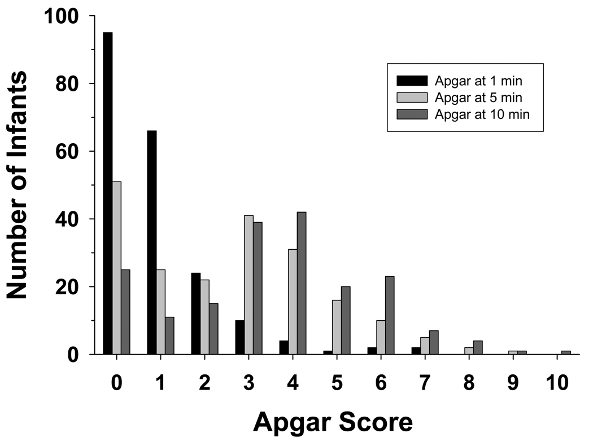

# Apgar scores

`````{admonition} Executive summary
:class: info

**Outcome:** Apgar score (at 1, 5 and/or 10 minutes)

**Specific to HIE?**
* No - it is a non-specific sign of illness

**Which infants with HIE?**
* Not all infants with have low Apgar-5 and Apgar-10, but those that do have <3 at 10 minutes are more likely to have morbidity or mortality

**Any other benefits or caveats not already mentioned?**
* Subjective, inter-rater reliability
* Theoretical assumptions - assumes all variables contribute equally

**Conclusion:** Potentially recommended. The Apgar score is used to assess the status of a newborn immediately after birth and whether they are responding to resuscitation. It is repeatedly stated that it should not be considered to be (a) evidence of asphyxia, or (b) a consequence of asphyxia, or (c) to predict outcomes - even if it is associated with higher likelihood of HIE. However, it is often used.
`````

Apgar scores are the most routinely used measure of the health status of newborns.[[source]](https://doi.org/10.1136/bmj.l1656) They evaluate 'neonates immediately after birth and in response to resucitation'. They were 'originally designed to assess need for intervention to establish breathing at 1 minute', and not as an outcome measure.[[source]](https://www.ncbi.nlm.nih.gov/books/NBK470569/)

Apgar has been **routinely collected** and performed for a long time (first devised in 1952, and has since become a very common and routine measure)[[source]](https://doi.org/10.1016/j.jclinepi.2004.04.012)

## How they are calculated

The Apgar score is typically quantified at 1 minute (**Apgar-1**), 5 minutes (**Apgar-5**) and 10 minutes(**Apgar-10**) after birth.[[source]](https://doi.org/10.1136/bmj.l1656)
 
Score of 0-2 for five elements:

| Element | Options |
| --- | --- |
| **A**ppearance | <ul><li>Pale/blue</li><li>Pink with blue extremeties</li><li>Pink</li></ul> |
| **P**ulse | <ul><li>Heart rate 0</li><li><100bpm</li><li>>100pm</li></ul> |
| **G**rimace | <ul><li>No response to stimulation</li><li>Grimace to stimulation</li><li>Cry/cough/sneeze to stimulation</li></ul> |
| **A**ctivity | <ul><li>Loose/floppy muscle tone</li><li>Some tone</li><li>Flexed muscle tone</li></ul> |
| **R**espiration | <ul><li>Not breathing</li><li>Slow/weak breathing</li><li>Vigorous crying</li></ul> | 

Note: Most will score 1 for color as peripheral cyanosis (blue discoloration of extremeties) is common among normal infants, and also colour can be misleading in non-white infants).[[source]](https://www.ncbi.nlm.nih.gov/books/NBK470569/)

Most of the items require **subjective** judgements - most objective is the heart rate which is based on measured FHR[[source]](https://doi.org/10.1016/j.jclinepi.2004.04.012)

The score is calculated without weighting, **assuming all variables contribute equally**, which is untenable - e.g. importance of heartrate v.s. colour[[source]](https://doi.org/10.1016/j.jclinepi.2004.04.012)

## Interpretation and association with neonatal outcomes

Interpretation (as defined by ACOG-AAP) in term and late-preterm infant:
* Reassuring: 7-10
* Moderately abnormal: 4-6
* Low: <=0-3[[ACOG guidelines]](https://www.acog.org/clinical/clinical-guidance/committee-opinion/articles/2015/10/the-apgar-score)


## Inter-rater reliability

Apgar has been found to have poor inter-rater reliablity - study of 223 health professionals found 68% agreement among pediatricians/pediatric house staff, and 24% agreement among nurses from community hospitals[[source]](https://doi.org/10.1016/j.jclinepi.2004.04.012)

## Intended use of Apgar

Apgar score alone is not 'evidence of asphyxia or proof of intrapartum hypoxia'.[[source]](https://www.ncbi.nlm.nih.gov/books/NBK470569/) The Apgar score provides an accepted and convenient method for reporting the status of the newborn infant immediately after birth and the response to resuscitation if needed. The Apgar score alone **cannot be considered to be evidence of or a consequence of asphyxia, and does not predict individual neonatal mortality or neurologic outcome**, and should not be used for that purpose.[[ACOG guidelines]](https://www.acog.org/clinical/clinical-guidance/committee-opinion/articles/2015/10/the-apgar-score)

It can serve as a '**non-specific sign of illness**, which may be one of the first indications of encephalopathy. However, a persistently low Apgar score alone is not a specific indicator for intrapartum compromise. Further, although the score is used widely in outcome studies, its inappropriate use has led to an erroneous definition of asphyxia. Asphyxia is defined as the marked impairment of gas exchange leading, if prolonged, to progressive hypoxemia, hypercapnia, and significant metabolic acidosis. The term asphyxia, which describes a process of varying severity and duration rather than an end point, should not be applied to birth events unless specific evidence of markedly impaired intrapartum or immediate postnatal gas exchange can be documented based on laboratory testing'.[[ACOG guidelines]](https://www.acog.org/clinical/clinical-guidance/committee-opinion/articles/2015/10/the-apgar-score)

## Causes of a low Apgar score

'There are numerous factors that can influence the Apgar score, including maternal sedation or anesthesia, congenital malformations, gestational age, trauma, and interobserver variability 6. In addition, the biochemical disturbance must be significant before the score is affected. Elements of the score such as tone, color, and reflex irritability can be subjective, and partially depend on the physiologic maturity of the infant. The score also may be affected by variations in normal transition. For example, lower initial oxygen saturations in the first few minutes need not prompt immediate supplemental oxygen administration; the Neonatal Resuscitation Program targets for oxygen saturation are 60–65% at 1 minute and 80–85% at 5 minutes. The healthy preterm infant with no evidence of asphyxia may receive a low score only because of immaturity. The incidence of low Apgar scores is inversely related to birth weight, and a low score cannot predict morbidity or mortality for any individual infant. As previously stated, it also is inappropriate to use an Apgar score alone to diagnose asphyxia.'[[ACOG guidelines]](https://www.acog.org/clinical/clinical-guidance/committee-opinion/articles/2015/10/the-apgar-score)

The most common antecedent of low Apgar scores is maternal fever in labor or a diagnosis of chorioamnionitis.[[Ellenberg and Nelson 2012]](https://doi.org/10.1111/dmcn.12016)

## Association with outcomes

**Low Apgar-1** 'is not predictive of adverse clinical outcomes or long-term health issues' as most infants will have normal scores by 5 minutes.[[source]](https://www.ncbi.nlm.nih.gov/books/NBK470569/)

**Low Apgar-5** is non-reassuring, and low scores 'correlate with mortality' and 'increased risk of cerebral palsy' - most infants will 'not go on to develop cerebral palsy, but lower scores over time increase risk'.[[source]](https://www.ncbi.nlm.nih.gov/books/NBK470569/)

The Apgar scores of infants with HIE from a study by Laptook et al. 2010 are presented below.[[Laptook et al. 2010]](https://doi.org/10.1542%2Fpeds.2009-0934)



Their findings: 'More than 90% of infants had Apgar scores of 0–2 at 1 minute and Apgars at 5 and 10 minutes shifted to progressively higher values; at 10 minutes 27% of infants had Apgar scores of 0–2. After adjustment each point decrease in Apgar score at 10 minutes was associated with a 45% increase in the odds of death or disability (OR 1.45, CI 1.22–1.72). Death or disability occurred in 76, 82 and 80% of infants with Apgar scores at 10 minutes of 0, 1 and 2, respectively. CART analysis indicated that Apgar scores at 10 minutes were discriminators of outcome.'[[Laptook et al. 2010]](https://doi.org/10.1542%2Fpeds.2009-0934)