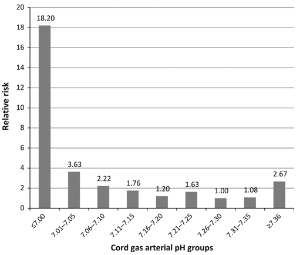

# Umbilical cord blood gas analysis

`````{admonition} Executive summary
:class: info

**Outcome:** Measurements of pH, base deficit/excess, pO<sub>2</sub> and pCO<sub>2</sub>. Various thresholds exist, but combined pH and base deficit can indicate metabolic acidosis, which has greater clinical significance.

**Specific to HIE?**
* No - many infants with abnormal pH won't have HIE (only 2.9% of infants with low pH had NE w/ seizures and/or death in 2012 study) - unless you look at a very low cord pH (e.g. <6.7), but that will be very few infants

**Which infants with HIE?**
* Only some - in a study of infants with NE w/ seizures and/or death, 75% of the infants with that outcome had a normal pH

**Any other benefits or caveats not already mentioned?**
* Many factors that can influence measurements - (a) artery or vein, (b) length of labour and elective caesarean, (c) timing of cord clamping, (d) timing from sampling to analysis, (e) base deficit calculation, (f) gestational age
* Whether measurement occurs is biased (more likely if something was wrong)

**Conclusion:** Potentially recommended. Must (a) consider metabolic acidosis, (b) not require low pH (as many infants with HIE won't have low pH), and (c) not base decision only on low pH (as many infants with low pH won't have HIE)
`````


## When is umbilical cord blood gas analysed?

'Umbilical cord blood gas analysis is recommended by NICE **whenever there has been a concern** about the baby either in labour or immediately following birth.'[Joint Trust Guidelines (ref below)]

Examples of when NHS Milton Keynes guidelines suggest cord blood must be taken are:
* All emergency caesarean sections and instrumental births
* Delivery for presumed ‘ fetal distress’
* Shoulder dystocia
* If fetal blood sampling has been performed during labour
* Following birth if the baby’s condition is poor (low apgars = to / less than 7)
* Significant meconium stained liquor present
* APH/Abruption
* Preterm birth
* Multiple pregnancy
* Pyrexia in labour[[source]](https://www.mkuh.nhs.uk/wp-content/uploads/2018/10/4257-Cord-Blood-Analysis-Guideline.pdf)

## How is it collected?

Blood can be collected from the:
* **Umbilical artery** - 
    * Gives **more accurate** information about fetal metabolic condition and correlates better with neonatal outcomes - since blood rich in carbon dioxide eliminated by the fetus returns to the placental circulation through the umbilical arteries
* **Umbilical vein** -
    * Easier to sample due to large diameter
    * Less accurate as mainly reflects placental metabolism rather than fetal metabolism - as the umbilical vein carries oxygenated blood to the fetus from the placenta.
    * During umbilical cord compression, the venous flow will compress more than the arterial flow (as veins are more compressible than arteries). The fetus will respond by extracting more oxygen, hence eliminating more CO2 through the umbilical artieries, but the umbilical venous acid-base status will reamin equilibriated by the normally functioning placenta [[source]](https://www.ncbi.nlm.nih.gov/books/NBK545290/)

Due to these differences, it is important to take **paired** arterial and venous cord blood samples. If only a single sample is taken, there is no way of knowing if it is arterial or venous.[Joint Trust Guideline (ref below)]

It is also important to note the **timing** of the samples:
* Clamped umbilical cord (isolated) will have reliable pH, pO2 and pCO2 up to 60 minutes after bith
* Unclamped (remianing in continuity with the placenta) will be unreliable as early as 20 minutes after delivery since ongoing placental metabolism will obscure the measurements
* Lactate levels obtained more than 20 minutes after birth will be unreliable regardless of whether they are from a clamped or unclamped cord.[Joint Trust Guidelines (ref below)]

NHS Milton Keynes Guidelines state that the samples should be taken from a **double clamped** segment of cord so it's isolated from the placenta.[[source]](https://www.mkuh.nhs.uk/wp-content/uploads/2018/10/4257-Cord-Blood-Analysis-Guideline.pdf)


Diagram of the fetus, placenta and umbilical blood vessels[[source]](https://socratic.org/questions/what-type-of-blood-do-each-of-the-umbilical-blood-vessels-carry)

## What blood gases are analysed and why?

**Acidemia** is when there is a low blood pH, which occurs due to an increase in the hydrogen ion H<sup>+</sup> concentration. There are three types of acidemia: metabolic, respiratory and mixed.

**Metabolic acidosis**: During oxygen (O<sub>2</sub>) deprivation:
* The fetus will switch from aerobic metabolism (relies on oxygen) to anaerobic metabolism (does not use oxygen)
* This will result in the accumulation of lactic acid (which is a combination of lactate and H<sup>+</sup>), which leads to metabolic acidosis
* Buffer bases (primarily bicarbonate) are used to try and neutralise the lactice acid. If buffer bases are depleted, this can lead to metabolic acidemia
* Note: metabolic acidosis can refer to process that lowers the pH, whilst acidemia describes the state of having a low blood pH
* Hence, during metabolic acidosis, we see **decreased pH, low pO<sub>2</sub>, and increased base deficit**[[source]](https://admin.learningstream.com/files/DA1537B2-387C-452A-890E-A227518D8EB6_9/94228/5FetalAcidbase.pdf)

Fetal **respiratory acidosis** is a relatively common transitory state that resolves soon after birth when the baby starts to breathe and is of little clinical significance.[[source]](https://acutecaretesting.org/en/articles/umbilical-cord-blood-gas-analysis) It occurs when the fetus takes in less oxygen during hypoxia, and so more CO<sub>2</sub> builds up in the blood, which increases the level of carbonic acid (H<sub>2</sub>CO<sub>3</sub>), decreasing the pH.

**Mixed acidosis** is when it is caused by metabolic and respiratory factors. The initial cause of acidosis will often by respiratory, but without improvement in oxygenation, the fetus will resort to anaerobic metabolism, leading to metabolic acidosis.[[source]](https://www.nationalbirthinjurylaw.com/fetal-acidosis) 

Metabolic acidosis reflects tissue oxygen debt and therefore is of greater prognostic significance than respiratory acidosis.[[source]](https://www.ncbi.nlm.nih.gov/pmc/articles/PMC3952302/) It is therefore important to **distinguish** between metabolic and respiratory acidosis.
* Metabolised acidosis is characterised by reduced pH, decreased base excess (i.e. increased base deficit), and elevated pCO<sub>2</sub>
* Respiratory acidosis is characterise by reduced pH, but normal PCO<sub>2</sub> and base excess
* Mixed acidosis is characterises by low pH, increased PCO<sub>2</sub>, but normal base excess[[source]](https://admin.learningstream.com/files/DA1537B2-387C-452A-890E-A227518D8EB6_9/94228/5FetalAcidbase.pdf)

Infants with intrauterine growth retardation (IUGR)/growth-restricted infants are at increased risk of metabolic acidosis than normal growth (AGA) infants.[[source]](https://doi.org/10.1016/0002-9378(80)90695-X)

````{mermaid}
  flowchart TD;

    %% Define the nodes and subgraphs
    o2("Oxygen deprivation<br>(decreased pO2)");
    anae("Anaerobic metabolism");
    subgraph "Metabolic acidosis"
        lac("Accumulation of lactic acid<br>(lactate + hydrogen ions)");
        h2("Increased hydrogen ions")
        buff("Buffer bases used to try and neutralise pH")
        base("Base deficit")
        ph_dec("Decreased pH")
    end
    subgraph "Respiratory acidosis"
        co2("Increased pCO2")
        carb("Increased carbonic acid in blood")
        ph_dec2("Decreased pH")
    end
    quick("Quicker to resolve<br>Less clinical significance")
    slow("Slower to resolve<br>More clinical significance")

    %% Produce the figure
    o2 --> anae;
    anae --> lac;
    lac --> h2;
    lac --> buff;
    buff --> base;
    h2 --> ph_dec;
    base --> slow;
    ph_dec --> slow;

    o2 --> co2;
    co2 --> carb;
    carb --> ph_dec2;
    ph_dec2 --> quick;
````

## What are the accepted thresholds for these blood gases?

Some degree of acidemia will always develop during labour, and it is normal to see some decrease in arterial and venous pH and bicarbonate and increase in base deficit.

According to NHS trust guidelines[source [1] and [2]], the normal blood gas values for a neonate born at term are:
| Location | pH | Base excess (mmol/L) | pO<sub>2</sub> (mm Hg) | pCO<sub>2</sub> (mm Hg) |
| --- | --- | --- | --- | --- |
| Umbilical artery | 7.10-7.38 | -9.0 to 1.8 | 4.1 to 31.7 | 39.1 to 73.5 |
| Umbilical vein | 7.20-7.44 | -7.7 to 1.9 | 30.4 to 57.2 | 14.1 to 43.3 |

In NHS guidelines, it doesn't include measurement of lactate.

'The generally accepted cut off value for a **pathological acidosis** (risk of seizures, moderate to severe HIE and cerebral palsy) is **umbilical arterial pH ≤ 7.0**. It is unlikely that acute acidosis with a pH value greater than 7.0 is directly associated with cerebral palsy.'[Joint NHS Trust Guidelines (ref below)]

The American College of Obstetricians and Gynecologists suggests using a cord artery pH < 7.00 and base deficit >= 12.0 mmol/L to indicate metabolic acidosis, since this threshold was found to strongly associate with neonatal morbidity and death. However, use of stationary reference cut-off points can be an issue, as base deficit, pH, pCO2 and lactate can vary with **gestational age**.[[source]](https://obgyn.onlinelibrary.wiley.com/doi/pdfdirect/10.3109/00016349.2010.513426)

## Factors associated with variation in measurements

Some of the challenges with cord blood gas analysis are that there are a few factors that can impact the results obtained:
* Whether samples are from umbilical **artery or vein**
* **Length of labour** since mixed metabolic and respiratory acidemia will develop in normal labour over time - and therefore, the normal range of reference values might not be valid for **elective caesarean deliveries**. 'During the process of preparing for and performing a caesarean delivery, factors such as type of anesthesia, extent of sympathetic blockade, aortocaval compression, intravenous fluid loading, oxygenation, vasopressor substances, and predelivery knife-time could influence the neonatal acid-base status'
* **Timing of cord clamping** - within a few seconds after birth, there will be acidosis (as blood had been centralised during labour to ensure delivery to brain, heart and adrenals, and so low priority organs accumulate acidic metabolities, which then surge back into central circulation when newborn starts to breathe, cry and move) - and because of this, NICE recommend clamping 1 minute after birth rather than immediately
* **Time from sampling to analysis** - das blood cell metabolism will continue in the same, with pCO2 and lactate increasing, and pH and pO2 decreasing
* **Base deficit calculation** - BD is a theoretical measure calculated by the blood gase analysed, but the calculation equation used differs among analysers. It can be calculated as 'base deficit in blood (or actual base deficit) or base deficit in extracellular fluid (or standard base deficit). Base deficit in extracellular fluid is advocated for fetal blood because a high partial pressure of CO2 (hypercapnia) is common in newborns without concomitant hypoxia, and hypercapnia has a strong influence on the pH value, then termed respiratory acidosis. An increase in partial pressure of CO2 causes less increase in base deficit in extracellular fluid than in base deficit in blood, thus base deficit in extracellular fluid better represents the metabolic component of acidosis.'
* **Gestational age** - pH and bicarbonate decrease and pCO2, BDecf, and lactate increase with the progression of pregnancy

[[Olofsson 2023]](https://doi.org/10.1016/j.ajog.2022.07.001)

## Association with neonatal outcomes

### Guidelines

'The American College of Obstetricians & Gynecologists (ACOG) and The American Academy of Pediatrics have also jointly set up the four essential criteria for establishing a causal link between intrapartum hypoxic events and cerebral palsy and included:
* Significantly low cord arterial pH (<7)
* Early onset of moderate or severe HIE in infants born at 34 weeks of gestation or more
* Cerebral palsy of the spastic quadriplegic or dyskinetic type
* Exclusion of other identifiable etiologies.'[[source]](https://doi.org/10.1111/aogs.14494)

These criteria were derived through consensus though, since existing observal studies can have inconsistent results, partly as a result of the different thresholds used to define abnormality, the variety of outcomes evaluated, and the different variables measured (arterial cord pH, venous cord pH, or base excess) - and it has been suggested that neonatal complications are associated with metabolic acidosis rather than respiratory acidosis.[[source]]( https://www.bmj.com/content/340/bmj.c1471)

### Studies

I did have statements from a discussion paper on how there is a strong relationship between pH and outcomes when there are other risk factors present - but I became a bit sceptical of some of the studies used to justify this (in particular, the samples used), so instead presented the details on each below, and whether I think they are relevant to us.

My conclusions from these papers - focussing on the the largest and more recent studies - are that:
* **pH in isolation is an unreliable indicator** for encephalopathy - the majority of infants with encephalopathy had a normal pH, and a small minority of infants with an abnormal pH had encephalopathy.
* **pH and base deficit in isolation might be an unreliable indicator** - this is based on findings from a study of children with metabolic acidosis but who had appeared healthy - and they had no difference in long-term outcomes - this is not based on a paper of the proportion of children with metabolic acidosis who are fine - hence *might be* unreliable

| Study | Sample | Findings | Caution | Summary |
| --- | --- | --- | --- | --- |
| Yeh et al. 2012 [[source]](https://doi.org/10.1111/j.1471-0528.2012.03335.x) | 51519 term neonates | Most neonates with neurological morbidity (encephalopathy with seizures and/or death) have normal cord pH values -  more than 75% with those outcomes had a pH above 7.10<br><br>If infants do have a pH <= 7, their relative risk of the outcomes is much higher. However, still only 33 out of 1120 infants with pH <=7.00 had those outcomes (2.9%)<br><br>Outcome was encephalopathy with seizures and/or death - did not include grade 1 encephalopathy or HIE as those are subjective diagnoses, and as grade 1 correlates little with long-term outcomes. | **Caution** - Type of encephalopathy - moderate/severe | Majority (75%+) of neonates with neurological outcome have normal pH<br><br>Only minority (2.9%) of neonates with low pH (<7) have neurological outcome |
| Hafström et al. 2012 [[source]](https://doi.org/10.1542/peds.2011-2831) (note: can't access paper so based on abstract) | 78 infants with metabolic acidosis (pH<7.05 and base deficit>12mmol/L) who appeared healthy at birth (didn't require special neonatal care, no signs of encephalopathy), then two matched controls for each infants (total 234) - chosen from a cohort of 14687 deliveries | At 6.5 years old, no differences were found in neurological or behavioural problems in need for action of diagnosis, between the control children and the healthy children with metabolic acidosis | **Caution** - focus on children who appeared healthy | No long term outcomes in children with metabolic acidosis who appeared healthy - indicating that's unlikely to be sufficient indicator in isolation |
| Carter et al. 1998 [[source]](https://doi.org/10.1016/s0022-3476(98)70349-x) | 3238 term newborns (of whom 366 are admitted to NICU) | Predicting NICU admission:<br>* Asphyxia score >=6 had OR 38.5 and PPV 73%<br><br>It goes on to give OR for individual components (not PPV). The asphyxia score was based on graded abnormalities in fetal heart rate monitoring, umbilical arterial base deficit, and 5-minute Apgar.<br><br>Only 11 infants had a score >=6 - of those, 5 had HIE. | **Caution** - as outcome is NICU admission, not HIE |  Combination of pH, abnormal FHR and Apgar5 improves it as an indicator for NICU admission |
| Perlman and Risser 1996 [[source]](https://pubmed.ncbi.nlm.nih.gov/8632928/) |  96 infants (of whom 5 went on to develop seizures). These infants were term, admitted to NICU, and high risk hypoxia ischaemia based on one of:<br>* Moderate to thick meconium-stained amniotic fluid (MSAF)<br>* FHR abnormalities<br>* Abruptio placentae<br>* Intubation and positive pressure ventilation in the delivery room<br>* Chest compressions and epinephrine administration as part of resuscitation<br>* 5-minute Apgar <= 5<br>* Arterial pH <= 7.00<br>* Base deficit <= -14 mEq/L | * Cord pH <7.0 and intubation had PPV 50% of seizures<br>* Cord pH <7.0 and Apgar5 ⩽5 had PPV 33.3% of seizures<br>* Cord pH <7.0, intubation and Apgar5 ⩽5 had PPV 80% of seizures | **Caution** - as sample is infants already in NICU and high risk | pH better indicator for seizures when combined with Apgar5 and intubation |
| Goodwin et al. 1992 [[source]](https://doi.org/10.1016/0002-9378(92)91728-S) | 129 term infants with pH < 7 | Incidence of HIE was 31% overall - looking by pH level, it was:<br>* 12% for cord pH <7.0<br>* 33% for cord pH <6.9<br>* 60% for cord pH <6.8<br>* 80% for cord pH <6.7<br>In infants with respiratory acidemia (26%), compared with those with similar pH, had similar levels of end-organ injury, but trend towards lower indicidence of HIE. | X | Increasing proportion of infants with low pH go on to have HIE - esp. if metabolic. |

From Yeh et al. 2012, percentage of all cases with encephalopathy with seizures or death in each arterial pH group:


The key focus here is that we want to know if pH can be a reliable indicator of HIE - and not if its associated with high risk - but if majority of infants with a low pH go on to have HIE. Hence, below are good studies that are not relevant as they are about risk:
| Study | Sample | pH threshold | Findings |
| --- | --- | --- | --- |
| Malin et al. 2010 [[source]](https://doi.org/10.1136%2Fbmj.c1471) | Meta-analysis of 51 studies | pH < 7 to < 7.24 | Hypoxic ischaemic encephalopathy (OR 13.8, 95% CI 6.6-28.9, I<sup>2</sup>=0%)<br>Neonatal mortality (OR 16.9, 95% CI 9.7-29.5, I<sup>2</sup>=0%)<br>Intraventricular haemorrhage or periventricular leucomalacia (OR 2.9, 95% CI 2.1-4.1, I<sup>2</sup>=0%)<br>Cerebral palsy (OR 2.3, 95% CI 1.3-4.2, I<sup>2</sup>=0%) |

From Yeh et al. 2012, relative risk of encephalopathy with seizures or death in each arterial pH group:



To add to tables:
* 'Interestingly, a pH as low as 7.00 is usually tolerated by the fetus without any adverse outcome. Most infants with a cord pH less than 7.00 do not develop neurologic problems after birth, nor even when followed for 6.5 years. An isolated respiratory acidosis is very rarely associated with poor outcomes. Thus, infants born with a pH less than 7.00 and without other abnormal clinical findings typically do not require any further investigation or NICU admission.'[[source]](https://www.ncbi.nlm.nih.gov/books/NBK545290/)
* 'When a pH less than 7.00 and/or a base deficit of more than 12 mmol/L are associated with other abnormal findings such as abnormal fetal heart tracings, 5-minutes Apgar scores equal to or less than 5, a requirement for intubation, they become strong predictors of poor neurological sequelae. **80%** of these newborns with clinical indicators of acidemia with a low pH develop seizures in the first few days after birth. Previous studies have shown that cord pH less than 7.00 is proportional to the risk and the severity of neurologic abnormalities. Furthermore, **80%** of infants born with a cord pH less than 6.70 develop symptoms and signs of neonatal encephalopathy.'[[source]](https://www.ncbi.nlm.nih.gov/books/NBK545290/)

## Suitability as a model outcome

Pros:
* pH can improve as a predictor if (a) the threshold is lower, (b) it is metabolic acidosis (i.e. combined with base deficit), or (c) it is combined with other indicators of adverse outcomes - the extent to which it improves as an indicator varies - but often this is about risk of outcome, rather than it being an indicator

Cons:
* Many infants with HIE won't have abnormal pH
* Many infants with abnormal pH won't have HIE
* There are many confounding factors that influence measurement obtained (artery or vein, length of labour, type of delivery, gestational age, timing of cord clamping, timing from sampling to analysis, base deficit calculation)
* Biased measurement - more likely if doctors/nurses thought something was wrong

## Conclusion

`````{admonition} Unsuitable
:class: error

Metabolic acidosis (pH and base deficit), in combination with other indicators, can move us towards a good indicator - but ultimately I don't think it's suitable because:
* (A) Not all infants with HIE will have abnormal blood gases
* (B) There are so many confounding factors that influence the measurements obtained
`````

## References

Throughout this jupyter book, the hyperlinks for each reference are provided within the test. However, for the Joint Trust Guidelines referenced above, the link produces an error message, as it is a download link. Instead, the details for this document are provided below:
* Joint Trust Guideline for the Management of Babies with Severe Umbilical Artery Acidosis (Cord Arterial pH≤7.1)
* Author/s: Shastri, Roy Author/s title: SpR Neonatology, Consultant Neonatologist Approved by: CGAP Date approved: 10/06/2022 Review date: 10/06/2025 Available via Trust Docs Version: 3 Trust Docs ID: 1356
* "www.nnuh.nhs.uk/publication/download/babies-with-severe-umbilical-artery-acidosis-cord-arterial-ph-7-1-jcg0322-v3/"