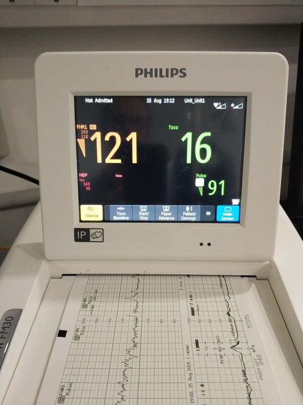

# Abnormal CTG

`````{admonition} Executive summary
:class: info

**Outcome:** Abnormal patterns in cardiotocography (CTG)

**Specific to HIE?**
* There are particular patterns that can be indicated of a hypoxic event

**Which infants with HIE?**
* Sometimes there can be no evidence that hypoxia has occurred in the CTG

**Any other benefits or caveats not already mentioned?**
* Very high intra- and inter-observer variability in CTG interpretation
* Likely either have to interpret CTG yourself, or the medical record will just say the CTG was "abnormal" and not why

**Conclusion:** Not recommended. The high intra- and inter-observer variability in interpretation, likely minimal record of decision in records, and challenges in automated interpretation (and challenges of even getting that data) - along with the fact that this can have high false positive and false negative - mean I wouldn't recommend this.
`````

# What measurements are taken?

**Cardiotocography (CTG)**: Fetal heartbeat (*cardio*) + uterine contractions (*toco*) + drawing representing recording (*graphy*)

CTG involves simultaneously recording:
1. The **fetal heart rate (FHR)** (bpm).
2. The **maternal uterine contractions (UC)** (mmHg).[[source]](https://doi.org/10.1109/embc.2017.8037391).

Methods of recording FHR:
* External monitoring using a transducer placed on the woman’s abdomen called a **Doppler ultrasound**. This is non-invasive. Ultrasound is high-frequency sound wave that travels freely through fluid and soft tissues, but will bounce back when it hits a hard surface like a heart valve. Doppler is a type of ultrasound for measuring moving structures.[[source]](https://patient.info/pregnancy/cardiotocography)
* Internal monitoring using a **wire electrode** placed on the baby's scalp that detects electrical signals from the baby's heart rate.[[source]](https://patient.info/pregnancy/cardiotocography) This is called a **direct fetal electrocardiogram (fECG)**.[[source]](https://www.mdpi.com/2306-5354/10/9/1007)

Methods of recording UC:
* External monitoring using a transducer placed on women's abdomen, based on how tense the abdomen is. This is called a **tocodynamometer** (TOCO).[[source]](https://www.mdpi.com/2306-5354/10/9/1007)
* Internal moniotring using an **intrauterine pressure catheter**.[[source]](https://www.mdpi.com/2306-5354/10/9/1007)

External monitoring methods (doppler and TOCO) can have signal dropout due to fetal and maternal movements, with worse quality for increased maternal body mass index (BMI), so invasive methods like the direct fECG and intrauterine pressure catheter can get more accurate readings - although have increased risk of infection, and can only be used by rupturing the membranes and so can only be used during labour.[[source]](https://www.mdpi.com/2306-5354/10/9/1007)

## How does it work?

This is an explanation from Chat-GPT although note I've not yet found official sources explaining how this all works to back it up:
1. Ultrasound Waves Emission: The ultrasound transducer emits these waves toward the fetus.
2. Reflection of Sound Waves: The waves encounter the moving structures within the fetus, particularly the heart, which causes some of the waves to bounce back toward the transducer.
3. Signal Reception: The transducer captures the reflected waves.
4. Conversion to Electrical Signals: The reflected waves are converted into electrical signals.
5. Signal Analysis: The cardiotocography machine analyzes the timing and pattern of these reflected signals. As the heart beats, there are changes in the timing and frequency of the reflected waves.
6. Heart Rate Calculation: Based on the intervals between these reflected waves, the CTG machine calculates the fetal heart rate in real time. It interprets these patterns to provide an ongoing measurement of the fetal heart rate, typically displayed in beats per minute (bpm) on a monitor or paper strip.

## How is it used?

**The FHR is plotted over time and interpreted in the context of the UC.**[[source]](https://resources.wfsahq.org/wp-content/uploads/uia29-Fetal-heart-rate-monitoring-%E2%80%93-principles-and-interpretation-of-cardiotocography.pdf)



## Abnormalities

A combination of abnormalities in the CTG indicate an increased likelihood of fetal distress - these include:
* **Baseline FHR outside normal range** (110-160bpm)
* **Baseline variability <5bpm** (variability is the beat-to-beat changes in FHR, which can measure by looking at highest and lowest rates in a 1-minute portion of the CTG trace, and we would expect to see normal variability of 5-15bpm)
* **Reduced or absent accelerations** (which are periodic, transient increases in FHR of >15bpm for >15sec and are associated with fetal activity, indicating that the fetus is healthy)
* **Presence of decelerations** (periodic, transient decreases in FHR, usually associated with UC and categorised in terms of how they occur in relation to UC - either as early, late, variable or prolonged declerations)

CTGs are categorised as normal, suspicious or pathological. Many UK maternity units use the sticker
below to monitor and classify (see grey highlighted row), which is adapted from NICE recommendations.
As in the sticker -
* Normal CTG - all four features reassuring
* Suspicious CTG - one non-reassuring feature
* Pathological CTG - two+ non-reassuring features, or one+ abnormal features


## Why would hypoxia associate with changes in fetal heart rate?

Hypoxic events trigger the fetal sympathetic and parasympathetic nervous systems, so variations in FHR can be monitored to detect signs of fetal compromise.[[source]](https://www.mdpi.com/2306-5354/10/9/1007)

Associations with acidemia:
* 'The presence of FHR accelerations (either spontaneous or stimulated) reliably predicts the absence of fetal metabolic acidemia at the time it is observed.
* Moderate FHR variability reliably predicts the absence of metabolic acidemia at the time it is observed
* The absence of accelerations does not reliably predict fetal acidemia
* Minimal or absent FHR variability alone does not reliably predict the presence of fetal hypoxemia or acidemia
* Minimal variability may reflect fetal sleep, narcotics, or other drugs'[[source]](https://admin.learningstream.com/files/DA1537B2-387C-452A-890E-A227518D8EB6_9/94228/5FetalAcidbase.pdf)

**Technical explanation:** 'During labor the fetus is intermittently deprived of O<sub>2</sub>, with a fall of 5% to 10% in oxygen saturation (SaO<sub>2</sub>) below baseline when the intrauterine pressure exceeds approximately 30 mm Hg during myometrial contractions. At 35 mm Hg of intrauterine pressure, which is the level at which we can usually feel the contractions on the abdominal wall, the uteroplacental blood flow disappears at the end of diastole, and at 60 mm Hg diastolic flow ceases completely. The occurrence of FHR decelerations accompanied by transient shunting of blood from peripheral to central organs during such O<sub>2</sub> deprivation is a normal physiological fetal response, known as the “diving reflex” in aquatic mammals and birds. The diving reflex thus strives to preserve an aerobic metabolism in central organs, provided by the concomitant metabolic down-regulation in peripheral organs. In a fetus already suffering a baseline O<sub>2</sub> deficit when at rest, such as with placental insufficiency in fetal growth restriction (FGR), the superimposed hypoxic stress by uterine contractions may progressively cause severe hypoxia, acidosis, and severe FHR decelerations. A loss of umbilical artery end-diastolic flow may then appear during both variable and late FHR decelerations. The umbilical artery flow resistance increases concomitantly which further compromises the O<sub>2</sub> diffusion across the placental membranes. The lowest SaO<sub>2</sub> is reached at the end of a contraction, and it takes up to 2 minutes after the peak of contraction to recover to baseline. Thus, when >5 labor contractions per 10 minutes occur, a full recovery might not be reached between contractions, and a superimposed fetal hypoxemia (low blood oxygen) develops. An intact fetus resists the strain of normal labor, but with tachysystole (>5 contractions every 10 minutes) a critical limit might be reached, which then also affects a previously healthy fetus.[[source]](https://doi.org/10.1016/j.ajog.2022.07.001)


## Challenges

'Cardiotocography (CTG) was introduced in the 1960s to detect fetal heart rate (FHR) patterns thought to indicate hypoxia. However, its value has been an ongoing topic of debate'.[[source]](https://doi.org/10.1080/14767058.2022.2050366) A Cochrane review of trials evaluating the efficacy and safety of the intrapartum CTG showed that although the use of CTG is associated with a reduction in neonatal seizures it does not prevent perinatal death or cerebral palsy. Furthermore, CTG monitoring has been associated with **rising cesarean section rates** which are independently associated with maternal risks.'[[source]](https://doi.org/10.1080/14767058.2022.2050366)

'A key issue with the use of CTG is interpretation. Several reports have suggested **CTG misinterpretation as the main contributory cause in preventable cases of HIE and perinatal deaths**. There are different guidelines worldwide for CTG interpretation. There is not only substantial inter-observer disagreement using individual guidelines but also poor agreement when the comparison is made across different guidelines. Furthermore, some experts argue that looking at CTG based on pattern recognition alone with emphasis on FHR decelerations results in unnecessary interventions for non-acidotic babies who mount normal responses to hypoxia and has no correlation with neonatal outcomes.'[[source]](https://doi.org/10.1080/14767058.2022.2050366)

Challenges with CTGs:
* **High inter-observer variability in CTG interpretation**. This is a common reason why studies investigate using deep learning methods to classify CTG scans as pathological or not. If models are trained based on human labels - from an expert annotating the CTG scan - you can see good agreement between the algorithms and human labels, but it doesn't serve as a good decision-support tool, as its just like adding another evaluator with similar instructions rather than offering anything new to what the expert might notice.[[source]](https://www.frontiersin.org/articles/10.3389/frai.2021.765210/full)
* **Acute events** like a cord prolapse or acute cord compression will only occur in a short section of the CTG, and labelling the whole CTG as pathological could introduce noise and misclassification
* **No signs on CTG** - sometimes, there is no evidence of a poor outcome like hypoxia from the CTG
* **Stage of labour** - a feature/pattern might be considered non-reassuring in the first stage of labour but normal in the second stage where contractions become more intense. It's likely that the later stages of the CTG contain data pertaining to outcome as the CTG ends with the time of birth - however, there is also more noise and motion artifacts. Classifier performance varies with the stage of labour. Therefore many studies will omit second stage data - but that may reduce the clinical usefulness of a decision support tool in practice [[source]](https://www.frontiersin.org/articles/10.3389/frai.2021.765210/full)
* **Complexity of FHR** - There has been significant progress in the domain of adult heart rate variability but not for FHR. The visual inspection of FHR is tricky because of the complexity of FHR dynamics, regulated by several neurological feedback loops. The application of most clinical guidelines often result in significant inter- and intra-observed variability. This drives the force of the search for an objective evaluation of the CTG signal.[[source]](https://link.springer.com/chapter/10.1007/978-3-319-64265-9_9)
* **Other factors** - Many studies have showed that the CTG signal itself is not sufficient and that supplemental clinical information is needed for making the correct decision like - APGAR score; Biochemical markers (pH value, base excess, base deficit); Family and mother anamneses, risk factors and other factors